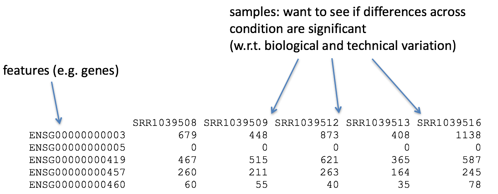

# Preparation (60 min)

## Get Story (2 min)
Purpose: https://pubmed.ncbi.nlm.nih.gov/28790111/

Summary:   
Use RNA-seq to compare an old drug (amiloride) and a new drug (TG003) in two cancer cell lines with different mutations (BM: p53mut, JJ: del(17p))

<!-- Results: More deregulated genes in BM (5000) vs JJ (1000), but focus on alternative isoforms -->
***

## Get Tools (15 min)

**Warmup Tasks**:

1. Start Rstudio session
2. Select R-version: 4.0.3
3. Create a new R-project, e.g. DESeq2_Course
4. Open a new notebook: e.g. DESeq2_notebook

<br> <br>

**Reminder**: Difference between *Console*, *Scripts* or *Notebooks*.

> **Poll 1**: 
> How do you get information about the current R-version and loaded packages?

<br><br>

### Install Tools
**Reminder**:  Many useful functions are already available with R: base packages.

Many analysis tools come with software **packages** that will need to be installed before use.
For R, two of the most common and reliable package repositories are **CRAN** or **Bioconductor**.

- https://cran.r-project.org/
- https://bioconductor.org/

**Notice**: 

1. All packages come for a **specific R-version**. This tutorial uses R version 4.0.3 (Oct 2021).
2. All packages have specific **package version** (e.g. DESeq2 is version 1.30.1)
3. Most packages have **dependencies** on other packages that should also be installed 
4. Installation can be very **time consuming** but needs to be done only once. For the purpose of this course we have precompiled a set of packages for the Rstudio server. To access make sure you select R version 4.0.3 and set the libPaths as below.


```{r installation, eval=FALSE}
BiocManager::install("DESeq2")
install.packages("tidyverse")
install.packages("pheatmap")
```

> **Poll 2**: Who has successfully installed the following packages: DESeq2, tidyverse, pheatmap?


### Load Tools

> **Task**:  Load the following packages: DESeq2, tidyverse, pheatmap

```{r load, message=FALSE}
.libPaths("/data/manke/processing/RdeseqEnv/R-4.0.3_Rcourse/lib64/R/library")  # thank you, Ward
library(DESeq2)
library(tidyverse)
library(pheatmap)
```

**Notice**: Loading new packages enables new functionalities for a given R-session. 
This may result in multiple (sometimes redundant) functions with the same name: e.g. sd()

In case of doubt, use package name explicitly: e.g. stats::sd()


> **Task**: Uses "sessionInfo()" to show all available packages in your R session.


***

## Get Data (40 min)
We assume that the sequencing data has already been processed  (QC, mapping, counting)
to obtain a so-called *count matrix*.  

It contains the number of reads that have been mapped to each gene and for each sample.



In principle, you can download this published data from GEO 

- GEO: https://www.ncbi.nlm.nih.gov/geo/query/acc.cgi?acc=GSE95077 

For this course, we have already prepared the data in a convenient format here: 

- github: https://github.com/maxplanck-ie/Rdeseq2/raw/main/data/myeloma/myeloma_counts.tsv
- local: /data/manke/processing/Rdeseq2/data/myeloma/myeloma_counts.tsv

**Notice**: It is good style to put data into a separate directory (e.g. data/)

### Import Data 
Data can come in various formats. Here we have prepared the data as tab-separated file.

> **Task**: Read the data e.g. using read.csv()

```{r import_data}
dfile="../data/myeloma/myeloma_counts.tsv"      # location of data file
data <- read.csv(file=dfile, header=TRUE, sep="\t")
```

**Discussion** Inspect the data structure. What does R mean with variables? What are observations? How many samples are in the data ?

> **Poll 3**: What is the median expression count in sample "BM_CTRL_3"? 
```{r poll3, eval=FALSE}
data %>% summary
data[,"BM_CTRL_3"] %>% median()
data %>% pull("BM_CTRL_3") %>% median()
```

**Discussion**: Where are the gene names, and which convention is chosen for them?

### Import Metadata
Metadata (=data about data) and typically contains important information on the samples and their origin. Often these are categorical data ("factors") such as cell type, experimental condition or other batch assignments. But it could also be quantitative data (e.g. age).

Often the metadata is hidden in the paper (or in the filename). This is bad practise - make sure to have a proper sample sheet. Metadata is just as important as data. Here is the prepared file for this introduction:

- github: https://github.com/maxplanck-ie/Rdeseq2/raw/main/data/myeloma/myeloma_meta.tsv
- local: /data/manke/processing/Rdeseq2/data/myeloma/myeloma_meta.tsv

> **Task**: Read the metadata into an R-object "metadata". Make sure that the columns "condition" and "celltype" are factors. 

```{r import_meta}
mfile="../data/myeloma/myeloma_meta.tsv"               # location of metadata file
metadata <- read.csv(file=mfile, header=TRUE, sep="\t")
metadata <- metadata %>% column_to_rownames("sample")  # sample -> rownames

# convert text strings to categorical variable (characters --> factors)
metadata$condition = as.factor(metadata$condition)
metadata$celltype  = as.factor(metadata$celltype)
```


**Question**: What is a factor?

***
# Break (10 min)
***

# Design (20 min)
For each gene, the data matrix contains a vector of counts ($y$) which depends on the vector of samples ($x$)

```{r gene_plot, echo=FALSE}
# extract and plot a specific gene vector
gene = data %>% 
  slice(42) %>%                         # pick gene #42
  gather(sample, count) %>%             # reshape for ggplot
  mutate(condition=metadata$condition)  # add condition. Careful: sorder needs to agree here (it does)

ggplot(gene, aes(x=sample, y=count)) + geom_point(size=3) + theme(axis.text.x=element_blank())    #plot against sample
```

### Hope
Counts ($y$) could be predicted (and controlled) given sufficient information on sample $x$ (c.f. linear regression)

$$
y_i = f(x_i) = \mu + \beta x_i ~~~~~~~~~ (i = 1\ldots n) \\ \\
$$
> **Poll 4**: What is $n$ in our example

1. number of genes
2. number of samples
3. total number of reads

### Goal
Model counts $y_i$ as a function of sample $x_i$ + noise factor ($\epsilon_i$)

$$
y_i = \mu + \beta x_i + \epsilon_i 
$$

**Discussion**: What should $x$ be? 
<br><br><br><br><br><br><br><br><br>

**Notice**: The researcher needs to decide *which factors* should be included in the model:

- none: all samples have their own values
- quantitative variable: e.g. sequence depth
- categorical variable: e.g. condition
- combination of variables: e.g. condition and celltype


**Notice**: Some *nuisance factors* (e.g. batches) may be known and measurable, but are not of primary interest - they should be included.

$$
y_i = \mu + \beta x_i + \gamma z_i + \epsilon_i
$$


```{r gene_plot_factors, echo=FALSE}
ggplot(gene, aes(x=condition, y=count, col=condition)) + geom_point(size=3)  #plot against condition
```


### The R-syntax: $Y \sim X + Z$
Define your design:

```{r design, echo=TRUE}
my_design <- ~ condition 
#my_design <- ~ condition + celltype   # !convention for later! last factor is condition of interest
```
**Notice**: The variables need to correspond to columns in the metadata.

> **Task**: Which variables can be used to define the design?

**Notice**: More complicated designs are possible ($\to$ day 3)

## Interlude: Model Matrix (5 min)
**Discussion**: How to convert sample factor (e.g. condition) into something numerical?

**Idea**: binary encoding of categorical variable $x$ (switch on and of contributions)

$x$=("Cond1", "Cond2", "Cond3") $\longrightarrow \left( \begin{array}{ccc} X_0 & X_1 & X_2 \\ 1 & 0 &  0 \\ 1 & 1 & 0 \\ 1 & 0 & 1 \end{array}\right)$ 

$$
y_i = \mu + \beta x_i \longrightarrow \beta_0 X_{0i} + \beta_1 X_{1i} + \beta_2 X_{2i} = X \cdot \beta
$$

(c.f. linear regression $\to$ multivariate linear regression)


**Upshot**: A factorial design can be translated into a (binary) *model matrix*

```{r model_matrix}
MM=model.matrix(my_design, data=metadata)
pheatmap(MM, cluster_cols = FALSE, cluster_rows=FALSE)
```

> **Tasks** (better for Part II/III): 

- Include an additional factor (+ celltype) and observe the design matrix 
- Bonus: include an interaction term (+ condition:celltype) and discuss its interpretation


## Interlude: Experimental Design (5 min)
https://github.com/hbctraining/DGE_workshop_salmon_online/blob/master/lessons/experimental_planning_considerations.md (50min)

PREPARE FIGURE

### Sequencing Depth
Control the sampling noise:

Need deeper for lowly expressed genes and isoform studies

### Replication
Replication is key to estimate variance. 

Typically variances: biological > sample prep > sequencing

Biological replication is essential to learn about biology!
Most studies are underpowered.

### Confounding
Sex, Age

### Batches


> **Poll 5**


# Create DESeq2 object (5 min)
Each software has their own data representation.
A DESeq2 data object combines data, metadata and the design formula in one single object

    dds = data + metadata + design

At later stages of the calculations new data may be added.


> **Task**: Create a DESeq data set.

```{r combine, echo=TRUE}
dds <- DESeqDataSetFromMatrix(countData=data, colData=metadata, design= my_design)
```


### Interlude: Alternatives (5 min)
There are various tools (HTSeq, Salmon) to produce count matrices (each with their own specific output formats).
Several other convenience functions exist to read them as DESeqDataSet objects

```{r alternative_dds, eval=FALSE}
# Alternative 1: HTSeq object
fm <- "../data/sampleTable2.csv"              # file with data links and metadata
sampleTable <- read.csv(fm, header=FALSE)
colnames(sampleTable)=c("name","filename", "condition","celltype")   # specifications for DESeqDataSetFromHTSeqCount

# categorical variables --> "factors"
sampleTable$condition = as.factor(sampleTable$condition)
sampleTable$celltype  = as.factor(sampleTable$celltype)
dds <- DESeqDataSetFromHTSeqCount(sampleTable, directory = ".", design = my_design)

# Alternative 2: txi object
#txi <- tximport(files, type="salmon", tx2gene=t2g, countsFromAbundance = "lengthScaledTPM")
#dds <- DESeqDataSetFromTximport(txi, colData = sample.table, design = my_desig)


# Alternative 3: Existing Data sets: just specify design
#library("airway")
#data("airway")
#DESeqDataSet(airway, design = ~ cell + dex)

# Alternative 4: Synthetic Data Generation (two conditions)
# dds <- makeExampleDESeqDataSet(n = 1000, m = 6, betaSD = 2)
```


# Data Exploration (40 min)

## Show me the (raw) data! (15 min)

- Data Structure, 
- Entries, Visualization
- Correlations

> **Task 1**: Inspect the data structures and dimensions of objects dds and extract the count matrix M 
(Hint: > ?counts)

> **Task 2**: Extract the first 10 rows (genes) from count matrix and safe as new data object -> Mr <- (for further use)

> **Bonus**: Extract 10 randomly sampled genes.

```{r donwsample}
dds                         # dds object --> inspect: str(dds), dim(dds)
M <- counts(dds)            # get gene-sample matrix
Mr <- M %>% head(10)                                 # just the first
#Mr <- M %>% data.frame() %>% sample_n(10)           # random rows
```

## Visualize (15 min)
```{r visual_explore}
pheatmap(Mr, cluster_rows=FALSE, cluster_cols=FALSE, main="First glimpse")

# create annotation data frame (metadata) and add as color to pheatmap
ann = data.frame(colData(dds))                     
pheatmap(Mr, cluster_rows=FALSE, cluster_cols=FALSE, annotation=ann, main="Data + Metadata")
```

> **Task**: understand the object "ann" and suggest how to add sequence depth as additional annotation column

```{r adding_annotations}
ann$seq_depth=colSums(counts(dds))/1e6    # sequencing depth in millions 
```

## genome-wide correlations

**Question**: How to calculate correlation matrix?

```{r correlations, echo=FALSE}
C <- cor(M)       # get sample-sample correlations: other correlations
pheatmap(C, annotation = ann)
```

### Interlude: Customizing Colors (5 min)

Often we need to adjust colours or ensure consistency across a project.
Refer to library(RColorBrewer) for more systematic and educated choices.

**Goal**: Define list of colours to be used in subsequent applications 
```{r colour, echo=TRUE}
ct_col = c("white", "black")                   # celltype colours
names(ct_col) = levels(ann$celltype)

#cn_col <- brewer.pal(n=3, "Dark2")            # avoid RColorBrewer dependence for this course
cn_col <- c("#1B9E77", "#D95F02", "#7570B3")   # condition colours
names(cn_col) = levels(ann$condition)

my_colors = list( celltype= ct_col, condition = cn_col )
pheatmap(C, annotation = ann, annotation_colors = my_colors)
```

## Simple transformation (10 min)
https://hbctraining.github.io/DGE_workshop_salmon_online/lessons/03_DGE_QC_analysis.html (80min)

> **Task** Look at the quantiles and means of the first 3 samples and create a boxplot
```{r summary, echo=FALSE}
summary(M[,1:3])  # M %>% data.frame() %>%  select(1:3) %>% summary()
boxplot(M[,1:3])  # M %>% data.frame() %>%  select(1:3) %>% boxplot()
```

**Discussion**:  What is the problem - What could we do about it ?


```{r log_norm}
myred=rgb(1,0,0,0.5)
myblue=rgb(0,0,1,0.5)
hist(log(M[,1]),100, col=myred)
hist(log(M[,3]),100, col=myblue, add=TRUE)
```

**Discussion**:   What happened to zero counts ? What may be the source of remaining discrepancy ?

<br><br><br><br><br><br><br><br><br>

- **Transformation**: make distributions more pleasing  
- **Normalization**: make samples comparable

## Sample-Sample Correlations
Compare the genome-wide correlations before and after transformation
```{r explore_corr}
Mt <- log2(M + 1)      # simple log-transform; (why + 1 ?)

# skip
#pheatmap(Mt %>% head(15), annotation=ann, annotation_colors = my_colors, main="Transformed data (log2)")

pheatmap(cor(Mt), annotation = ann, annotation_colors = my_colors)
```
**Discussion**: overall high correlations?

**Upshot**: transformations are important for data exploration


## PCA plot (10 min)
PCA aims to project samples from a high-dimensional space (M=20k+ genes) to a lower dimension (D=2).
Similar to correlation analysis, the main purpose is to identify distinct and similar samples.
```{r PCA_manual}
nt <- 500                                              # set number of most variable genes
top <- order(rowVars(Mt), decreasing = TRUE)[1:nt]     # calculate variance for each row and sort


pca <- prcomp(t(Mt[top,]), scale=TRUE)                 # perform PCA
#eigs <- pca$sdev^2                                     # extract eigenvalue
#vars <- round(100*eigs / sum(eigs), 2)                 # calculate % of explained variance

# prepare data frame for plotting
rld_PCA <- as.data.frame(pca$x[,1:2])                     # only take PC1 and PC2 (column 1 + 2)
rld_PCA$condition <- ann[rownames(rld_PCA),"condition"]   # add condition label from ann
rld_PCA$celltype  <- ann[rownames(rld_PCA),"celltype"]    # add celltype label from ann

ggplot(rld_PCA, aes(PC1, PC2, color=condition, shape=celltype)) +
  geom_point(size=3) +
#  xlab(paste0("PC1: ",vars[1])) +
#  ylab(paste0("PC2: ",vars[2])) +
  scale_colour_manual(values=cn_col)
```

> **Tasks / Homework** 

1. Observe and interprete the PCA plot. 
2. Which factor explains the separation?
3. Can we go ahead with analysis ?
4. Optional: 
Repeat PCA analysis with more sophisticated normalization from the DESeq2 package "rlog()". Notice that the output is not a matrix but a more complicated object. It can be used by the plotPCA() function.


```{r plotPCA, eval=FALSE}
rld <- rlog(dds)      # more sophisticated log-transform to account for seq.depth=lib.size --> str(rld)
rld_PCA <- plotPCA(rld, intgroup=c("condition", "celltype"), returnData=TRUE)
percentVar <- round(100 * attr(rld_PCA, "percentVar"), 1)

ggplot(rld_PCA, aes(PC1, PC2, color=condition, shape=celltype)) +
  geom_point(size=3) +
  xlab(paste0("PC1: ",percentVar[1])) +
  ylab(paste0("PC2: ",percentVar[2])) +
  scale_colour_manual(values=cn_col)
```


