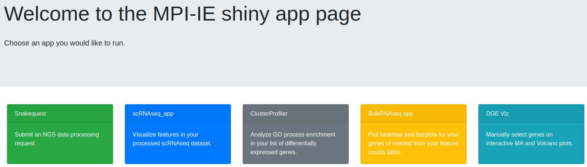

## Goals:
- going over the DESeq2 workflow
- indepth explanations for:
  - general formating for data and metadata 
  - factorization
  - pre-filtering
  - RNA-seq data distribution
  - modelling data
  - data transformation
  - size factors and normalization
  - dispersions
- extracting the results
\
\
\


## 1. Filtering data - 25 min


**Load data, metadata, check samples**

\

```dds <- data + metadata + design```

\

a) Load libraries - TO DELETE
```{r paths_libraries, echo = TRUE, results = 'hide', message=FALSE}

my_load_namespaces <- function(packagesToLoad=c(), coreLibraries=c()) {
  # coreLibraries = not explicitly loaded, but required anyway (e.g. dependencies)
  installed_pkgs <- installed.packages()
  
  if (! "BiocManager" %in% installed_pkgs) install.packages("BiocManager")
  
  lapply(c(coreLibraries, packagesToLoad),
		 function(x) if (! x %in% installed_pkgs) BiocManager::install(x, ask = FALSE))
  
  lapply(packagesToLoad, function(pkg) {
	suppressPackageStartupMessages(require(pkg, character.only = TRUE))
  })
  
  TRUE
}


my_load_namespaces(c("DESeq2", "tidyverse", "pheatmap"), c())
```

b) Load data and metadata

```{r load_data, message=FALSE, echo = TRUE, results = 'hide'}
loc_wd <- "/data/manke/group/balan/courses/2023_Rcourse_DESeq2/Rdeseq2"
loc_code <- paste0(loc_wd, "/rmd")
setwd(loc_code)


#loading data and metadata (sample sheet) with tidyverse
data <- readr::read_tsv(paste0(loc_wd, "/data/myeloma/myeloma_counts.tsv"), col_types = cols(gene_id="c", .default= "i"), col_names=TRUE)

metadata <- readr::read_tsv(paste0(loc_wd, "/data/myeloma/myeloma_meta.tsv"), col_types = list("c", "f", "f"), col_names=TRUE)

# Same as:
# metadata %>% mutate(celltype = factor(celltype))
# metadata %>% mutate(condition = factor(condition))

data <- column_to_rownames(data, var="gene_id")
metadata <- column_to_rownames(metadata, var="sample")

#preview your data and metadata
data %>% head()
data %>% dim()

metadata %>% head()
metadata %>% dim()
```


c) Make design and create the DDS object

```{r make_dds_obj, message=FALSE, echo = TRUE, results = 'hide'}
#check if the col and rows are in the same order:
all(rownames(metadata) == colnames(data))

#create design
my_design <- ~celltype + condition

#make dds obj
dds <- DESeqDataSetFromMatrix(countData=data, colData=metadata, design= my_design)
```


### 1.1. Sample filtering - 15 min

Previously you noticed that the PCA shows a problem with our data. 

```{r old_PCA, echo=FALSE, out.width = '60%', fig.align="center"}
#plotPCA is the DESeq2 function to plot automatically your samples on a PCA. However, the images don't look to nice. So we use it to extract the values needed for plotting and then using them with ggplot to get a better PCA.

rld_PCA <- rlog(dds, blind = TRUE) %>% plotPCA(intgroup=c("condition", "celltype"), returnData=TRUE)

percentVar <- round(100 * attr(rld_PCA, "percentVar"), 1)   # rounded values for each axis of PC variance

rld_PCA %>% ggplot(aes(PC1, PC2, color=condition, shape=celltype)) +
  geom_point(size=3) +
  scale_shape_manual(values=c(3, 1))+    # change shapes of symbols
  scale_size_manual(values=c(2, 2))+     # change sizes of symbols
  xlab(paste0("PC1: ",percentVar[1])) +
  ylab(paste0("PC2: ",percentVar[2])) +
  geom_point(aes(x = rld_PCA["JJ_CTRL_1","PC1"], y = rld_PCA["JJ_CTRL_1","PC2"]), shape=3, size=3, color="black") +
  geom_point(aes(x = rld_PCA["BM_CTRL_1", "PC1"], y = rld_PCA["BM_CTRL_1", "PC2"]), shape=1, size=3, color="black")+
  geom_text(x = 0, y = -1, label="what does the sample mixing mean?", color="black", size=5) +
  geom_segment(aes(x = -25, y = -3, xend = -60, yend = -8), arrow = arrow(length = unit(0.5, "cm")), color="black", show.legend = FALSE) +   #arrow1
  geom_segment(aes(x = 25, y = -3, xend = 60, yend = -8), arrow = arrow(length = unit(0.5, "cm")), color="black", show.legend = FALSE)      #arrow2
```

> **Poll 1:** What do you think about this PCA plot? Does it need to be fixed? How would you do it? - 5 min

\ 

> **Task 1:** Let's fix the data by removing the problematic samples and visualize the resulting PCA:

```
# select the wrong samples from the dds object (columns: 1 and 7), then drop it:
dds_clean <- dds[, -c(column_number_sample1, column_number_sample2)]

# plot the PCA using the the new dds object (can use yesterday's code)
 # first get the counts out of the dds object (): counts(dds) 
 # use log2() on the counts  -  or use rlog() on the dds object!
 # plot the PCA
```

```{r fix_data_metadata, out.width = '60%', fig.align="center"}
#remove the samples from data and metadata:
dds_clean <- dds[, -c(1,7)]
#or
#dds_clean2 <- dds[, -which(colnames(dds) %in% c("JJ_CTRL_1", "BM_CTRL_1"))]

rld_PCA_clean <- rlog(dds_clean, blind = TRUE) %>% plotPCA(intgroup=c("condition", "celltype"), returnData=TRUE)

# cosmetic changes:
percentVar_clean <- round(100 * attr(rld_PCA_clean, "percentVar"), 1)   # rounded values for each axis of PC variance

rld_PCA_clean %>% ggplot(aes(PC1, PC2, color=condition, shape=celltype)) +
  geom_point(size=3) +
  scale_shape_manual(values=c(3, 1))+    # change shapes of symbols
  scale_size_manual(values=c(2, 2))+     # change sizes of symbols
  xlab(paste0("PC1: ",percentVar[1])) +
  ylab(paste0("PC2: ",percentVar[2]))
```

\
\

### 1.2. Feature filtering - 10 min

- filtering: manual or automatic
- helpful but not necessary to remove rows/genes that have very low counts (very unlikely to have biological meaning)
  - arbitrary threshold: < 1, < 10
  - reduces the memory size that the 'dds' object occupies => increases the speed of transformations and calculations
  
\

> **Task 2:** Filter out the genes that have a total amount of only zero or 1 counts:

\


```
# find which rows in the counts of the dds object have only zero or 1 counts overall (= sum of rows is zero or 1)
  # on the counts from dds object, find out the sum of rows; keep them if > 1 
    keep <- rowSums() > 1

# filter out the unnecessary rows
dds <- dds[keep, ]
```
 
\
 
 
> **Discussion:** What type of object is 'keep'?:

\


```{r DESeq2_filtering, fig.align="center"}
#decide on the threshold you want to use  (= the minimum number of counts you want to keep)
keep2 <- rowSums(counts(dds_clean)) > 1
cat('genes before filter: ', nrow(dds_clean), '\n')    # prints the number of rows you have before the filtering

# keep the desired rows
fdds_clean <- dds_clean[keep2, ]                     # most people keep the 'dds' name, but I will change it to help you differentiate between the different steps and learn. But doing this will fill up your memory.
cat('genes before filter: ', nrow(fdds_clean), '\n')    # prints the number of rows you have after the filtering
```

Notice how many rows you have dropped. In this case you are left only with **`r round(nrow(fdds) * 100 / nrow(dds), digits=2)` %** of the initial number of rows!

```{r needed_for_fixing_code, echo = FALSE, results = 'hide', message=FALSE}
dds_clean <-fdds_clean
```
\
\
\

\

## 2. Brief overview and (semi-)deep dive into concepts - 25 min

\

The steps required to do differential expression analysis using DESeq2 package (with default parameters): 

\

```
# make the DESeqDataSet (dds) object:
dds <- DESeqDataSetFromMatrix(countData = matrix_with_count_data,
                              colData = dataframe_with_sample_information,
                              design = what_variables_interest_you)

# explore data & QC: transform data, plot (filtering, PCA, heatmap)

***********************************************************************

# perform statistical analysis
dds <- DESeq(dds)

# extract results
res <- results(dds)
```
\

Things are a bit more complicated in reality - an interative process.

<br>

<center>

{width=80%}

</center>

<br>

**Know your starting data and what you want to achieve with it**

- Have a **working log** where you keep track of all the information regarding the experimental design, the output from the sequencing, the purpose of the analyses, the analysis steps, the observations and all the decissions that you took during the analyses 

  - e.g. does the experimental design and the number of biological repeats allow you to apply certain statistical analyses? What did the QC report of the sequencing say? Do you see the expected sample separation on PCA? Did you find a problem that forced you to make decissions such as dropping samples? Using a certain unusual threshold? 
  
  - can use R notebooks as working logs - it is a place to experiment. But pay attention to not getting mixed up in the data!!

\

- For every step:

  - examine what you have initially (data and the format)
  - know your next step and how the outcome should look like
  - apply the transformation to get the result
  - examine what you got and see if it is what you wanted

\

#### 2.1.a. count data
- usually named 'data', 'counts'
- a matrix with **raw counts** - not normalized, not transformed; integers
- to explore: head(data), dim(data), str(data), summary(data)
  
\

#### 2.1.b. information about the samples
- usually named 'metadata', 'colData'
- dataframe with all known useful information about the samples: name, condition (control/treatment, WT/KO/KD/OE), batch/ sequencing day, gender, age
- to explore: head(metadata)
  - rows of the metadata should be named with sample names (important for downstream steps)
  - **column names of the data should be identical and in the same order with the row names of the metadata!**: `all(colnames(data)==rownames(metadata))` should output 'TRUE'

##### **Understanding factors**
  - used to represent categorical data 
  - stored as integers that have associated labels: R sorts the labels alphabetically


        1    2    3
        AMIL DMSO TG
  - can be: 
    - ordered: small < normal < large; sand < pebels < stones < boulders;
    - unordered: DMSO, TG, AMIL; WT, KO-1, KO-2;
  - levels = predefined factors; reference level = the 1st level
  - the order in which the factors are ordered matters: 
      - for plotting:
```{r bar1, echo=FALSE, out.width = '60%', fig.align="center"}
par(mfrow = c(1,2))

my_numbers1 <- c(25, 12, 34)
my_names1 <- c('treat.2', 'control', 'treat.1')
barplot(my_numbers1, names.arg = my_names1, main = 'Not what you want')

my_numbers2 <- c(12, 34, 25)
my_names2 <- c('control', 'treat.1', 'treat.2')
barplot(my_numbers2, names.arg=my_names2, main = "The correct display")
par(mfrow = c(1,1))
```
      - for statistics: for DE analysis, DESeq2 compares all other levels within a variable with the 1st level. So if they are mixed, instead of comparing 'treatment1 to control' and 'treatment2 to control', you might end up with unexpected results! 

<br>

<center>

{width=60%}

</center>

<br>

  - how to reorder factors:  
```
# or in the dds object, if you only care about what is the reference level:
dds$condition <- relevel(dds$condition, ref='DMSO')   

# or in the dds, if you want a specific order for all of them
dds$condition <- factor(dds$condition, levels = c ('DMSO', 'TG', 'AMIL')) 

# don't reorder the factors, but then remember to use the 'contrast' arguments in the results() function 
```

\

> **Task 3:** Please reorder factors with 'DMSO' as baseline - 2 min

\

This is the order of the factors before and after re-arrangement:
```{r rearrange_factors}
#initial factor arrangement:
dds_clean$condition

#rearrange factors
dds_clean$condition <- relevel(dds_clean$condition, ref='DMSO')

dds_clean$condition
```


\ 

#### 2.1.c. experimental design
- contains variables which will be used in data modeling for estimating dispersions and the log fold changes.
- formula:
  - the names used are the names of the columns of the metadata
  - add the needed variables, with **the one you are most interested in explaining at the end**
    - e.g. '~ celltype + condition' = measure the effect of condition, while controlling for cell type-induced differences

```
my_design <- ~ celltype + condition
```

\

#### 2.1.d. dds object

All that is left now is to make the dds object:

```
dds <- DESeqDataSetFromMatrix(countData=data, colData=metadata, design=my_design) 
```

- dds object stores:
  - read counts (data) - call it with `counts(dds)`
  - sample info (metadata) - call it with `colData(dds)`
  - intermediate estimated quantities - during statistical analysis
  - more additional features that you can add manually to the metadata columns of a newly constructed object: `mcols(dds) <- DataFrame(mcols(dds), my_dataframe)`
  - *every time you change anything about the 'data', 'metadata' or 'design', you have to re-create the dds object!*
  
\
\
\
  


## Break - 10 min

\
\
\

## 3.  Data exploration, visualization and QC  - 20 min

To explore your data further and to create informative, easy to interpret visualizations, the data needs to be transformed before plotting. 

\

### Data transformation: log and rlog

DESeq2 needs as input **raw counts** for statistical testing, but for some stages of visualization or downstream analysis, you need **transformed data**. 

a) **logarithmic data** - mostly in visualization because it reduces the large dynamic range of the data (usually log2(count+1)).

> **Task 4.a):** Do a logarithmic transformation of the first 4 samples (columns) and look only at the output before and after, only for the first 4 samples

```
# look at the first rows of the counts of the first 4 samples from the dds object
# transform the *dds counts* using a log() function
# look at the first rows of first 4 samples from the transformed data
```

```{r log, message=FALSE}
print('dataset with counts before transformation (raw counts):' )  
counts(dds_clean)[,1:4] %>% head(n=3)

print('dataset with counts after logarithmic transformation:' )  
counts(dds_clean)[,1:4] %>% log(base=2) %>% head(n=3)
```

\
\

b) **Regularized logarithm (RLOG)** transform takes in consideration prior information about all the samples in the experiment. It is slower.

> **Task 4.b):** Do a rlog transformation of the first 4 samples (columns) of the dds object and look at the output 

```
# transform the *dds object* using the rlog() function
# look at the first rows of first 4 samples from the transformed data
```

```{r rlog, echo = FALSE, message=FALSE}
print('dataset with counts after RLOG transformation:' )  
#rld_clean <- rlog(dds_clean, blind = TRUE)
rld_clean <- dds_clean %>% rlog(blind = TRUE)
assay(rld_clean)[,1:4] %>% head(n=3)
```

\
\
\

```{r logs_plot, fig.show="hold", out.width = '50%'}
counts(dds_clean)[,c(3,10)] %>% plot()

counts(dds_clean)[,c(3,10)] %>% log(base=2) %>% plot()
assay(rld_clean)[,c(3,10)] %>% plot()               # 'assay()' allows you to extract the counts from the 'rld' object
```

\
\
\

Where can we see the difference between the log and rlog transform?
```{r diff_log_vst_rlog, out.width = '60%', fig.align="center"}
df1 <- data.frame(rlg_base2=log2(counts(dds_clean)[, 1]+1))
df2 <- data.frame(rlg=assay(rld_clean)[, 1])

df <- merge(df1, df2, by=0) # merge the 2 dataframes by rownames

df %>% ggplot(aes(x=rlg_base2, y=rlg)) +
      geom_point(size=1, shape=3) +
      ggtitle("Comparing 'log2(n+1)' and 'rlog' data transformation") +
      xlab("log2(n+1) transformation") + ylab("rlog transformation") +
      theme(plot.title = element_text(hjust=0.5))
```

\
\
\

Does it make a difference to the visualizations?

```{r ploc, fig.show="hold", out.width = '50%'}
th <- data.frame(round(log(counts(dds_clean)+1)))

th.pca <- prcomp(t(th))
pca_data_perc=round(100*th.pca$sdev^2/sum(th.pca$sdev^2),1)

df_pca_data=data.frame(PC1 = th.pca$x[,1], PC2 = th.pca$x[,2], sample = colData(dds_clean)$celltype, condition=colData(dds_clean)$celltype)  #! !Extract the needed info from dds with colData instead of using the 'metadata' ('metadata' needs to be corrected too if you drop samples!)

df_pca_data %>% ggplot(aes(PC1, PC2, color=sample)) +
  geom_point(size=3) +
  geom_text(x = 0, y = -1, label="PCA done with log(n+1) transformation", color="black", size=5) +
  xlab(paste0("PC1: ",pca_data_perc[1])) +
  ylab(paste0("PC2: ",pca_data_perc[2]))

#############################
rld_new3 <- rlog(dds_clean, blind = TRUE) %>% plotPCA(intgroup='celltype', returnData=TRUE)  # 'plotPCA' is a DESeq2 function used for plotting transformed data; can use ggplot code you learned yesterday
percentVar <- round(100 * attr(rld_new3, "percentVar"), 1)   # rounded values for each axis of PC variance

rld_new3 %>% ggplot(aes(PC1, PC2, color=celltype)) +
  geom_point(size=3) +
  geom_text(x = 0, y = -1, label="PCA done with rlog transformation", color="black", size=5) +
  xlab(paste0("PC1: ",percentVar[1])) +
  ylab(paste0("PC2: ",percentVar[2]))

##ref: https://www.biostars.org/p/289333/
```


\
\
\

## 4. Differential expression analysis - 30 min

```
dds <- DESeq(dds)
```

There are several steps to generating the DE results, and they are wrapped together in the **DESeq()** function. The 3 main steps are estimations of:

- estimating size factors                 - *estimateSizeFactors()*
- estimating gene-wise dispersions        - *estimateDispersions()*
- general linear model fit for each gene and testing - *nbinomWaldTest()*

\ 
\

### 4.1. Modeling count data - 15 min

**Why is modeling needed?** 

<br>

<center>

{width=80%}

</center>

<br>

\
\
\

- data can be modeled with various distributions depending on its properties.

- terms:
  - mean of the group: the average value of a sample
  - variance: the expectation of the squared deviation (stdev^2) of a variable from its population mean. 

What properties can you attribute to RNA-seq data?

```{r print_out, echo=FALSE, comment=''}
cat('RNAseq data is: \n   - discrete (counts) \n   - very large number of RNAs are represented and the probability of pulling out a particular transcript is very small \n   - variance is higher than mean')
```

\
\

> **Poll 2**: what kind of distribution would you use for count data?

\
\
\

> **Task 5:** Please plot the mean vs the variance of the genes. Use the following code as guide 

```
#calculate the mean and the variance for each gene (the code for the mean is given bellow)
mean_counts <- apply(counts(dds)[,6:8], 1, mean) 

# plot mean vs variance using plot() and smoothScatter()
```

\ 

```{r mean_vs_variation2, warning=FALSE, out.width = '40%', fig.show='hold'}
op <- par( mar=c(2.3, 0, 0.3, 0), pty="s", fig=c(0, 1, 0, 1), oma=c(0, 0, 0, 0))

mean_counts <- apply(counts(dds_clean)[,3:5], 1, mean)        # '1' means that the function 'apply' is applied to rows.

variance_counts <- apply(counts(dds_clean)[,3:5], 1, var)

plot(log10(mean_counts), log10(variance_counts), xlim=c(-1, 10), ylim=c(-1, 10))
abline(0,1, col="red")

smoothScatter(log10(mean_counts), log10(variance_counts), xlim=c(-1, 10), ylim=c(-1, 10))
abline(0,1, col="red")

par(op)
```


- for genes with high mean expression, the variance across replicates tends to be greater that the mean => use a **negative binomial** distribution
- for genes with low mean expression, there is a large scatter = hetero-scedasti-city = for a given expression level in the low range, we obs a lot of variability in the variance values.


\
\
\


### 4.2. Size factors - 20 min

- sequencing depth - the ratio between the total nr of bases and the size of the genome; the avg nr of times each base is measured in the genome

\
 
```{r, echo=FALSE, out.width = '60%', fig.align="center"}

```
 
\
 
- composition bias - e.g. if there are just a few highly expressed genes dominating in some of your samples
- normalization 

\
 
```{r, echo=FALSE, out.width = '60%', fig.align="center", fig.cap="\\label{fig:figs}(ref: Kumar, 2018, BMC Genomics)"}

```
 
\

> **Task 6.a):** Please print out the sizes of each sample (hint: library size is the sum of all counts)

\

```{r size_libraries, echo=FALSE, results = 'hide'}
colSums(counts(dds))
```

\
\

How to calculate size factors in DESeq2?


```{r size_factors}
dds_clean <- estimateSizeFactors(dds_clean)
sizeFactors(dds_clean)
```


> **Task 6.b):** Please print out the sizes of each sample after normalization

```{r normalized, echo=FALSE, results = 'hide'}
colSums(counts(dds_clean, normalized=T))
```

> **Discuss**: Can the size factors be used as quality control? At what value of the size factors should you go back and look at your data?

\
\
\

NOTE: 'DESeq()' function estimates size factors automatically. But if you *run `estimateSizeFactors()`* or another function to estimate factors *before `DESeq()`*, those calculated values would be used instead. 

Why can you do this in 2 different ways? So you can integrate various methods to compensate for sources of bias within the DESeq2 workflow (e.g. *cqn*, *EDASeq*, etc)

```{r, echo=FALSE, out.width = '80%', fig.align="center"}
knitr::include_graphics(c("../images/expl_size_factors.png"))
```

\ 

### 4.3. Dispersions - 15 min

Within group variability (e.g. between replicates) is modeled by parameter `α`, which describes variance of counts with: `Var = μ + α*μ^2`, where `α` = dispersion, `Var` = variance, and `μ` = mean. 
Accurate estimation of `α` is critical:

- not a problem for large studies with many samples and replicates 

- but usually we only have 2-3 replicates => highly variable `α` estimates for each gene.

\
\
\

> **Task 7:** Visualize the dispersion in your analysis using the following functions: ```dds <- estimateDispersions(dds)``` and ```plotDispEsts(dds)```

```{r, echo=FALSE, results = 'hide', message=FALSE}
dds_clean <- estimateDispersions(dds_clean)
#plotDispEsts(dds_clean)
```

\
\
\

```{r, echo=FALSE, out.width = '50%', fig.align="center"}
knitr::include_graphics(c("../images/explain_dispersion.png"))
```

\

- count data for each gene separately => get preliminary gene-wise dispersion estimates using maximum-likelihood estimation (black dots)

- fit the dispersion trend (red line)

- combine the likelihood with the trended prior to get a maximum *a posteriori* (MAP) values = final dispersion estimates (blue dots)

\

Bad examples of dispersion plots:

<br>

<center>
```{r, echo=FALSE, out.width = '60%', fig.align='center'}
knitr::include_graphics("../images/initial_dispersion.png")
```

</center>

<br>

\
\


### 4.4. Wald test
- gene-wise dispersion by fitting a negative binomial general linear model (GLM) to the data and then returning the results using Wald statistics (**nbinomWaldTest**) > tomorrow
- default parameters: obtain DE genes for the last variable in the design formula ('TG/DMSO')


> **Task 8:** Please run the DESeq() function on the dds object to do the DE analysis:

```{r run_DE, message=FALSE}
dds_clean <- DESeq(dds_clean)
```

\
\
\

## 5. Extracting results - 10 min

\

To extract the results, use: 

```
# default use gives results only for the last variable in the design formula (in this case 'TG/DMSO')
dds_res <- results(dds)

# complex use to extract the specified contrast: (DO NOT RUN THIS!)
resultsName(dds)
dds_res <- results(dds, contrast)
```

it gives you the **log2 fold changes** and the **adjusted p-values** for the specified contrasts (the estimates are of the logarithmic fold change log2(treated/untreated). In our case it will AMIL/DMSO and TG/DMSO.


> **Task 9:** Please run the results() function on the dds object:

```{r results_DE}
dds_res <- results(dds_clean)
dds_res
```


- baseMean: mean of normalized counts for all samples
- **log2FoldChange: log2 fold change**
- lfcSE: standard error
- stat: Wald statistic
- pvalue: Wald test p-value
- **padj: BH adjusted p-values**

\

> **Discussion:** What are the NA values in the 'padj' column?

\
\


- how many genes do we get with padj < 0.05?

```{r}
table(dds_res$padj < 0.05)
```

- sort the list to have at the top the genes with the lowest padj values:

```{r}
dds_res.1 <- subset(dds_res, padj < 0.1)                 # find all rows that have a padj < 0.1; helps to remove the NAs and insignificant values
dds_res_ordered <- dds_res.1[order(dds_res.1$padj),]     # sort the subset
```

\
\
\


## 6. Exporting results and further analyses - 15 min

\


- why export data?
```{r, echo=FALSE, out.width = '70%', fig.align="center"}
knitr::include_graphics(c("../images/analysis_tools.png"))
```

- you can save your results in a 'tsv' file:

> **Task 9:** Please find the write.csv function and use it to export your data:

```{r export_results}
# change the location of the saved file!!
wfile="../misc/results.tsv"      # location of data file
#write.table(dds_res_ordered, file=wfile, col.names=T, row.names = T, sep = "\t", quote=F)  #tab-sep
write.csv(dds_res_ordered, file=wfile, row.names=TRUE)                                      #comma-sep
```

\

- use the exported data for downstream analysis: 
  - shiny apps on  MPI-IE website:

```{r, echo=FALSE, out.width = '80%', fig.align="center"}

```

  - ClusterProfiler:

```{r, echo=FALSE, out.width = '80%', fig.align="center"}
knitr::include_graphics("../images/gene2functions.png")
```
 
  - Ingenuity Pathway Analysis (IPA): tool to help interprete and analyze omics data (e.g. functional enrichment of DEGs)
  
```{r, echo=FALSE, out.width = '60%', fig.align="center"}
knitr::include_graphics("../images/ipa_example.jpg")
```


> **Task 10:** Please reorder factors with 'AMIL' as baseline, for next day's analysis - 2 min

```{r rearr_back, echo = FALSE}
dds$condition <- relevel(dds$condition, ref='AMIL')
```