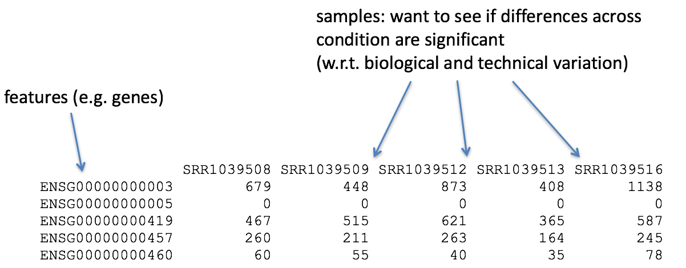
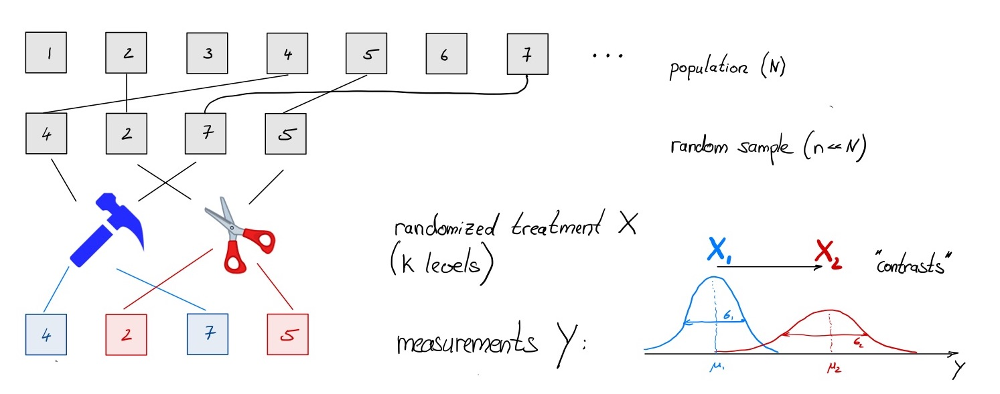
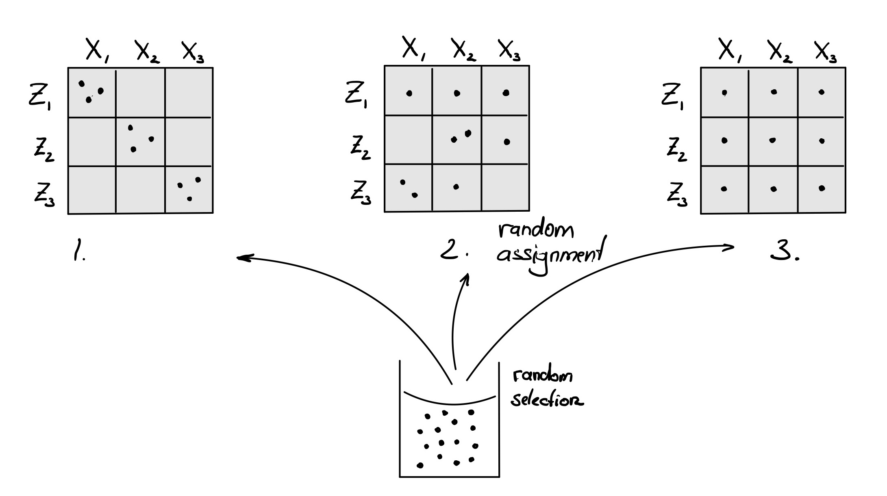

***

# Preparation (60 min)

## 1. Story

The story we'll work with is a 'drug repurposing' effort to use an old diuretic drug as a cancer treatment:
<br> 
[Amiloride to treat multiple myeloma](https://pubmed.ncbi.nlm.nih.gov/28790111/)

Note that this is publically available data under GEO accession ID GSE95077, but the data shipped with this repository is altered for educational purposes.  
In this study, RNA-seq data is available to compare amiloride to a state-of-the-art drug (TG003) in two cancer (multiple myeloma) cell lines with different mutations (BM: p53mut, JJ: del(17p)).
<br> 

***

## 2. Tools

> **Poll 1.1**: 
> How do you get information about the current R-version and loaded packages?

<br> 

### a. Packages

Many useful functions are already available with R: *base packages*.
Most analysis tools come with software packages that will need to be installed before use.

For R, two of the most common and reliable package repositories are:

- **CRAN** https://cran.r-project.org/
- **Bioconductor** https://bioconductor.org/

**Reminder** 

1. All packages come for a **specific R-version**. This tutorial uses R version 4.2.3.
2. All packages have specific **package version** (e.g. DESeq2 is version 1.36.0), and can come from different sources (CRAN, Bioconductor, github, ...).
3. Most packages have **dependencies** on other packages that should also be installed 
4. Installation can be very **time consuming** but needs to be done only once. 

### b. Load packages

> **Task**:  Load the following packages: DESeq2, tidyverse, pheatmap

> **Poll 1.2**: Did you manage to load DESeq2, tidyverse & pheatmap ?

```{r load, message=FALSE}
library(DESeq2)
library(tidyverse)
library(pheatmap)
```

**Reminder**: Loading new packages enables new functionalities for a given R-session. 

This may result in multiple (sometimes redundant) functions with the same name: e.g. sd()

In case of doubt, use package name explicitly: e.g. stats::sd()


> **Task**: Uses "sessionInfo()" to show all available packages in your R session.


***

## 3. Get Data
We assume that the sequencing data has already been processed  (QC, mapping, counting)
to obtain a so-called *count matrix*. Data received in-house (given that it's a model organism) will have count matrices generated that you can start with immediately.
A count matrix contains the number of reads that have been mapped to each gene, for each sample.

<br>



***

In principle, you can download the published data for our tutorial from [GEO](https://www.ncbi.nlm.nih.gov/geo/query/acc.cgi?acc=GSE95077), and many published papers will (or should) have a GEO / SRA / data accession code available.
For this course, we have already prepared the data that will be used in in a convenient format.


**Recommendation**: It is good style to put data into a separate directory (e.g. data/).

### a. Import Data 
Data can come in various formats. Here we have prepared the data as tab-separated file with header information.

> **Task**: Read the data e.g. using read_tsv()

```{r import_data, message=FALSE}
dfile <- "data/myeloma/myeloma_counts.tsv"
data <- read_tsv(file=dfile)
```

Take some time to inspect the data structure. What are the variables? How many samples are in the data ?

```{r head_data}
data %>% head()
```

> **Poll 1.3**: What is the median expression count in sample "BM_CTRL_3"? 

**Recommendation**: Some functions that could be of help: summary (baseR), pull (tidyverse)

Don't worry if the syntax is confusing at first. It takes time and practice to familiarize yourself.

```{r poll3, eval=FALSE}
data %>% summary
data %>% pull("BM_CTRL_3") %>% median()
```

Where are the gene names, and which convention is chosen for them?

### b. Import Metadata

Metadata (=data about data); typically contains important information on the samples and their origin. 
Often these are categorical data such as cell type, experimental condition or other batch assignments. But it could also be quantitative data (e.g. age, weight, ...).
Often the metadata is hidden in the paper (or in the filenames). This is bad practise - make sure to have a proper 'samplesheet'.
Metadata is just as important as data.

Our metadata file is located here:

> 'data/myeloma/myeloma_meta.tsv' 

> **Task**: Read the metadata into an R-object "metadata". Inspect the data frame - which data types are included?
Make sure that the rownames of the metadata are valid sample names.

```{r import_meta}
mfile <- "data/myeloma/myeloma_meta.tsv"               # location of metadata file
metadata <- read_tsv(file=mfile) 
```

```{r head_metadata}
metadata %>% head()
```

> **Poll 1.4**: What is a factor?

> **Task**  Convert the character variables "condition" and "celltype" into factors. 

```{r make_factors}
# convert text strings to categorical variable (characters --> factors)
metadata$condition <- as.factor(metadata$condition)
metadata$celltype  <- as.factor(metadata$celltype)
metadata$sample    <- as.factor(metadata$sample)

# alternatively
#metadata <- metadata %>% mutate_if(is.character,as.factor)
```

***
# Break (10 min)
***

# Design (20 min)
For each gene (=row), the data matrix contains a vector of counts ($y$) which depends on the vector of samples ($x$)

> **Tasks (optional)**: Extract the 42nd gene in the data matrix and plot it against all samples

```{r gene_plot}
gene = data %>%
  slice(42) %>%                                                      # pick gene
  pivot_longer(-gene_id, names_to = "sample", values_to = "count")   # convert to long

gene_mean = gene %>% pull(count) %>% mean()                          # calculate mean

ggplot(gene, aes(x=sample, y=count)) +
  geom_point() +
  geom_hline(yintercept = gene_mean, color=2) +
  theme(axis.text.x = element_text(angle = 90))

#base-R
#boxplot(data[42,], xlab="sample", ylab="count", names=FALSE) 
#abline(h=rowMeans(data[42,]), col="red", lty=2)
```


## 1. Hope
Gene expression (counts $y$) could be predicted (and controlled) given sufficient sample information $x$ (up to some noise $\epsilon$):

$$
y_i = f(x_i, \theta) + \epsilon_i ~~~~~~~~~ (i = 1\ldots n)\\
$$

> **Poll 1.5**: What is $n$ in our example?

## 2. What should $x$ be?

**Reminder**: The researcher needs to decide *which factors* should be included in the model.

- none: all samples have their own values $\to y = \mu + \epsilon$
- quantitative variable: e.g. sequence depth $\to y = f(sequencing~depth)$
- categorical variable: e.g. condition $\to y = f(condition)$
- combination of variables: e.g. condition and celltype

```{r gene_plot_factors}
gene %>%
  # join gene with metadata (by sample)
  inner_join(metadata, by="sample") %>%
  #plot against condition
  ggplot(aes(x=condition, y=count, col=condition)) + 
  geom_point(size=3)  
```

> **Task**: Plot gene counts against celltype.

**Notice**:

- ggplot understands factors for plotting 
- R understands formulae with factors:  $Y \sim X$

## 3. Under the hood: the model matrix

How are factorial variables (e.g. condition) encoded into something numerical ?

Use dummy variables: binary encoding of categorical variable $x$ (switch different levels on and off)

$$
\left[
\begin{array}{c}
y_1 \\
y_2 \\
\vdots \\
y_i \\
\vdots \\
y_n \\
\end{array}
\right] = 
\left[
\begin{array}{ccc}
1 & 0 & \ldots & 0 \\
1 & 0 & \ldots & 0 \\
\vdots \\
0 & 1 & \ldots & 0 \\
\vdots \\
0 & 0 & \ldots & 1 \\
\end{array}
\right] \cdot
\left[
\begin{array}{c}
\mu_1 \\
\mu_2 \\
\vdots \\
\mu_p \\
\end{array}
\right] + 
\left[
\begin{array}{c}
\epsilon_1 \\
\epsilon_2 \\
\vdots \\
\epsilon_i \\
\vdots \\
\epsilon_n \\
\end{array}
\right] 
$$
and in compact notation:
$$
y = X \mu + \epsilon
$$
$X$: $n\times p$ *incidence model matrix* $\to$ multivariate linear regression

***
An equivalent alternative parameterization is:
$$
\left[
\begin{array}{c}
y_1 \\
y_2 \\
\vdots \\
y_i \\
\vdots \\
y_n \\
\end{array}
\right] = 
\left[
\begin{array}{ccc}
1 & 0 & \ldots & 0 \\
1 & 0 & \ldots & 0 \\
\vdots \\
1 & 1 & \ldots & 0 \\
\vdots \\
1 & 0 & \ldots & 1 \\
\end{array}
\right] \cdot
\left[
\begin{array}{c}
\beta_0 \\
\beta_1 \\
\vdots \\
\beta_{p-1} \\
\end{array}
\right] + 
\left[
\begin{array}{c}
\epsilon_1 \\
\epsilon_2 \\
\vdots \\
\epsilon_i \\
\vdots \\
\epsilon_n \\
\end{array}
\right]
$$
and in compact notation:
$$
y = \beta_0 + X' \beta + \epsilon
$$
$X'$: $n \times (p-1)$ model matrix with intersept.

In this parameterization one factor level serves as reference level $\beta_0 = \mu_1$. 

Sometimes this choice is preferable since then all the other parameters $\beta_i=\mu_{i+1} - \mu_1$ can be interpreted as `effects` of level $i \ge 1$ with respect to reference level.

We are free to chose from many different parameterizations 
$\mu \leftrightarrow \beta$ which will have different interpretations.

## 4. Design In Action

**Define Design**: 
The design formula should only include variables from the columns of the metadata!
In the example below we decide to model only the dependency on the factor "condition"

```{r design, echo=TRUE}
my_design <- ~ 0 + condition   # without intersect
# my_design <- ~ 1 + condition # with intersect
```

**Define Model Matrix**: from design formula and metadata
A factorial design can be translated into a (binary) *model matrix*
```{r model_matrix}
MM <- model.matrix(my_design, data=metadata)
rownames(MM) = metadata$sample
pheatmap(MM, cluster_cols = FALSE, cluster_rows=FALSE)
```

**Notice**: A factor with $p$ levels will have $p$ dummy variables and $p$ corresponding parameters (e.g. the means for $p$ different groups).

> **Task** Try the alternative design formula and inspect the effect on the matrix.


### Multifactorial designs

More complicated designs are possible and often necessary ($\to$ day 2 and 3)

> **Tasks**: Include an additional factor (condition + celltype) and observe the design matrix   
> **Bonus**: Include an interaction term (+ condition*celltype) and discuss its interpretation  

```{r model_matrix_interaction}
MM <- model.matrix(~ 1 + condition * celltype, data=metadata)
rownames(MM) = metadata$sample
pheatmap(MM, cluster_cols = FALSE, cluster_rows=FALSE)
```

***

## 5. Experimental design
A more elaborate (highly recommended) tutorial can be found [here](https://github.com/hbctraining/DGE_workshop_salmon_online/blob/master/lessons/experimental_planning_considerations.md)



### a. The problem: more factors!
Usually there are other factors in addition to a simple treatment:

- known and interesting: multi-factorial design and interaction effects (condition * celltype)
- known and uninteresting: batch, covariates
- unknown and unvoidable: noise

... all contribute to total variability and limit our ability to detect treatment-related differences $\to$ account for them as much as possible !

<br>

> **Poll 1.6** You are planning an experiment with 3 treatment levels $(X_1, X_2, X_3)$ and aim for 3 replicates each. Unfortunately, you can process at most 3 samples per day. So you'll need three days $(Z_1, Z_2, Z_3)$. How should you assign your samples to different treatments?




### Sources of Variability


| Source | What can be done about it |
|-------|:-----|
Treatment            | Observe!?
Biological           | Estimate with **replication**
Sample Preparation   | Estimate with batch controls (**blocking**)
Unknown Confounders  | Reduce risk by **randomization** 
Sequencing           | Control with sequencing depth (read sampling)
Analysis             | Control software version and parameters
 
Some *nuisance factors* (e.g. batches) may be known and measurable, but are not of primary interest - they should be included as metadata and in the model.

$$
\mbox{R syntax:} ~~~Y \sim X + Z
$$
```{r alt_design, echo=TRUE, eval=FALSE}
my_alt_design <- ~ celltype + condition
```

**Reminder**: The choice of factors rests with the researcher.


***

# Create DESeq2 object (5 min)
Each software has their own data representation.
A DESeq2 data object combines data, metadata and the design formula in one single object

    dds = data + metadata + design

All subsequent calculations will use this object (and modify it).


> **Task**: Create a DESeq data set.

```{r combine, echo=TRUE}
dds <- DESeqDataSetFromMatrix(
  # countData= expects matrix, so remove "gene_id" column and keep as rowname
  countData=data %>% column_to_rownames("gene_id"),
  colData=metadata, 
  design= my_design)
```


# Data Exploration (40 min)

## 1. Data Access

> **Tasks**: 

- Inspect the class, structure and dimensions of `dds`. 
- Re-extract the count matrix (Hint: ?counts) and save as `Y`
- Re-extract the metadata (Hint: ?colData), remove column "sample" and save as `meta`

```{r dds_access}
dds                     # dds object --> inspect: class(dds), str(dds), dim(dds)
Y <- counts(dds)        # get gene-sample data matrix from dds

# get metadata from dds and remove column 'sample'
meta <- data.frame(colData(dds)) %>% select(-sample)
```

> **Tasks**: 

- Extract the first 10 rows (genes) from count matrix `Y` and safe this data subset as `Yr` (reduced size for further use)
- Optional: Extract 10 randomly sampled genes.

```{r downsample}
Yr <- Y %>% head(10)    # extract first 10 rows (for illustrations only)
#Yr <- Y %>% data.frame() %>% sample_n(10)  # random rows
```

## 2. Data Visualization

> **Task**: Create heatmap for the reduced data set Yr (?pheatmap). You might want to disable the default clustering of rows and columns

```{r visual_explore}
pheatmap(Yr, cluster_rows=FALSE, cluster_cols=FALSE, main="First glimpse")
```

> **Task**: Add metadata `meta` as annotation to pheatmap

```{r data_and_metadata, echo = FALSE}
pheatmap(Yr, cluster_rows=FALSE, cluster_cols=FALSE, annotation=meta, main="Data + Metadata")
```

### Customizing Metadata (5 min)

> **Task**: 

- understand the object "meta" and how it is encoded as colors in pheatmap
- modify "meta" by adding sequence depth as additional metadata for all samples (additional column)
- rerun the pheatmap to yield

```{r adding_annotations, echo=FALSE}
meta$seq_depth <- counts(dds) %>% colSums()/1e6    # sequencing depth in millions 
pheatmap(Yr, cluster_rows=FALSE, cluster_cols=FALSE, annotation=meta, main="Data + Metadata")
```


**Notice**:  'meta=colData(dds)' is almost identical to the original 'metadata' (read from file). But meta has rownames, and rownames(meta) = colnames(Y)

### Customizing Colours (5 min)

Often we need to adjust colours or ensure consistency across a project.
In the example above, the colour representation of the metadata may also be improved.

Use > library(RColorBrewer) for systematic and educated colour choices.

**Goal**: Define list of colours to be used for metadata? 
```{r colour, echo=TRUE}
# celltype colours
ct_col <- c("white", "black")                   
names(ct_col) <- levels(meta$celltype)

# condition colours
cn_col <- c("#1B9E77", "#D95F02", "#7570B3")   # = RColorBrewer::brewer.pal(n=3, "Dark2")
names(cn_col) <- levels(meta$condition)

# create list of colour choices
my_colors <- list( celltype= ct_col, condition = cn_col )

pheatmap(Yr, cluster_rows=FALSE, cluster_cols=FALSE, 
         annotation=meta, annotation_colors = my_colors, 
         main="Data + Metadata")
```
The colour encoding of the heatmap can also be customized (code not run)
```{r adjust_heatmap_colors, eval=FALSE, echo=TRUE}
blue_colors = RColorBrewer::brewer.pal(9,"Blues")
pheatmap(Yr, cluster_rows=FALSE, cluster_cols=FALSE,
         annotation = meta, annotation_colors = my_colors, 
         color=blue_colors,
         main="Data + Metadata") 
```

## 3. Data transformation
A more elaborate (highly recommended) tutorial can be found [here](https://hbctraining.github.io/DGE_workshop_salmon_online/lessons/03_DGE_QC_analysis.html)

> **Task** Inspect the quantiles and means of the first 10 genes (from Yr) and create a boxplot

*Hint:* Many R functions (e.g. summary, boxplot) treat rows as observations, and columns as variables. This is different from the common choice for count matrix Y its submatrix Yr. To utilize these functions efficiently we first have to transpose.

```{r summary, echo=FALSE}
Yr %>% t %>% summary
Yr %>% t %>% boxplot(las=2, cex.axis=0.5)
```

**Discussion:** What is the problem and what could we do about it ?

```{r log_transform}
Yt <- log2(Y + 1)   # simple log-transform; (why + 1 ?)
Yt[1:10,] %>% t %>% boxplot(las=2, cex.axis=0.5)
```

More boxplot customization with ggplot
```{r transform_ggplot, eval=FALSE}
Yt %>% head(10) %>%
  as_tibble(rownames="gene_id") %>% 
  pivot_longer(-gene_id, names_to = "sample", values_to = "log_count") %>% 
  inner_join(metadata, by="sample") %>%
  ggplot(aes(x=gene_id, y=log_count, color=condition)) +
  geom_boxplot() +
  facet_wrap(~celltype) +
  theme(axis.text.x = element_text(angle = 90))
```


What happened to zero counts ? What might be the source of remaining variability ?

- **Transformation**: make distributions more pleasing  
- **Normalization**: make samples comparable


## 4. Sample-Sample correlations (genome-wide)

**Question**: How to calculate the sample-sample correlation matrix?

```{r correlations}
C <- cor(Yt)       # get sample-sample correlations: other correlations?
pheatmap(C, annotation = meta, annotation_colors = my_colors)
```

Notice the overall high correlations. How would you explore this further?

```{r smoothScatter}
# correlation coeff. is only a single number
smoothScatter(Yt[,"JJ_TG_1"], Yt[,"JJ_AMIL_1"])
```

## 5. PCA plot
PCA aims to project samples from a high-dimensional space (M=20k+ genes) to a lower dimension (D=2).
Similar to correlation analysis, the main purpose is to identify distinct and similar samples.
```{r PCA_manual}
#Yt is the transformed count matrix: log, rlog, vst, ...

# set number of most variable genes
nt <- 500     
# calculate variance for each row (gene), sort and get top variable genes
top <-  Yt %>% rowVars(useNames=TRUE) %>% order(decreasing=TRUE) %>% head(nt)   
# subset, transpose and perform PCA
pca <- Yt[top,] %>% t() %>% prcomp(scale=TRUE)      

# calculate fraction of explained variance by PC 
vars = round(pca$sdev^2 / sum(pca$sdev^2),3)

S = pca$x[,1:2] %>%                    # pca$x: score matrix (nt=500 genes --> 2 PC)
  as_tibble(rownames="sample") %>%     # convert to tibble
  inner_join(metadata, by="sample")    # attach metadata for visualization

ggplot(S, aes(x=PC1, y=PC2, color=condition, shape=celltype)) +
  geom_point(size=3) +
  xlab(paste0("PC1: ",vars[1])) +
  ylab(paste0("PC2: ",vars[2])) +
  scale_colour_manual(values=cn_col)
  # scale_colour_brewer(palette="Dark2")
```

> **Homework** 

1. Observe and interpret the PCA plot. 
2. Which factor explains the separation?
3. Can we go ahead with analysis ?
4. Optional: 
Repeat PCA analysis with more sophisticated normalization from the DESeq2 package "rlog()". Notice that the output is not a matrix but a more complicated object. It can be used by the plotPCA() function.


```{r plotPCA, eval=FALSE}
rld <- rlog(dds)  # more sophisticated log-transform to account for seq.depth=lib.size --> str(rld)

plotPCA(rld)
```
```{r plotPCA_custom, eval=FALSE}
rld_PCA <- plotPCA(rld, intgroup=c("condition", "celltype"), returnData=TRUE)
percentVar <- round(100 * attr(rld_PCA, "percentVar"), 1)

ggplot(rld_PCA, aes(PC1, PC2, color=condition, shape=celltype)) +
  geom_point(size=3) +
  xlab(paste0("PC1: ",percentVar[1])) +
  ylab(paste0("PC2: ",percentVar[2])) +
  scale_colour_manual(values=cn_col)
```


