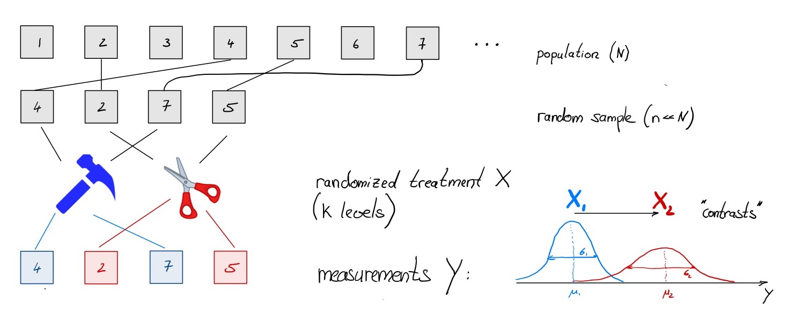
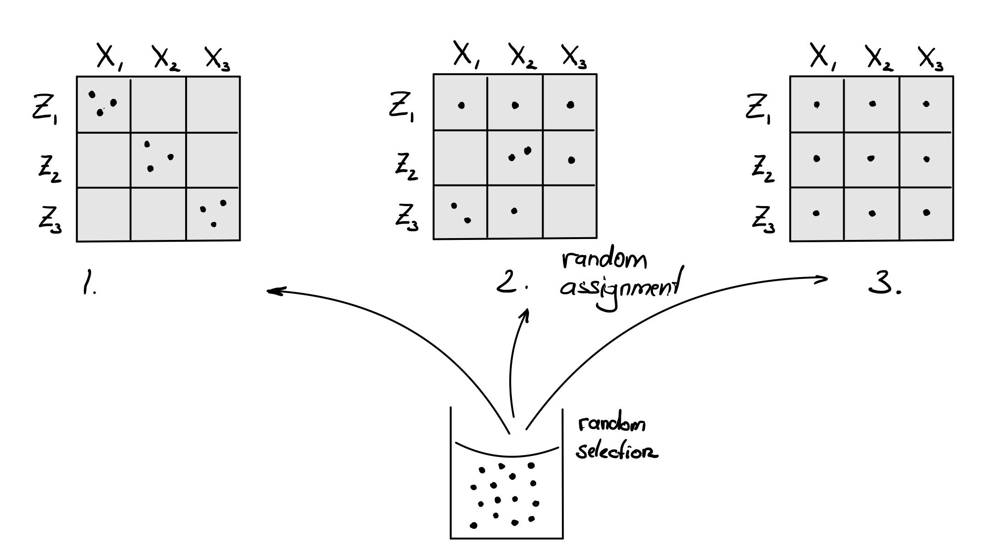

***

# Preparation (60 min)

## 1. Story

The story we'll work with is a 'drug repurposing' effort to use an old diuretic drug as a cancer treatment:
<br> 
[Amiloride to treat multiple myeloma](https://pubmed.ncbi.nlm.nih.gov/28790111/)

In this study, RNA-seq data is available to compare amiloride to a state-of-the-art drug (TG003) in two cancer (multiple myeloma) cell lines with different mutations (BM: p53mut, JJ: del(17p)).
<br> 
***

## 2. Tools

> **Task**: Start a new session in [workbench](https://workbench.ie-freiburg.mpg.de), or on your local computer. Note that we will be working with R version 4.1.3.
> **Task**: Create a new R-project, e.g. DESeq2_Course
> **Task**: Open a new notebook: e.g. DESeq2_notebook

**Recommendation** 
We advice you to use Notebooks throughout the course (and beyond), as it is straight forward to keep your notes (documentation) and code together in one place.

> **Poll 1.1**: 
> How do you get information about the current R-version and loaded packages?

<br> 

### a. Packages

Many useful functions are already available with R: *base packages*.
Most analysis tools come with software packages that will need to be installed before use.

For R, two of the most common and reliable package repositories are:

- **CRAN** https://cran.r-project.org/
- **Bioconductor** https://bioconductor.org/

**Reminder** 

1. All packages come for a **specific R-version**. This tutorial uses R version 4.1.3.
2. All packages have specific **package version** (e.g. DESeq2 is version 1.30.1), and can come from different sources (CRAN, Bioconductor, github, ...).
3. Most packages have **dependencies** on other packages that should also be installed 
4. Installation can be very **time consuming** but needs to be done only once. 

### b. Load packages

> **Task**:  Load the following packages: DESeq2, tidyverse, pheatmap

> **Poll 1.2**: Did you manage to load DESeq2, tidyverse & pheatmap ?

```{r load, message=FALSE}
library(DESeq2)
library(tidyverse)
library(pheatmap)
```

**Reminder**: Loading new packages enables new functionalities for a given R-session. 

This may result in multiple (sometimes redundant) functions with the same name: e.g. sd()

In case of doubt, use package name explicitly: e.g. stats::sd()


> **Task**: Uses "sessionInfo()" to show all available packages in your R session.


***

## 3. Get Data
We assume that the sequencing data has already been processed  (QC, mapping, counting)
to obtain a so-called *count matrix*. Data received in-house (given that it's a model organism) will have count matrices generated that you can start with immediately.
A count matrix contains the number of reads that have been mapped to each gene, for each sample.

<br>


***

In principle, you can download the published data for our tutorial from [GEO](https://www.ncbi.nlm.nih.gov/geo/query/acc.cgi?acc=GSE95077), and many published papers will (or should) have a GEO / SRA / data accession code available.
For this course, we have already prepared the data that will be used in in a convenient format.


**Recommendation**: It is good style to put data into a separate directory (e.g. data/).

### a. Import Data 
Data can come in various formats. Here we have prepared the data as tab-separated file with header information.

> **Task**: Read the data e.g. using read_tsv()

```{r import_data, message=FALSE}
dfile <- "data/myeloma/myeloma_counts.tsv"
data <- read_tsv(file=dfile)
```

Take some time to inspect the data structure. What are the variables? How many samples are in the data ?

```{r head_data}
data %>% head()
```

If the ```%>%``` symbol is confusing, one could interprete
```data %>% head()```
as
'Take data and forward it into head()'


> **Poll 1.3**: What is the median expression count in sample "BM_CTRL_3"? 

**Recommendation**: Some functions that could be of help: summary (baseR), pull (tidyverse)

Don't worry if the syntax is confusing at first. It takes time and practice to familiarize yourself.

```{r poll3, eval=FALSE}
data %>% summary
data %>% pull("BM_CTRL_3") %>% median()
```

Where are the gene names, and which convention is chosen for them?

> **Task**: Ensure that the rownames of the count data are gene names.

```{r add_rownames}
# dplyr
data <- data %>% column_to_rownames("gene_id")  # gene_id -> rownames and removes gene_id

# magrittr with a 'reassignment pipe!'
# library(magrittr)
#data %<>% column_to_rownames("gene_id")

# base-R
# rownames(data)    # check: may already be defined during read
# rownames(data) <- data$gene_id
# data$gene_id   <- NULL
```

### b. Import Metadata

Metadata (=data about data); typically contains important information on the samples and their origin. 
Often these are categorical data such as cell type, experimental condition or other batch assignments. But it could also be quantitative data (e.g. age, weight, ...).
Often the metadata is hidden in the paper (or in the filenames). This is bad practise - make sure to have a proper 'samplesheet'.
 Metadata is just as important as data.

> **Task**: Read the metadata into an R-object "metadata". Inspect the data frame - which data types are included?
Make sure that the rownames of the metadata are valid sample names.

```{r import_meta}
mfile <- "data/myeloma/myeloma_meta.tsv"               # location of metadata file
#metadata <- read.csv(file=mfile, header=TRUE, sep="\t")
metadata <- read_tsv(file=mfile)
metadata <- metadata %>% column_to_rownames("sample")  # sample -> rownames
```

```{r head_metadata}
metadata %>% head()
```

> **Poll 1.4**: What is a factor?

> **Task**  Convert the character variables "condition" and "celltype" into factors. 

```{r make_factors}
# convert text strings to categorical variable (characters --> factors)
metadata$condition <- as.factor(metadata$condition)
metadata$celltype  <- as.factor(metadata$celltype)
```

***
# Break (10 min)
***

# Design (20 min)
For each gene (=row), the data matrix contains a vector of counts ($y$) which depends on the vector of samples ($x$)

> **Tasks (optional)**: Extract the 42nd gene in the data matrix and plot it against all samples

```{r gene_plot}
boxplot(data[42,], xlab="sample", ylab="count", names=FALSE) # base-R (ggplot below)
abline(h=rowMeans(data[42,]), col="red", lty=2)
```

## 1. Hope
Counts ($y$) could be predicted (and controlled) given sufficient sample information $x$

$$
y_i = f(x_i) = \mu + \beta x_i ~~~~~~~~~ (i = 1\ldots n) \\ \\
$$

> **Poll 1.5**: What is $n$ in our example?

## 2. Goal
Model the counts ($y_i$) as a function of sample $x_i$ + noise factor ($\epsilon_i$)

$$
y_i = \mu + \beta x_i + \epsilon_i 
$$

What should $x$ be? 

**Reminder**: The researcher needs to decide *which factors* should be included in the model:

- none: all samples have their own values
- quantitative variable: e.g. sequence depth
- categorical variable: e.g. condition
- combination of variables: e.g. condition and celltype


```{r gene_plot_factors}
gene <- data %>% 
  slice(42) %>%                         # pick gene #42
  gather(sample, count) %>%             # reshape for ggplot (1 sample per row!)
  mutate(condition=metadata$condition)  # add condition. Careful: order needs to agree 

ggplot(gene, aes(x=condition, y=count, col=condition)) + 
  geom_point(size=3)  #plot against condition

```


## 3. The R-syntax: $Y \sim X$
Define your design:

```{r design, echo=TRUE}
# here: X = condition
my_design <- ~ condition  # notice the tilde *not* minus
```


**Reminder**: The variables need to correspond to columns in the metadata.

**Reminder**: More complicated designs are possible and often necessary ($\to$ day 2 and 3)

*** 

# Interlude (15 min)
## 1. The model matrix
How do we convert a factor (e.g. condition) into something numerical ?
Use binary encoding of categorical variable $x$ (switch on and of contributions)

$x$=("Cond1", "Cond2", "Cond3") $\longrightarrow \left( \begin{array}{ccc} X_0 & X_1 & X_2 \\ 1 & 0 &  0 \\ 1 & 1 & 0 \\ 1 & 0 & 1 \end{array}\right)$ 

$$
y_i = \mu + \beta x_i \longrightarrow \beta_0 X_{0i} + \beta_1 X_{1i} + \beta_2 X_{2i} = X \cdot \beta
$$

(c.f. linear regression $\to$ multivariate linear regression)


A factorial design can be translated into a (binary) *model matrix*

```{r model_matrix}
MM <- model.matrix(my_design, data=metadata)
pheatmap(MM, cluster_cols = FALSE, cluster_rows=FALSE)
```

> **Tasks**: Include an additional factor (+ celltype) and observe the design matrix 
> **Tasks**: Bonus: include an interaction term (+ condition:celltype) and discuss its interpretation

```{r model_matrix_interaction}
MM <- model.matrix(~ condition*celltype, data=metadata)
pheatmap(MM, cluster_cols = FALSE, cluster_rows=FALSE)
```

***
## 2. Experimental design
A more elaborate (highly recommended) tutorial can be found [here](https://github.com/hbctraining/DGE_workshop_salmon_online/blob/master/lessons/experimental_planning_considerations.md)



### a. The problem: more factors!
Usually there are other factors in addition to a simple treatment:

- known and interesting: multi-factorial design and interaction effects (genotype * treatment)
- known and uninteresting: batch, covariates
- unknown and unvoidable: noise

... all contribute to total variability and limit our ability to detect treatment-related differences $\to$ account for them as much as possible !

<br>

> **Poll 1.6** You are planning an experiment with 3 treatment levels $(X_1, X_2, X_3)$ and aim for 3 replicates each. Unfortunately, you can process at most 3 samples per day. So you'll need three days $(Z_1, Z_2, Z_3)$. How should you assign your samples to different treatments?




### Sources of Variability


| Source | What can be done about it |
|-------|:-----|
Treatment            | Observe!?
Biological           | Estimate with **replication**
Sample Preparation   | Estimate with batch controls (**blocking**)
Unknown Confounders  | Reduce risk by **randomization** 
Sequencing           | Control with sequencing depth (read sampling)
Analysis             | Control software version and parameters
 
Some *nuisance factors* (e.g. batches) may be known and measurable, but are not of primary interest - they should be included as metadata and in the model.

$$
y_i = \mu + \beta x_i + \gamma z_i + \epsilon_i \\ ~~\\
\mbox{R syntax:} ~~~Y \sim X + Z
$$
```{r alt_design, echo=TRUE, eval=FALSE}
my_alt_design <- ~ celltype + condition
```

**Reminder**: The choice of factors rests with the researcher.


***

# Create DESeq2 object (5 min)
Each software has their own data representation.
A DESeq2 data object combines data, metadata and the design formula in one single object

    dds = data + metadata + design

All subsequent calculations will use this object (and modify it).


> **Task**: Create a DESeq data set.

```{r combine, echo=TRUE}
dds <- DESeqDataSetFromMatrix(countData=data, colData=metadata, design= my_design)
```


# Data Exploration (40 min)

## 1. Show me the (raw) data!

- Data Structure 
- Data Entries 
- Visualization
- Correlations

> **Tasks**: Inspect the data structures and dimensions of objects dds and extract the count matrix M 
(Hint: > ?counts)

> **Tasks**: Extract the first 10 rows (genes) from count matrix and safe as new data object -> Mr <- (for further use)

> **Tasks (optional)**: Extract 10 randomly sampled genes.

```{r downsample}
dds                         # dds object --> inspect: str(dds), dim(dds)
M <- counts(dds)            # get gene-sample matrix
( Mr <- M %>% head(10) )                                 # just the first
#Mr <- M %>% data.frame() %>% sample_n(10)           # random rows
```

## 2. Visualize

> **Tasks**: Create heatmap for the first view genes in Mr (?pheatmap). How would you add metadata as below?

```{r visual_explore}
pheatmap(Mr, cluster_rows=FALSE, cluster_cols=FALSE, main="First glimpse")

# create annotation data frame (metadata) and add as color to pheatmap
ann <- data.frame(colData(dds))                     
pheatmap(Mr, cluster_rows=FALSE, cluster_cols=FALSE, annotation=ann, main="Data + Metadata")
```

> **Tasks**: understand the object "ann" and suggest how to add sequence depth as additional annotation column

```{r adding_annotations}
ann$seq_depth <- counts(dds) %>% colSums()/1e6    # sequencing depth in millions 
```

## 3. genome-wide correlations

**Question**: How to calculate the sample-sample correlation matrix?

```{r correlations}
C <- cor(M)       # get sample-sample correlations: other correlations?
pheatmap(C, annotation = ann)
```

### a. Interlude: Customizing Colors (5 min)

Often we need to adjust colours or ensure consistency across a project.
Use > library(RColorBrewer) for systematic and educated choices.

**Goal**: Define list of colours to be used for metadata? 
```{r colour, echo=TRUE}
ct_col <- c("white", "black")                   # celltype colours
names(ct_col) <- levels(ann$celltype)

#cn_col <- brewer.pal(n=3, "Dark2")            # avoid RColorBrewer dependence for this course
cn_col <- c("#1B9E77", "#D95F02", "#7570B3")   # condition colours
names(cn_col) <- levels(ann$condition)

my_colors <- list( celltype= ct_col, condition = cn_col )
pheatmap(C, annotation = ann, annotation_colors = my_colors)

# adjust also heatmap
# blue_colors = RColorBrewer::brewer.pal(9,"Blues"))
# pheatmap(C, annotation = ann, annotation_colors = my_colors, color=blue_colors) 
```

## 4. Simple transformation
A more elaborate (highly recommended) tutorial can be found [here](https://hbctraining.github.io/DGE_workshop_salmon_online/lessons/03_DGE_QC_analysis.html)

> **Task** Look at the quantiles and means of the first 3 samples and create a boxplot
```{r summary, echo=FALSE}
summary(M[,1:3])  # M %>% data.frame() %>%  select(1:3) %>% summary()
boxplot(M[,1:3])  # M %>% data.frame() %>%  select(1:3) %>% boxplot()
```

What is the problem and what could we do about it ?


```{r log_norm}
myred <- rgb(1,0,0,0.5)
myblue <- rgb(0,0,1,0.5)
hist(log(M[,1]),100, col=myred)
hist(log(M[,3]),100, col=myblue, add=TRUE)
```

What happened to zero counts ? What may be the source of remaining discrepancy ?

- **Transformation**: make distributions more pleasing  
- **Normalization**: make samples comparable

## 5. Sample-Sample Correlations
Compare the genome-wide correlations before and after transformation
```{r explore_corr}
Mt <- log2(M + 1)      # simple log-transform; (why + 1 ?)
pheatmap(cor(Mt), annotation = ann, annotation_colors = my_colors)
```
Notice the overall high correlations? How would you explore this further

```{r smoothScatter}
# correlation coeff. is only a single number
smoothScatter(Mt[,1], Mt[,5])
```

## 6. PCA plot
PCA aims to project samples from a high-dimensional space (M=20k+ genes) to a lower dimension (D=2).
Similar to correlation analysis, the main purpose is to identify distinct and similar samples.
```{r PCA_manual}
#Mt is the transformed count matrix: log, rlog, vst, ...

nt <- 500     # set number of most variable genes

# get top variable genes (rows)
top <-  Mt %>% rowVars() %>% order(decreasing=TRUE) %>% head(nt)  # calculate variance for each row and sort
pca <- Mt[top,] %>% t() %>% prcomp(scale=TRUE)      # perform PCA

# pca-object contains transformed coordinates for each sample 
# pca$x:  number of genes --> 2

# calculate explained variance from pca object
#eigs <- pca$sdev^2                       # extract eigenvalue
#vars <- round(100*eigs / sum(eigs), 2)   # calculate % of explained variance

# prepare data frame for plotting
rld_PCA <- as.data.frame(pca$x[,1:2])                     # only take PC1 and PC2 (column 1 + 2)
rld_PCA$condition <- ann[rownames(rld_PCA),"condition"]   # add condition label from ann
rld_PCA$celltype  <- ann[rownames(rld_PCA),"celltype"]    # add celltype label from ann

ggplot(rld_PCA, aes(PC1, PC2, color=condition, shape=celltype)) +
  geom_point(size=3) +
#  xlab(paste0("PC1: ",vars[1])) +
#  ylab(paste0("PC2: ",vars[2])) +
  scale_colour_manual(values=cn_col)
```

> **Homework** 

1. Observe and interprete the PCA plot. 
2. Which factor explains the separation?
3. Can we go ahead with analysis ?
4. Optional: 
Repeat PCA analysis with more sophisticated normalization from the DESeq2 package "rlog()". Notice that the output is not a matrix but a more complicated object. It can be used by the plotPCA() function.


```{r plotPCA, eval=FALSE}
rld <- rlog(dds)      # more sophisticated log-transform to account for seq.depth=lib.size --> str(rld)
rld_PCA <- plotPCA(rld, intgroup=c("condition", "celltype"), returnData=TRUE)
percentVar <- round(100 * attr(rld_PCA, "percentVar"), 1)

ggplot(rld_PCA, aes(PC1, PC2, color=condition, shape=celltype)) +
  geom_point(size=3) +
  xlab(paste0("PC1: ",percentVar[1])) +
  ylab(paste0("PC2: ",percentVar[2])) +
  scale_colour_manual(values=cn_col)
```
