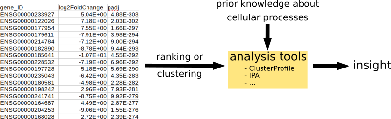
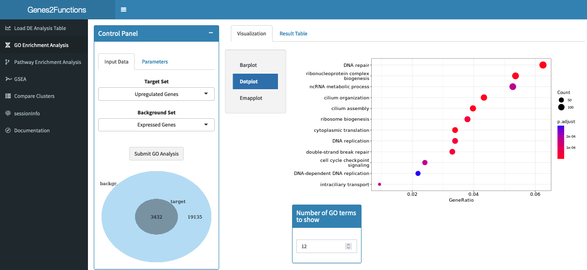

## Goals: DESeq2 workflow
- repeat: generating DESeq-object (data, metadata, design)
- filtering: samples and genes
- transformations: normalization and sizefactors
- modeling: variance + dispersion
- statistical tests
- extracting results

## Preparation (Repeat)

### Load packages
``` {r load_libraries}
suppressPackageStartupMessages({
library("tidyverse")
library("DESeq2")
library("pheatmap")
})

# a convenience function for PCA-plotting
PCA_tm <- function(dds, nt=500){
  
  Y <- dds %>% counts %>% {log2(. + 1)} # data + transformation
#  Y <- dds %>% counts %>% rlog          # rlog is slow
  meta <- dds %>% colData               # metadata

  # get nt top variable genes 
  top <-  Y %>% rowVars(useNames=TRUE) %>% order(decreasing=TRUE) %>% head(nt)   
  
  # subset, transpose and perform PCA
  pca <- Y[top,] %>% t %>% prcomp(scale=TRUE)      

  # calculate fraction of explained variance by PC 
  vars = round(pca$sdev^2 / sum(pca$sdev^2),3)

  S = pca$x[,1:2] %>%                    # pca$x: score matrix (nt=500 genes --> 2 PC)
    as_tibble(rownames="sample") %>%     # convert to tibble
    inner_join(metadata, by="sample")    # attach metadata for visualization

  # aes() is specific to course material with "condition" and "celltype"
  ggplot(S, aes(x=PC1, y=PC2, color=condition, shape=celltype)) +
    geom_point(size=3) +
    xlab(paste0("PC1: ",vars[1])) +
    ylab(paste0("PC2: ",vars[2]))
}
```

### Load data
```{r load_data}
data <- readr::read_tsv("data/myeloma/myeloma_counts.tsv")

#data <- data %>% 
#  column_to_rownames(var="gene_id") %>%
#  mutate(across(where(is.double), as.integer))

#data %>% str()
#data %>% dim()
data %>% head()
```

### Load Metadata
```{r load_meta_data}

metadata <- readr::read_tsv("data/myeloma/myeloma_meta.tsv")
metadata <- metadata %>% mutate_if(is.character,as.factor)

#metadata <- metadata %>% 
#  mutate(celltype = factor(celltype)) %>%
#  mutate(condition = factor(condition)) %>%
#  column_to_rownames("sample")  

#metadata %>% str()
#metadata %>% dim()
metadata %>% head()

#check if the col and rows are in the same order:
all(rownames(metadata) == colnames(data))

```

### Create Design
```{r create_design}
my_design <- ~ celltype + condition
```

### Create DESeq Object
```{r create_deseq_object}
dds <- DESeqDataSetFromMatrix(
  countData=data %>% column_to_rownames("gene_id"), 
  colData=metadata, 
  design=my_design)

class(dds)
dim(dds)
```

### First Inspection (PCA)

Previously you noticed that the PCA shows a problem with our data. 

```{r old_PCA, out.width = '80%', fig.align="center"}

dds %>% PCA_tm

# DESeq2::plotPCA does not show this very clearly
# dds %>% rlog %>% plotPCA(intgroup=c("celltype", "condition")) # rlog slow
# dds %>% vst %>% plotPCA(intgroup=c("celltype", "condition"))  # vst faster
```

> **Poll 2.1:** What should we do next ?


## Filtering


### Filter Samples - 10 min


**Task**: Filter the problematic samples (columns 1 and 7) from dds object and produce a new PCA plot.

Hint: Although the `dds` object is a more complex data class it also has dimensions assigned -- check `dim(dds)` -- and samples can be un/selected like columns in a standard dataframes.

```{r filter_samples, out.width = '80%', fig.align="center"}
dds_clean <- dds[, -c(1,7)] 
dds_clean %>% PCA_tm
```

### Filter Genes - 10 min

- remove genes (rows) that have very low counts 
- arbitrary threshold: < 1, < 10
- benefits:
  - increase robustness of analysis
  - reduces memory size of 'dds' object => increases the speed
  

**Task** Filter out the genes from dds that have a total amount of only zero or 1 counts.
Based on this filtering define a new data set and inspect its dimensions

Hint: Have a look at the output of `dds_clean %>% counts %>% rowSums() %>% head()`

```{r filter_genes}
rs <- dds_clean %>% counts %>% rowSums()

# class(dds_clean)="DESeqDataSet" with convenience operator []
dds_clean <- dds_clean[rs>1,] 

dim(dds_clean)
```

 
> **Poll 2.2** How many samples and genes are left in the filtered data set?


## Relevel Factors - 10 min

**Remember**: factors are used to represent categorical data ! 

Internally they are stored as integers and per default they are sorted *alphanumerically*. 
It may be more convenient to sort them by some user defined order - this is called relevelling

<center>

{width=60%}

</center>

<br>


> **Task** Reorder the condition with 'DMSO' as baseline - 2 min.

Hint: Use the `relevel` function

This is the order of the factors before and after re-arrangement:
```{r rearrange_factors}
#initial factor arrangement:
dds_clean$condition

dds_clean$condition <- relevel(dds_clean$condition, ref='DMSO')
#dds_clean$condition <- factor(dds_clean$condition, levels = c ('DMSO', 'TG', 'AMIL')) # alternatively

dds_clean$condition
```

**Notice:** Per default DESeq2 will make comparisons with respect to the 1st level,
unless specified more explicitly using "contrasts" (see tomorrow).
  

## Preparation Summary
We have now covered the most important preparation steps:

- load library and data
- define DESeq data object
  - count data: `counts()` -- not normalized. data frame of integers
  - meta data: `colData()` -- added data on samples. data frame of numerical or categorical variables
  - design: `design()` -- variables to be modeled. formula will be converted to design matrix with dummy variables
- Filtering & Transformation & Relevel

> This is **before** any statistical analysis ! A real-world analysis would likely be iterative


> **Message**: Document your decisions, parameters, workflows and software versions carefully - use notebooks !


## Break - 10 min

***

## The DESeq workflow (60 min)

Everything we did until now was setup - and before any normalization, parameter estimates or statistical testing.

Luckily for much of the following DESeq2 provides a convenient wrapper function:

> dds <- DESeq(dds)

```{r run deseq2}
dds_clean <- DESeq(dds_clean)
```


There are several steps to generating differential expression results, and they are wrapped together in the **DESeq()** function. The 3 main steps are of the workflow are:

- Normalization                 - *estimateSizeFactors()*
- estimating dispersions        - *estimateDispersions()*
- general linear model fit for each gene and testing - *nbinomWaldTest()*

### Normalization and size factors

As mentioned yesterday, raw counts cannot be directly used to compare samples. 
To allow comparison we need to normalize. Note that this is also needed for exploratory analysis and visualisation.

A couple of reasons for normalization include:

***

 *sequencing depth*

{width=50%}

 
***

 *gene length*

{width=35%}

***

*compositional bias*

{width=50%}

***

A number of commonly used normalization techniques:

| method | factors taking into account |
|-------|:-----|
CPM | sequencing depth
RPKM | sequencing depth and gene length
DESeq2 median of ratios | sequencing depth and RNA composition

Workflow for the 'median of ratios':

 * Take geometric mean per gene (of all samples!) -> 'pseudosample'
 * calculate the count / pseudosample ratio
 * 'sizefactor' == median(ratios) 

and many others exist.

Remember that DESeq2 needs **raw counts** as input (upon creating the dds object).


> **Task **: Plot a heatmap of the first 10 rows of your counts (non-normalized), deseq normalized counts and if you are up for some manual labour, sequencing depth normalized counts.

Hint, counts() can return DESeq normalized counts as well with the argument normalized=TRUE!
Hint2: geometric mean of a vector x can be calculated with exp(mean(log(x)))


```{r heatmap_raw}
meta <- dds_clean %>% colData %>% data.frame %>% select(-sample)
Y <- dds_clean %>% counts %>% head(10) 
pheatmap(Y, annotation=meta)
```
**Notice**:

- a size factor was added to each sample (during the DESeq2 run)
- colours can of course be customized (as shown before)
- pheatmap is opinionated about possible inputs (need to convert)

**Task**:
The counts() function has a parameter (normalized=TRUE) to extract the normalized counts after DESeq2 is run. Modify the above to plot the same heatmap with normalized counts and observe the differences.

```{r heatmap deseq_normalized}
Y <- dds_clean %>% counts(normalized=TRUE) %>% head(10) 
pheatmap(Y, annotation=meta)
```

Remember that the size factor for each sample (meta$sizeFactor) is a sophisticated
way to account for sequencing depth and underpins the normalization used above.
It is good practice to inspect the size factors and try to detect outlier samples 

**Task**:

- add the sequencing depth as additional column to metadata `meta`
- plot the size factor vs sequencing depth

```{r sizeFactor_vs_seqdepth, echo=FALSE}

meta <- dds_clean %>% colData %>% data.frame 

# meta includes sizeFactor determined by DESeq2
meta$sizeFactor %>% summary

# add sequencing depth (in millions) to meta

meta$seq_depth <- dds_clean %>% counts %>% colSums()/1e6  

ggplot(meta, aes(x=seq_depth, y=sizeFactor)) + geom_point()
```

```{r sizeFactor_vs_seqdepth_imp, eval=FALSE, echo=TRUE}
# Notice that
# colSums(counts(dds_clean)) are not strictly the sequencing depths (after gene filtering), but
# colSums(counts(dds))       may contain more samples (before sample filtering)

meta <- dds_clean %>% colData %>% data.frame 

# The code below uses original dds
sd <- dds %>% counts %>% colSums %>% enframe(name="sample", value="seq_depth") %>% mutate(seq_depth=seq_depth/1e6)

# pay more attention to proper sample name matching: inner_join by sample name 
meta %>% inner_join(sd, by="sample") %>% 
  ggplot(aes(x=seq_depth, y=sizeFactor)) + geom_point()
```

**Observation:**. No outliers. sizeFactors behaves as expected.

**Task** 
Study the effect of sizeFactor normalization for a single gene.
The code below is for unnormalized count data - with a simple modification
you can obtain the normalized data.

```{r effect_of_sizefactor}
gene <- dds_clean %>% counts(normalized=T) %>%
  as_tibble(rownames='gene_id') %>%       # tibble does not like rownames
  filter(gene_id=="ENSG00000003509") %>%  # pick gene (previously slice 42)
  pivot_longer(-gene_id, names_to = "sample", values_to = "count")   %>% # convert to long
  inner_join(meta, by="sample")

gene %>%
  ggplot(aes(x=condition, y=count, col=condition,shape=celltype)) +
  geom_point(size=3) 
```

> **Poll 2.3 **: what kind of distribution would be the most appropriate for this data ?


### Variance estimates and dispersions

To determine if the expression of a gene differs between different factor levels, we will also need to estimate its variance.   
Moreover, it is assumed that the variance $\sigma^2$ is independent for each sample $i$

$$
y_i = f(x_i, \theta) + \epsilon_i ~~~~~~~~~ \epsilon_i \propto N(0, \sigma^2)
$$
In general the variance $\sigma^2$ is gene dependent, and it would take many replicates to estimate it properly.

Unfortunately this is rarely the case in an RNA-seq setting, but it would be great if $\sigma^2$ could be estimated from its mean expression. This hope drives much of the work in gene expression analysis, and the discussion below.

To keep things simple let's focus on 3 samples from the *same* celltype and condition.

```{r var_vs_mu_plot}
var_mu_plot <- function(dds,title="variance-vs-mean"){ 
  means <- dds %>% counts %>% rowMeans()
  vars <- dds %>% counts %>% rowVars(useNames = TRUE)
  data.frame(mean=means,variance=vars) %>% 
    ggplot(aes(x=mean, y=variance)) + 
    geom_point() +
    scale_x_log10() + 
    scale_y_log10() +
    geom_abline(intercept = 0, slope = 1, color="red") +
    ggtitle(title)
}

dds_clean[, 3:5] %>% var_mu_plot
```
**Notice**: 

- wide range of means
- many genes are not shown because of logarithmic scale and $\mu=0$
- for large means: variance is larger than predicted by Poisson (red curve: $var = \mu$)
- for small means: variance fluctuates strongly

These properties are commonly observed for all RNA-seq experiments and these observations have
guided the choice of distributions to be used for modelling of sequence counts.
In fact there are simple tools to generate your own synthetic data sets:


**Task**: 

Compare this plot with a *simulated* data set with $n=5000$ genes, $m$ samples from two different
choices of distributions

```{r var_mu_sim}
DESeq2::makeExampleDESeqDataSet(n=5000, m=3, dispMeanRel = function(x) 0) %>% var_mu_plot(title="Poisson")
DESeq2::makeExampleDESeqDataSet(n=5000, m=3) %>% var_mu_plot(title="Negative Binomial")
```
**Try it out**: change the number of samples ($m$) in these simulations and observe the changes

**Upshot**: 

$$
Var(\mu) = \mu + \alpha \mu^2
$$
and hence we will have to determine $\alpha$ - the *dispersion* parameter.

This is part of the DESeq2 workflow and can be illustrated as follows

#### gene-wise dispersion estimates

```{r plot dispersions}
plotDispEsts(dds_clean)
```

The black dots denote gene-wise estimates for $\alpha$. 
They fluctuate strongly but empirically there seems to be a trend $\alpha=\alpha(\mu)$ than could be exploited
(red line). In DESeq2 parlance we can share information across genes for a more robust (and opinionated estimates).
These are the blue dots that represent the adjusted estimates of $\alpha$ and hence the variance.


what would be 'bad' dispersion ?

```{r baddisp}
# remove sizeFactor from metadata and shuffle (=sample) all columns
meta_shuffled <- dds_clean %>% colData %>% data.frame() %>% select(-sizeFactor) %>% mutate_all(sample)

dds_shuffled <- DESeqDataSetFromMatrix(
  countData=dds_clean %>% counts, 
  colData=meta_shuffled, 
  design= dds_clean %>% design)

# re-run DESeq including sizeFactor and dispersion estimates
dds_shuffled <- DESeq(dds_shuffled) 
plotDispEsts(dds_shuffled)
```

Signs of a 'good' dispersion plot:

 * data should scatter around the curve
 * dispersion should decrease with increasing mean of counts
 * 'clouds' or 'wonky shapes' often indicate contamination / outliers


### Model fit and testing

Finally we get a fit for each gene, and a Wald test can be used to test for significance of coefficients of interest.

Luckily DESeq2 wraps this in a convenient function as well: *results()*.
By default we obtain DE genes for the last coefficient, though you can specify contrasts to get your comparison of interest (see tomorrow).

> **Task** Please run results() on the dds_clean object and have a look at the result.

```{r results_DE}
dds_res <- results(dds_clean)
dds_res
```

- baseMean: mean of normalized counts for all samples
- **log2FoldChange: log2 fold change**
- lfcSE: standard error
- stat: Wald statistic
- pvalue: Wald test p-value
- **padj: BH adjusted p-values**

> **Poll 2.4:** What does a positive log2 foldChange and a significant padj value reflect ?

- how many genes do we get with padj < 0.05?

```{r sig res}
dds_res %>% subset(padj < 0.05) %>% nrow()
```

- get the 20 significantly expressed genes with the highest log2FoldChange.

```{r sort descending}
dds_res %>% 
  data.frame() %>% 
  subset(padj < 0.05) %>% 
  arrange(abs(log2FoldChange), descending=TRUE) %>% head(20)
```


### Exporting results and further analyses

{width=80%}


> **Task**: Please export your results table to a csv / tsv file.

hint: write_tsv, write_csv(), write.table(), write_delim() ,...


```{r export results}
write.table(dds_res %>% data.frame, file="DMSO_vs_TG_BMcells.tsv", col.names=T, row.names = T, sep = "\t", quote=F)
```


shiny apps on  MPI-IE website (https://rsconnect.ie-freiburg.mpg.de/shiny/)

{width=80%}

*Genes2Functions*


{width=80%}

{width=80%} 
