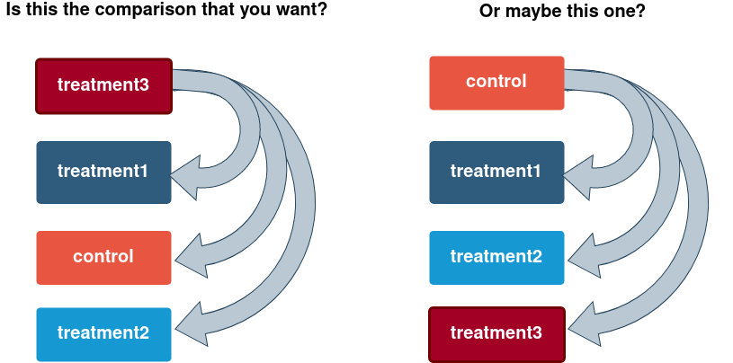
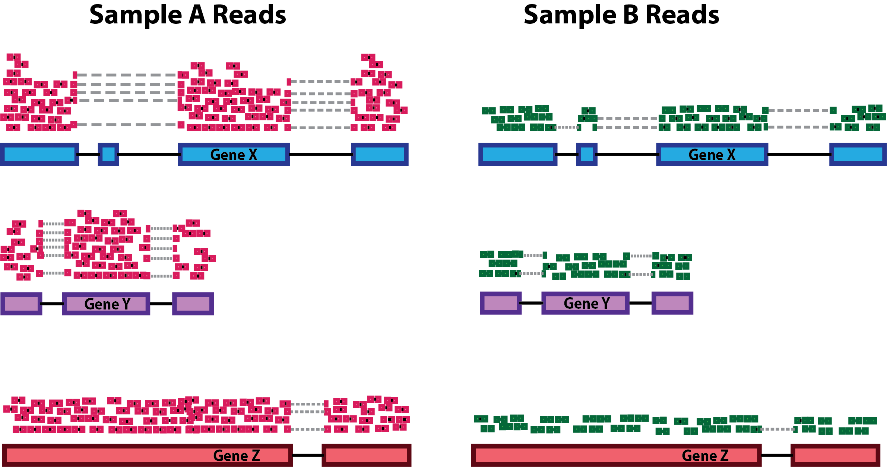
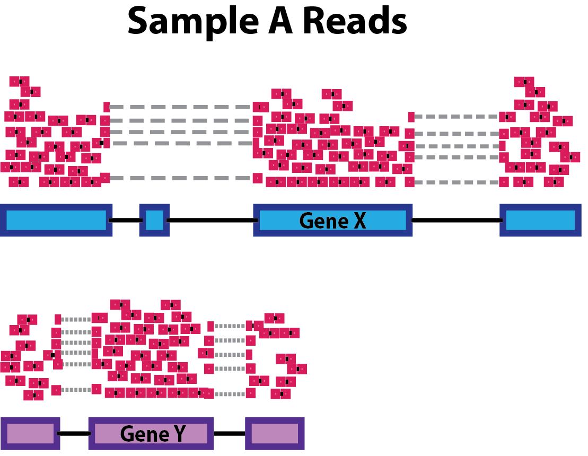
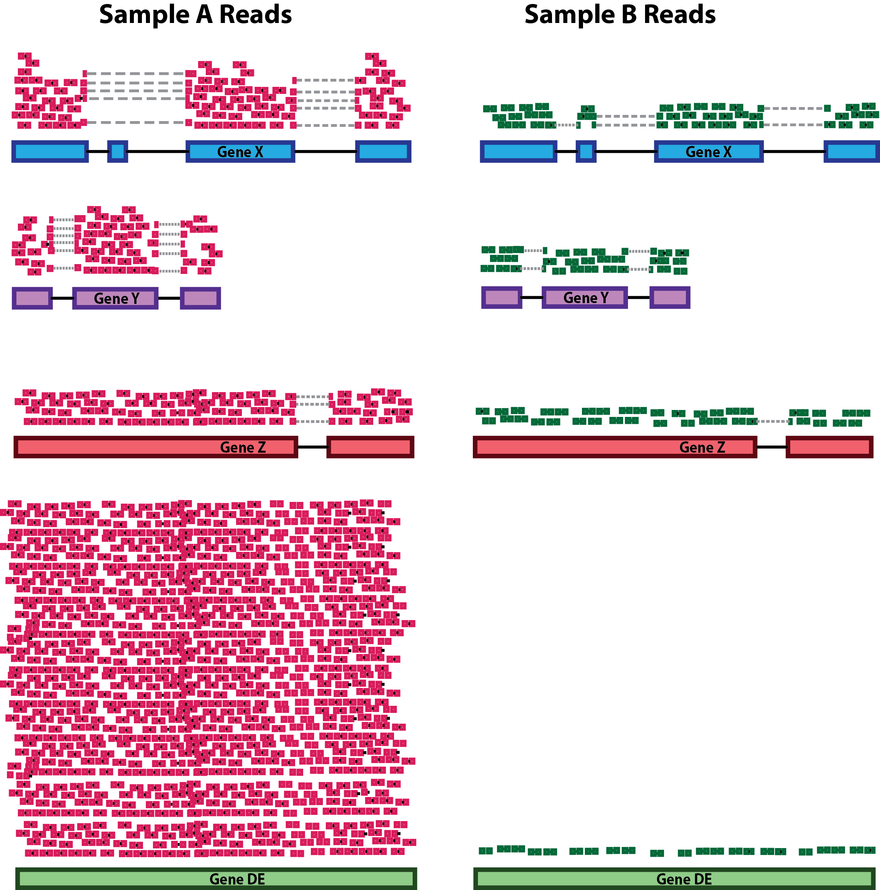
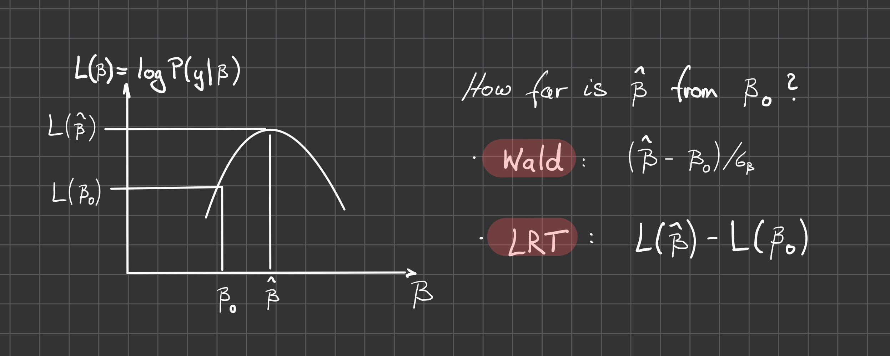
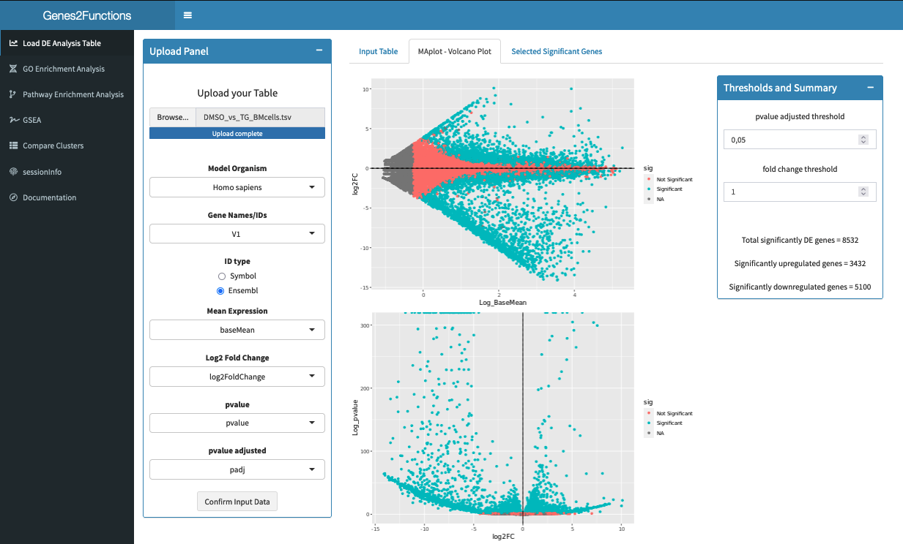

## Preparation/Repetition (10 min)

### Load packages
``` {r load_libraries}
suppressPackageStartupMessages({
library("tidyverse")
library("DESeq2")
library("pheatmap")
})


PCA_tm <- function(dds, groups=c("condition", "celltype"), trans_func=vst){
  # a convenience function for PCA-plotting - rather specific to this course
  # Usage: dds %>% PCA_tm(c("condition","celltype"), trans_func = rlog)

  # Define color and shape variables - set to NULL if not used
  color_var <- if( length(groups) > 0) { sym(groups[1]) } else { NULL }
  shape_var <- if( length(groups) > 1) { sym(groups[2]) } else { NULL }
  
  # transformation | PCA 
  PCA <- dds %>% trans_func %>% plotPCA(intgroup=groups, returnData=TRUE)
  # get percentage explained variation per PC
  percentVar <- round(100 * attr(PCA, "percentVar"), 1)
  
  ggplot(PCA, aes(x=PC1, y=PC2, color={{color_var}}, shape={{shape_var}})) +
    geom_point(size=3, alpha=0.5) +
    xlab(paste0("PC1: ",percentVar[1])) +
    ylab(paste0("PC2: ",percentVar[2]))

}
```


Remember how important sessionInfo() is:

```{r sessionInfo}
sessionInfo()
```

### Load data
```{r load_data}
data <- readr::read_tsv("data/myeloma/myeloma_counts.tsv")
data %>% head()
```

### Load Metadata
```{r load_meta_data}
metadata <- readr::read_tsv("data/myeloma/myeloma_meta.tsv")
metadata <- metadata %>% mutate_if(is.character,as.factor)
metadata %>% head()
```

### Define Design
```{r create_design}
my_design <- ~ celltype + condition
```

### Create DESeq Object

    dds = data + metadata + design


```{r create_deseq_object}
dds <- DESeqDataSetFromMatrix(
  countData=data %>% column_to_rownames("gene_id"), 
  colData=metadata, 
  design=my_design)

class(dds)
dim(dds)
```

### First Inspection (PCA)

Previously you noticed that the PCA shows a problem with our data. 

```{r old_PCA, out.width = '80%', fig.align="center"}

dds %>% PCA_tm

# DESeq2::plotPCA does not show this very clearly
# dds %>% rlog %>% plotPCA(intgroup=c("celltype", "condition")) # rlog slow
# dds %>% vst %>% plotPCA(intgroup=c("celltype", "condition"))  # vst faster
```

> **Poll 2.1:** What should we do next ?


## Pre-processing (30min)

Pre-processing is easier if done at the level of the dds object - and more consistent to keep data and metadata in sync.

It also tends to be iterative.

### Filter Samples


**Task (3 min)**: Filter the problematic samples (columns 1 and 7) from dds object and produce a new PCA plot.

Hint: Although the `dds` object is a more complex data class it also has dimensions assigned -- check `dim(dds)` -- and samples can be un/selected like columns in a standard dataframes.

```{r filter_samples, out.width = '80%', fig.align="center"}
dds_clean <- dds[, -c(1,7)] 
dds_clean %>% PCA_tm
```

### Filter Genes

- remove genes (rows) that have very low counts 
- arbitrary threshold: < 1, < 10
- benefits:
  - increase robustness of analysis
  - reduces memory size of 'dds' object => increases the speed
  

**Task (5 min)** Filter out the genes from dds_clean that have a total amount of only zero or 1 counts.
Based on this filtering define a new data set and inspect its dimensions

Hint 1: Have a look at the output of `dds_clean %>% counts %>% rowSums() %>% head()`


```{r filter_genes, eval=FALSE}
rs <- dds_clean %>% counts %>% rowSums()

# class(dds_clean)="DESeqDataSet" with convenience operator []
dds_clean <- dds_clean[rs>1,] 

dim(dds_clean)
```

 
> **Poll 2.2** How many samples and genes are left in the filtered data set?


### Relevel Factors

**Remember**: factors are used to represent categorical data ! 

Internally they are stored as integers and per default they are sorted *alphanumerically*. 
It may be more convenient to sort them by some user defined order - this is called relevelling


{width=60%}

<br>

Th values and default level order of factor "condition":
```{r default_order}
#initial factor arrangement:
dds_clean$condition
```

> **Task (2 min)** Reorder the condition with 'DMSO' as baseline.

Hint: Use the `relevel` function

This should be the order after releveling:
```{r rearrange_factors, echo=FALSE}
dds_clean$condition <- relevel(dds_clean$condition, ref='DMSO')
#dds_clean$condition <- factor(dds_clean$condition, levels = c ('DMSO', 'TG', 'AMIL')) # alternatively

dds_clean$condition
```

**Notice:** Per default DESeq2 will make comparisons with respect to the 1st level,
unless specified more explicitly using "contrasts" (see tomorrow).
  

## Preprocessing Summary
We have now covered the most important preprocessing steps:

- load software packages and data
- define DESeq data object
  - count data: `counts()` -- not yet normalized. data frame of integers
  - meta data: `colData()` -- added data on samples. data frame of numerical or categorical variables
  - design: `design()` -- variables to be modeled. formula will be converted to design matrix with dummy variables
- Data Exploration: PCA
- Filtering & Relevel

> This is **before** any statistical analysis ! A real-world analysis would likely be iterative

> **Message**: Document your decisions, parameters, workflows and software versions carefully - use scripts or notebooks !


## Some more Checks

### Factorial Design

```{r design_checks}
meta = dds_clean %>% colData %>% data.frame

( design_table <- meta %>% select(-sample) %>% table  )
design_table %>% pheatmap(cluster_cols=F, cluster_rows=F, display_numbers=T, fontsize_number=10)
```
### Goal and Factorial Plot 

To highlight the goal of the subsequent analysis it will be useful to focus on a single gene and highlight the effects of the different factor level combinations (!) on the mean expression

```{r factorial plot}
gene_select <- "ENSG00000003509"

gene <- dds_clean %>% counts %>% as_tibble(rownames='gene_id') %>%       
  filter(gene_id==gene_select) %>%  
  pivot_longer(-gene_id, names_to = "sample", values_to = "count") %>% # convert to long
  inner_join(meta, by="sample")                                        # add sample metadata from meta

gene %>% 
  ggplot(aes(x=condition, y=count, col=celltype, group=celltype)) +
  geom_point(size=1) +
  stat_summary(fun=mean, geom="line",linewidth=2)
```

```{r factorial_plot2, eval=FALSE, echo=FALSE}
# group | summarize | plot means only
gene %>% group_by(condition, celltype) %>% summarize(mean = mean(count)) %>%
  ggplot(aes(x=condition, y=mean, col=celltype, group=celltype)) +
  geom_point(size=3) + geom_line() 
```


## Break - 10 min

***

## The DESeq workflow (60 min)

Everything we did until now was setup - and before any normalization, parameter estimates or statistical testing.

Luckily for much of the following DESeq2 provides a convenient wrapper function which takes a dds object, modifies it and returns a new dds object.
To save memory we often just overwrite the old objects

> dds_clean <- DESeq(dds_clean)

```{r run deseq2}
dds_clean <- DESeq(dds_clean)
```

As you can tell from the verbose output, several distinct steps have been performed that are wrapped together in the **DESeq()** function. 
The 3 main steps are of the workflow are:

- Normalization (each sample)                 - *estimateSizeFactors()*
- Estimating dispersion ($\to$ variance) (for each gene)       - *estimateDispersions()*
- Estimating GLM parameters and test  (for each gene) - *nbinomWaldTest()*

We will briefly describe them below.

### Normalization and size factors

As mentioned yesterday, raw counts cannot be directly used to compare samples. 
To allow comparison we need to normalize. Note that this is also needed for exploratory analysis and visualisation.

A couple of reasons for normalization include:

***

**sequencing depth**

{width=50%}

 
***

**gene length**

{width=35%}

***

**compositional bias**

{width=50%}

***

A number of commonly used normalization techniques:

| method | takes into account: |
|:-------|:-----|
CPM | sequencing depth
RPKM | sequencing depth and gene length
DESeq2 median of ratios | sequencing depth and RNA composition

... and many others exist.


DESeq2 Workflow for the 'median of ratios':

 * Take geometric mean per gene (of all samples!) -> 'pseudosample'
 * calculate the count / pseudosample ratio
 * 'sizefactor' == median(ratios) 

> **Task (5 min)**: Plot a heatmap of the first 10 genes (rows) of the counts matrix and add the metadata
after DESeq was run as above.
Hint: Remember that both the data and the metadata can be obtained from the dds object (counts(), colData()),
but you might want to convert the output of colData() to a data frame, such that it can be passed as 'annotation' to pheatmap


```{r heatmap_raw}
meta <- dds_clean %>% colData %>% data.frame %>% select(-sample)
Y <- dds_clean %>% counts %>% head(10) 
pheatmap(Y, annotation=meta)
```

**Notice**:

- a size factor was added to each sample (during the DESeq2 run)
- colours can of course be customized (as shown before)
- pheatmap is strict about input formats $\to$ convert annotations to data frame

> **Task (2 min)**:
The counts() function has a parameter (normalized=TRUE) to extract the normalized counts after DESeq2 is run. 
Modify the above to plot the same heatmap with *normalized counts* and observe the differences.

```{r heatmap deseq_normalized, echo=FALSE, eval=FALSE}
Y <- dds_clean %>% counts(normalized=TRUE) %>% head(10) 
pheatmap(Y, annotation=meta)
```

Remember that the size factor for each sample (meta$sizeFactor) is a sophisticated
way to account for sequencing depth and underpins the normalization used above.
It is good practice to inspect the size factors and try to detect outlier samples 

> **Task**:

- add the sequencing depth as additional column to metadata `meta`
- plot the size factor vs sequencing depth

```{r sizeFactor_vs_seqdepth, echo=FALSE}

meta <- dds_clean %>% colData %>% data.frame 

# meta includes sizeFactor determined by DESeq2
meta$sizeFactor %>% summary

# add sequencing depth (in millions) to meta

meta$seq_depth <- dds_clean %>% counts %>% colSums()/1e6  

ggplot(meta, aes(x=seq_depth, y=sizeFactor)) + geom_point()
```

**Observation:**. No outliers. sizeFactors behaves as expected.

> **Task**: 
Study the effect of sizeFactor normalization for a single gene.
The code below is for unnormalized count data - with a simple modification
you can obtain the normalized data.

```{r effect_of_sizefactor}
gene <- dds_clean %>% counts() %>%
  as_tibble(rownames='gene_id') %>%       # tibble does not like rownames
  filter(gene_id=="ENSG00000003509") %>%  # pick gene (previously slice 42)
  pivot_longer(-gene_id, names_to = "sample", values_to = "count")   %>% # convert to long
  inner_join(meta, by="sample")

gene %>%
  ggplot(aes(x=condition, y=count, col=condition,shape=celltype)) +
  geom_point(size=3) 
```

> **Discussion**: What do you observe?

> **Poll 2.3 **: what kind of distribution would be the most appropriate for this data ?


### Variance estimates and dispersions

To determine if the expression of a gene differs between different factor levels, we will also need to estimate its variance. 

In an ideal world we would have many replicates (per level combination) to estimate this variance.

In RNA-seq data we tend to only have a few replicates ($n \propto 3$) and we need strong assumptions on the expected distributions.

More specifically, it would be great if the variance could be estimated from the mean gene expression $\mu$ (c.f.  Poisson)

This hope drives much of the work in gene expression analysis, and the discussion below.

Let's look at the variance-mean relationship for all genes. 
To keep things simple let's focus on 3 replicate samples from the *same* celltype (BM) and condition (AMIL):

```{r var_vs_mu_plot}
var_mu_plot <- function(dds,title="variance-vs-mean"){ 
  means <- dds %>% counts %>% rowMeans()
  vars <- dds %>% counts %>% rowVars(useNames = TRUE)
  data.frame(mean=means,variance=vars) %>% 
    ggplot(aes(x=mean, y=variance)) + 
    # geom_point(alpha=0.25) + 
    # replace points by tile/density plot 
    stat_density2d(aes(fill = after_stat(count)), geom = "tile", n=50, contour=F) +
    scale_fill_continuous(low = "white", high = "dodgerblue3") + 
    # add Poisson line
    geom_abline(intercept = 0, slope = 1, color="red") +
    scale_x_log10() + 
    scale_y_log10() +
    ggtitle(title)
}

# pick 3 replicates (3,4,5) from same cell
dds_clean[, 3:5] %>% var_mu_plot
```

**Notice**: 

- wide range of means
- many genes are not shown because of logarithmic scale and $\mu=0 \to$ Warnings 
- for large means: variance is larger than predicted by Poisson (red curve: $Var = \mu$)
- for small means: variance fluctuates strongly (for few samples)

These properties are commonly observed for all RNA-seq experiments and these observations have
guided the choice of distributions to be used for modelling of sequence counts.
In fact there are simple tools to generate your own synthetic data sets:

**Upshot**: RNA-seq data are **over-dispersed**

$$
Var = \mu + \alpha \mu^2 \\
\alpha = \alpha_0 + \alpha_1 / \mu
$$
and hence we will have to determine $\alpha = \alpha(\mu)$ - the *dispersion* parameter.

The estimation of $\alpha$ is part of the DESeq2 workflow and can be illustrated as follows


```{r plot dispersions}
dds_clean %>% plotDispEsts
```

The *black* dots denote gene-wise estimates for dispersion $\alpha$. 

For small number of samples, these dispersion estimates fluctuate strongly, and sometimes the estimates fail ($NA \to 10^{-8}$)

Empirically there seems to be a trend $\alpha=\alpha(\mu)$ that we seek to exploit (red line). 

In DESeq2 parlance, we **share information** across genes for a more robust (and opinionated) estimates of dispersion and variance.
These are the blue dots that represent the adjusted estimates of $\alpha$ and hence the variance.

Genes with very high dispersion will not be adjusted - as this might overly reduce their variance (and increase the false positive).


*Observations:*

- genes with smaller mean should have larger dispersion ($\to$ larger variance)
- genes with higher mean and higher variance are not effected $\alpha \to \alpha_0$
- dispersion estimates for very low mean become unreliable $\to$ simulations


### Simulations (optional)

Below we simulate expression data with $n=5000$ genes and $m$ samples.
```{r var_vs_mu_sim}
# simulate data from negative binomial with alpha = 0.1 + 4/mu
dds_sim6 <- DESeq2::makeExampleDESeqDataSet(n=5000, m=6) %>% DESeq(quiet=TRUE)
dds_sim50 <- DESeq2::makeExampleDESeqDataSet(n=5000, m=50) %>% DESeq(quiet=TRUE)

# simulate from Poisson
#dds_pois6 <- DESeq2::makeExampleDESeqDataSet(n=5000, m=6, dispMeanRel = function(x) 0) %>% DESeq
#dds_pois50 <- DESeq2::makeExampleDESeqDataSet(n=5000, m=50, dispMeanRel = function(x) 0) %>% DESeq
```

```{r dispersion_sim_plot}
dd = dds_sim6 
dd_val = dd %>% mcols %>% data.frame %>% 
  mutate(delta_disp=dispersion-trueDisp) %>%
  mutate(delta_simp=dispGeneEst-trueDisp)
  
dd %>% var_mu_plot(title="simulated data")
dd %>% plotDispEsts()
dd_val %>% ggplot(aes(x=baseMean, y=delta_disp)) + geom_point() + scale_x_log10()

#hist(log10(dd_val$delta_disp), n=50);  hist(log10(dd_val$delta_simp), n=50, add=T, col="red")
#dd_val %>% ggplot(aes(x=delta_disp)) +  geom_histogram(bins=200) + scale_x_log10() #+ scale_y_log10()
```

For small baseMean the dispersion estimate become unreliable


### Model fit and testing
Once the dispersion parameters (for each gene) are obtained, the "best" parameters $\beta$ can be estimated
by *Maximum Likelihood*. For Gaussian distributions $y \sim N(\mu, \sigma^2)$ this is easy and corresponds to the least squares formula for both $\mu$ and $\sigma^2$, But recall that we assume that the expression counts follow a negative bionmial distribution

$$
y \sim NB(\mu, \alpha) \\
\log \mu = X \beta \\
\alpha = \alpha_0 + \alpha_1 / \mu
$$


Finally we get a fit for each gene, and a Wald test can be used to test for significance of coefficients of interest.



**Notice**: In our factorial analysis, $\beta$ summarizes multiple parameters that may correspond to the different cell means or the differences with respect to some reference level - depending on our encoding of the model matrix.

By default DESeq tests the difference of the last coefficient and its deviation from zero, but in general we will be interested in specific differences among the $\beta$ (contrasts, linear combinations) and test their deviation from zero

$$
c^T \beta = 0
$$

To be continued - tomorrow.

To obtain the test results for all genes, DESeq2 offers a convenient function: *results()*.

> **Task (2 min)** Please run results() on the dds_clean object and have a look at the result.

```{r results_DE}
( dds_res <- dds_clean %>% results )
```

- baseMean: mean of normalized counts for all samples
- **log2FoldChange**: log2 fold change (the effect of interest)
- lfcSE: standard error
- stat: Wald statistic
- pvalue: Wald test p-value
- **padj**: BH adjusted p-values

> **Poll 2.4:** What does a positive log2 foldChange and a significant padj value reflect ?

- how many genes do we get with padj < 0.05?

```{r sig res}
dds_res %>% subset(padj < 0.05) %>% nrow()
```

- get the 20 significantly expressed genes with the highest log2FoldChange.

```{r sort descending}
dds_res %>% 
  data.frame() %>% 
  subset(padj < 0.05) %>% 
  arrange(abs(log2FoldChange), descending=TRUE) %>% head(20)
```

### Explore results


**Task (5 min):** MA plots
Plot the log2Foldchange from the results DESeq results object against the logarithm of the baseMean.

Optional: highlight (with different colour) the differentially expressed genes based on some threshold on p-value, log2FoldChange etc.
This is a very common plots, so DESeq also has a function for this: plotMA().

```{r MA_plot, echo=FALSE}

dds_res %>% 
  data.frame() %>% 
  mutate(differential = padj < 0.5) %>%
  ggplot(aes(x=baseMean, y=log2FoldChange, colour=differential)) + 
  geom_point() +
  scale_x_log10()

# dds_res %>% plotMA() # DESeq style
```


**Task (5 min):** Volcano plots
Plot the adjusted p-value against estimate effect (log2FoldChange).

```{r volcano}
dds_res %>% 
  data.frame() %>% 
  mutate(differential = padj < 0.05) %>%
  ggplot(aes(x=log2FoldChange, y=-log10(padj), colour=differential)) + 
  geom_point(alpha=0.5) +
  xlim(c(-2,2)) +
  ylim(c(0, 10))
#  scale_color_manual(values=c("black", "red")) +

```


### Export results

The results table is quite standardized and serves as input to many other tools.

> **Task (3 min)**: Please export your results table to a csv / tsv file.

hint: write_tsv, write_csv(), write.table(), write_delim() ,...


```{r export}
dds_res %>% data.frame %>%
  # keep rownames as explicit column
  rownames_to_column("gene_id") %>%
  write_csv(file = "DMSO_vs_TG_BMcells.csv")
```


For example, you might want to upload the file to our (MPI-IE internal) shiny apps (https://rsconnect.ie-freiburg.mpg.de/shiny/)


{width=80%}
