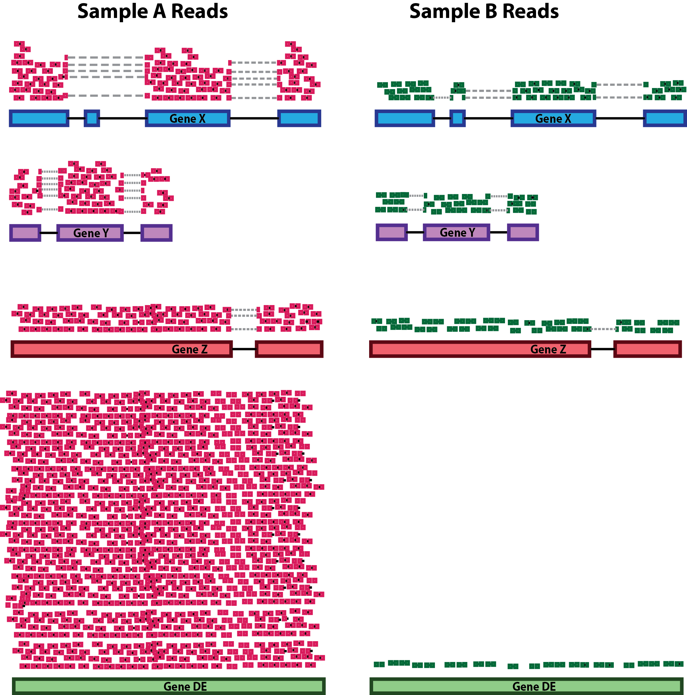
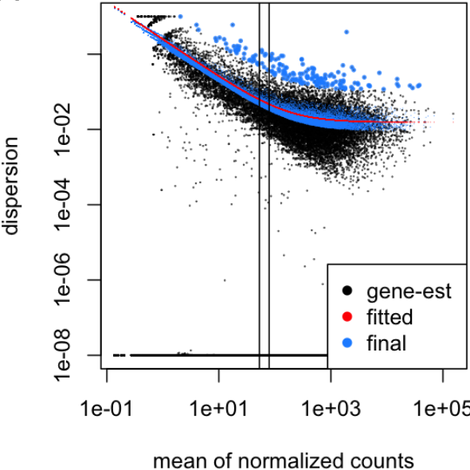
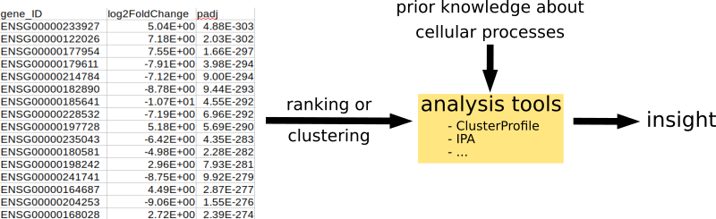

## Goals: DESeq2 workflow
- repeat: generaing DESeq-object (data, metadata, design)
- filtering: samples and genes
- transformations: normalization and sizefactors
- modeling: variance + dispersion
- statistical tests
- extracting results

## Preparation (Repeat)

### Load Libraries
``` {r load_libraries}
suppressPackageStartupMessages({
library("tidyverse")
library("DESeq2")
library("pheatmap")
library("ashr")
})
```

### Load data
```{r load_data}
data <- readr::read_tsv("data/myeloma/myeloma_counts.tsv")

data <- data %>% 
  column_to_rownames(var="gene_id") %>%
  mutate(across(where(is.double), as.integer))

data %>% str()
data %>% dim()
data %>% head()
```

### Load Metadata
```{r load_meta_data}

metadata <- readr::read_tsv("data/myeloma/myeloma_meta.tsv")

metadata <- metadata %>% 
  mutate(celltype = factor(celltype)) %>%
  mutate(condition = factor(condition)) %>%
  column_to_rownames("sample")  

metadata %>% str()
metadata %>% dim()
metadata %>% head()

#check if the col and rows are in the same order:
all(rownames(metadata) == colnames(data))

# Convert to factors
metadata$celltype <- metadata$celltype %>% as.factor()
metadata$condition <- metadata$condition %>% as.factor()
```

### Create Design
```{r create_design}
my_design <- ~celltype + condition
```

### Create DESeq Object
```{r create_deseq_object}
dds <- DESeqDataSetFromMatrix(countData=data, colData=metadata, design=my_design)

class(dds)
dim(dds)
```

### First Inspection (PCA)

Previously you noticed that the PCA shows a problem with our data. 

```{r old_PCA, out.width = '80%', fig.align="center"}

# define function (see day 1)
myPlotPCA = function(dds, nt=500) {
  M <- counts(dds)                 # get counts from dds
  Mt <- log2(M + 1)                # a simple (and fast) transformation
  ann <- data.frame(colData(dds))  # get annotations from colData = metadata
  cn_col <- c("#1B9E77", "#D95F02", "#7570B3")   # condition colours
  names(cn_col) <- levels(ann$condition) # name the color vector

  top <- Mt %>% rowVars() %>% order(decreasing=TRUE) %>% head(nt)  # calculate variance for each row and sort
  pca <- Mt[top,] %>% t() %>% prcomp(scale=TRUE)                    # perform PCA

  rld_PCA <- as.data.frame(pca$x[,1:2])                     # only take PC1 and PC2 (column 1 + 2)
  rld_PCA$condition <- ann[rownames(rld_PCA),"condition"]   # add condition label from ann
  rld_PCA$celltype  <- ann[rownames(rld_PCA),"celltype"]    # add celltype label from ann

  ggplot(rld_PCA, aes(PC1, PC2, color=condition, shape=celltype)) +
    geom_point(size=3) +
    scale_colour_manual(values=cn_col)
}


myPlotPCA(dds)
```

> **Poll 1:** Does the PCA show a problem ? What should we do next ?


## Filtering


### Filter Samples - 10 min


**Task**: Filter the problematic samples (columns 1 and 7) from dds object and produce a new PCA plot.

Hint: Although the `dds` object is a more complex data class it also has dimensions assigned -- check `dim(dds)` -- and samples can be un/selected like columns in a standard dataframes.


```{r filter_samples, out.width = '80%', fig.align="center"}
dds_clean <- dds[, -c(1,7)] 
myPlotPCA(dds_clean)
```

### Filter Genes - 10 min

- remove genes (rows) that have very low counts 
- arbitrary threshold: < 1, < 10
- benefits:
  - increase robustness of analysis
  - reduces memory size of 'dds' object => increases the speed
  

**Task 2:** Filter out the genes that have a total amount of only zero or 1 counts.

Hint: Have a look at the output of `dds_clean %>% counts %>% rowSums() %>% head()`

```{r filter_genes}
rs = dds_clean %>% counts %>% rowSums()
dds_clean = dds_clean[rs>1,]
```

 
> **Poll 2** How many samples and genes are left in the filtered data set?


## Relevel Factors - 10 min

**Remember**: factors are used to represent categorical data ! 

Internally they are stored as integers and per default they are sorted *alphanumerically*. 
It may be more convenient to sort them by some user defined order - this is called relevelling

<center>

{width=60%}

</center>

<br>


> **Task** Reorder the condition with 'DMSO' as baseline - 2 min.

Hint: Use the `relevel` function

This is the order of the factors before and after re-arrangement:
```{r rearrange_factors}
#initial factor arrangement:
dds_clean$condition

dds_clean$condition <- relevel(dds_clean$condition, ref='DMSO')
#dds_clean$condition <- factor(dds_clean$condition, levels = c ('DMSO', 'TG', 'AMIL')) # alternatively

dds_clean$condition
```

**Notice:** Per default DESeq2 will make comparisons with respect to the 1st level,
unless specified more explicitly as contrasts.
  

## Preparation Summary
We have now covered the most important preparation steps:

- load library and data
- define DESeq data object
  - count data: `counts()` -- not normalized. data frame of integers
  - meta data: `colData()` -- added data on samples. data frame of numerical or categorical variables
  - design: `design()` -- variables to be modeled. formula will be converted to design matrix with dummy variables
- Filtering & Transformation & Relevel

> This is **before** any statistical analysis ! A real-world analysis would likely be iterative


> **Message**: Document your decisions, parameters, workflows and software versions carefully - use notebooks !


## Break - 10 min

***

## The DESeq workflow (60 min)


dds <- DESeq(dds)

There are several steps to generating differential expression results, and they are wrapped together in the **DESeq()** function. The 3 main steps are of the workflow are:

- Normalization                 - *estimateSizeFactors()*
- estimating gene-wise dispersions        - *estimateDispersions()*
- general linear model fit for each gene and testing - *nbinomWaldTest()*

### a. Normalization

As mentioned yesterday, raw counts cannot be directly used to compare samples. 
To allow comparison we need to normalize. Note that this is also needed for exploratory analysis and visualisation.

A couple of reasons for normalization include:

***

 * sequencing depth.

 

 
***

 * gene length

 

***

* compositional bias

 

***

A number of commonly used normalization techniques:

| method | factors taking into account |
|-------|:-----|
CPM | sequencing depth
RPKM | sequencing depth and gene length
DESeq2 median of ratios | sequencing depth and RNA composition


and many others exist.

Remember that DESeq2 needs **raw counts** as input (upon creating the dds object).


> **Task **: Plot a heatmap of the first 10 rows of your counts (non-normalized), log2 transformed counts, and rlog transformed counts (using 'rlog' function from DESeq2').


```{r heatmap_raw}
pheatmap(
  counts(dds) %>% head(10),
  main="Raw",
  cluster_cols=FALSE,
  cluster_rows=FALSE
)
```


```{r heatmap_log2}
log2counts <- log2(counts(dds) + 1)
pheatmap(
  log2counts %>% head(10),
  main='log2 transformed counts',
  cluster_cols=FALSE,
  cluster_rows=FALSE
)
```

```{r heatmap_log2}
rld <- rlog(dds, blind=TRUE)
pheatmap(
  assay(rld) %>% head(10),
  main="rlog normalized counts",
  cluster_cols=FALSE,
  cluster_rows=FALSE
)
```

Plot log2 transformed vs rlog normalized counts.

```{r rlog vs log2}
ggplot() +
  geom_point(
    aes(
      x=assay(rld) %>% data.frame() %>% pull("JJ_CTRL_1"),
      y=log2counts %>% data.frame() %>% pull('JJ_CTRL_1')
    )
  ) +
  theme_minimal() +
  xlab("rlog") +
  ylab("log2")

```


## 4. Differential expression analysis - 30 min

### a. Modeling count data.

Why is modeling needed ?

```{r plotcounts}
ggplot(data=counts(dds) %>% data.frame()) +
  geom_histogram(
    aes(x=JJ_CTRL_1),
    stat='bin', bins=200
  ) +
  theme_minimal()

```

Recall that:

 * Most genes have no counts (0-inflation)
 * very large range of values

Even a non-trained eye can see that this is not normally distributed, so what distribution do we use ?
For count data in general:

 * Binomial distribution: e.g. number of heads upon tossing a coin n times.
 * Poisson distribution: ~= binomial though n = infinite and event is very small (e.g. lottery). Appropriate for data where mean == variance

In RNA-seq data we have a very large number of RNA molecules, finding a particular gene ~= winning the lottery ?

```{r mean vs variance}
means <- counts(dds) %>% data.frame() %>% select("BM_AMIL_1", "BM_AMIL_2", "BM_AMIL_3") %>% apply(1, mean)
vars <- counts(dds) %>% data.frame() %>% select("BM_AMIL_1", "BM_AMIL_2", "BM_AMIL_3") %>% apply(1, var)
ggplot(data.frame(means,vars)) +
  geom_point(size=0.5, aes(x=means, y=vars)) +
  scale_y_log10(limits=c(1,1e8)) +
  scale_x_log10(limits=c(1,1e8)) +
  geom_abline(intercept = 0, slope = 1, color="red") +
  theme_minimal()
```

> **Poll 2.2 **: what kind of distribution would be the most appropriate for this data ?


A few remarks:

 * Mean != variance
 * higher expressed genes tend to have higher variances
 * the variance in the 'lower expressed regions' is quite scattered

"heteroscedasticity"

If we would have money (and time) for a very large number of replicates, the high expression data points would move closer to the red line -> Poisson.

In practice, we stick to the negative binomial distribution as it's a good approximation for data where mean < variance

```


### 4.3. Dispersions - 15 min

Within group variability (e.g. between replicates) is modeled by parameter `α`, which describes variance of counts with: `Var = μ + α*μ^2`, where `α` = dispersion, `Var` = variance, and `μ` = mean. 
Accurate estimation of `α` is critical:

- not a problem for large studies with many samples and replicates 

- but usually we only have 2-3 replicates => highly variable `α` estimates for each gene.

\
\
\

> **Task 7:** Visualize the dispersion in your analysis using the following functions: ```dds <- estimateDispersions(dds)``` and ```plotDispEsts(dds)```

```{r, echo=FALSE, results = 'hide', message=FALSE}
dds_clean <- estimateDispersions(dds_clean)
#plotDispEsts(dds_clean)
```

\
\
\


<br>

<center>

{width=80%}

</center>

<br>


\

- count data for each gene separately => get preliminary gene-wise dispersion estimates using maximum-likelihood estimation (black dots)

- fit the dispersion trend (red line)

- combine the likelihood with the trended prior to get a maximum *a posteriori* (MAP) values = final dispersion estimates (blue dots)

\

Bad examples of dispersion plots:

<br>

<center>

{width=80%}

</center>

<br>

\
\


### 4.4. Wald test
- gene-wise dispersion by fitting a negative binomial general linear model (GLM) to the data and then returning the results using Wald statistics (**nbinomWaldTest**) > tomorrow
- default parameters: obtain DE genes for the last variable in the design formula ('TG/DMSO')


> **Task 8:** Please run the DESeq() function on the dds object to do the DE analysis:

```{r run_DE, message=FALSE}
dds_clean <- DESeq(dds_clean)
```

\
\
\

## 5. Extracting results - 10 min

\

To extract the results, use: 

```
# default use gives results only for the last variable in the design formula (in this case 'TG/DMSO')
dds_res <- results(dds)

# complex use to extract the specified contrast: (DO NOT RUN THIS!)
resultsName(dds)
dds_res <- results(dds, contrast)
```

it gives you the **log2 fold changes** and the **adjusted p-values** for the specified contrasts (the estimates are of the logarithmic fold change log2(treated/untreated). In our case it will AMIL/DMSO and TG/DMSO.


> **Task 9:** Please run the results() function on the dds object:

```{r results_DE}
dds_res <- results(dds_clean)
dds_res
```


- baseMean: mean of normalized counts for all samples
- **log2FoldChange: log2 fold change**
- lfcSE: standard error
- stat: Wald statistic
- pvalue: Wald test p-value
- **padj: BH adjusted p-values**

\

> **Discussion:** What are the NA values in the 'padj' column?

\
\


- how many genes do we get with padj < 0.05?

```{r}
table(dds_res$padj < 0.05)
```

- sort the list to have at the top the genes with the lowest padj values:

```{r}
dds_res.1 <- subset(dds_res, padj < 0.1)                 # find all rows that have a padj < 0.1; helps to remove the NAs and insignificant values
dds_res_ordered <- dds_res.1[order(dds_res.1$padj),]     # sort the subset
```

\
\
\


## 6. Exporting results and further analyses - 15 min

\


- why export data?

<br>

<center>

{width=80%}

</center>

<br>


- you can save your results in a 'tsv' file:

> **Task 9:** Please export your data as a tsv:

```{r export_results}
# change the location of the saved file!!
write.table(dds_res_ordered, file="day2_results.tsv", col.names=T, row.names = T, sep = "\t", quote=F)  #tab-sep
#write.csv(dds_res_ordered, file=wfile, row.names=TRUE)                                      #comma-sep
```

\

- use the exported data for downstream analysis: 
  - shiny apps on  MPI-IE website:

<br>

<center>

{width=80%}

</center>

<br>


  - ClusterProfiler:

<br>

<center>

{width=80%}

</center>

<br>
 
  - Ingenuity Pathway Analysis (IPA): tool to help interprete and analyze omics data (e.g. functional enrichment of DEGs)
  
<br>

<center>

{width=80%}

</center>

<br>


> **Task 10:** Please reorder factors with 'AMIL' as baseline, for next day's analysis - 2 min

```{r rearr_back, echo = FALSE}
dds$condition <- relevel(dds$condition, ref='AMIL')
```
