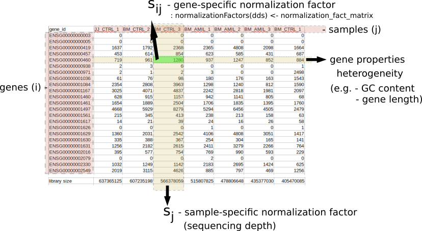

## Goals: DESeq2 workflow
- repeat: generaing DESeq-object (data, metaadata, design)
- filtering: samples and genes
- transformations: normalization and sizefactors
- modelling: variance + dispersion
- statistical tests
- extracting the results

## Preparation (Repeat)

### Load Libraries
``` {r load_libraries}
suppressPackageStartupMessages({
library("tidyverse")
library("DESeq2")
library("pheatmap")
library("ashr")
})
```

### Load data
```{r load_data}
data <- readr::read_tsv("data/myeloma/myeloma_counts.tsv")

data <- data %>% 
  column_to_rownames(var="gene_id") %>%
  mutate(across(where(is.double), as.integer))

data %>% str()
data %>% dim()
data %>% head()
```

### Load Metadata
```{r load_meta_data}

metadata <- readr::read_tsv("data/myeloma/myeloma_meta.tsv")

metadata <- metadata %>% 
  mutate(celltype = factor(celltype)) %>%
  mutate(condition = factor(condition)) %>%
  column_to_rownames("sample")  

metadata %>% str()
metadata %>% dim()
metadata %>% head()

#check if the col and rows are in the same order:
all(rownames(metadata) == colnames(data))
```

### Create Design
```{r create_design}
my_design <- ~celltype + condition
```

### Create DESeq Object
```{r create_deseq_object}
dds <- DESeqDataSetFromMatrix(countData=data, colData=metadata, design=my_design)

class(dds)
dim(dds)
```

### First Inspection (PCA)

Previously you noticed that the PCA shows a problem with our data. 

```{r old_PCA, out.width = '80%', fig.align="center"}

# define function (see day 1)
myPlotPCA = function(dds, nt=500) {
  M <- counts(dds)                 # get counts from dds
  Mt <- log2(M + 1)                # a simple (and fast) transformation
  ann <- data.frame(colData(dds))  # get annotations from colData = metadata
  cn_col <- c("#1B9E77", "#D95F02", "#7570B3")   # condition colours
  names(cn_col) <- levels(ann$condition) # name the color vector

  top <- Mt %>% rowVars() %>% order(decreasing=TRUE) %>% head(nt)  # calculate variance for each row and sort
  pca <- Mt[top,] %>% t() %>% prcomp(scale=TRUE)                    # perform PCA

  rld_PCA <- as.data.frame(pca$x[,1:2])                     # only take PC1 and PC2 (column 1 + 2)
  rld_PCA$condition <- ann[rownames(rld_PCA),"condition"]   # add condition label from ann
  rld_PCA$celltype  <- ann[rownames(rld_PCA),"celltype"]    # add celltype label from ann

  ggplot(rld_PCA, aes(PC1, PC2, color=condition, shape=celltype)) +
    geom_point(size=3) +
    scale_colour_manual(values=cn_col)
}


myPlotPCA(dds)
```

> **Poll 1:** Does the PCA show a problem ? What should we do next ?


## Filtering


### Filter Samples - 10 min


**Task**: Filter the problematic samples (columns 1 and 7) from dds object and produce a new PCA plot.

Hint: Although the `dds` object is more complex data class it also has dimensions assigned -- check `dim(dds)` -- and samples can be un/selected like columns in a standard dataframes.


```{r filter_samples, out.width = '80%', fig.align="center"}
dds_clean <- dds[, -c(1,7)] 
myPlotPCA(dds_clean)
```

### Filter Genes - 10 min

- remove genes (rows) that have very low counts 
- arbitrary threshold: < 1, < 10
- benefits:
  - increase robustness of analysis
  - reduces memory size of 'dds' object => increases the speed
  

**Task 2:** Filter out the genes that have a total amount of only zero or 1 counts.

Hint: Have a look at the output of `dds_clean %>% counts %>% rowSums() %>% head()`

```{r filter_genes}
rs = dds_clean %>% counts %>% rowSums()
dds_clean = dds_clean[rs>1,]
```

 
> **Poll 2** How many samples and genes are left in the filtered data set?


## Relevel Factors - 10 min

**Remember**: factors are used to represent categorical data ! 

Internally they are stored as integers and per default they are sorted *alphanumerically*. 
It may be more convenient to sort them by some user defined order - this is called relevelling

<center>

{width=60%}

</center>

<br>


> **Task** Reorder the condition with 'DMSO' as baseline - 2 min.

Hint: Use the `relevel` function

This is the order of the factors before and after re-arrangement:
```{r rearrange_factors}
#initial factor arrangement:
dds_clean$condition

dds_clean$condition <- relevel(dds_clean$condition, ref='DMSO')
#dds_clean$condition <- factor(dds_clean$condition, levels = c ('DMSO', 'TG', 'AMIL')) # alternatively

dds_clean$condition
```

**Notice:** Per default DESeq2 will make comparisons with respect to the 1st level,
unless specified more explicitly as contrasts.
  

## Preparation Summary
We have now covered the most important preparation steps:

- load library and data
- define DESeq data object
  - count data: `counts()` -- not normalized. data frame of integers
  - meta data: `colData()` -- added data on samples. data frame of numerical or categorical variables
  - design: `design()` -- variables to be modeled. formula will be converted to design matrix with dummy variables
- Filtering & Transformation & Relevel

> This is **before** any statistical analysis ! A real-world analysis would likely be iterative


> **Message**: Document your decisions, parameters, workflows and software versions carefully - use notebooks !


## Break - 10 min

\
\
\

## 3.  Data exploration, visualization and QC  - 20 min

To explore your data further and to create informative, easy to interpret visualizations, the data needs to be transformed before plotting. 

\

### Data transformation: log and rlog

DESeq2 needs as input **raw counts** for statistical testing, but for some stages of visualization or downstream analysis, you need **transformed data**. 

a) **logarithmic data** - mostly in visualization because it reduces the large dynamic range of the data (usually log2(count+1)).

> **Task 4.a):** Do a logarithmic transformation of the first 4 samples (columns) and look only at the output before and after, only for the first 4 samples

```
# look at the first rows of the counts of the first 4 samples from the dds object
# transform the *dds counts* using a log() function
# look at the first rows of first 4 samples from the transformed data
```

```{r log, message=FALSE}
print('dataset with counts before transformation (raw counts):' )  
counts(dds_clean)[,1:4] %>% head(n=3)

print('dataset with counts after logarithmic transformation:' )  
counts(dds_clean)[,1:4] %>% log(base=2) %>% head(n=3)
```

\
\

b) **Regularized logarithm (RLOG)** transform takes in consideration prior information about all the samples in the experiment. It is slower.

> **Task 4.b):** Do a rlog transformation of the first 4 samples (columns) of the dds object and look at the output 

```
# transform the *dds object* using the rlog() function
# look at the first rows of first 4 samples from the transformed data
```

```{r rlog, echo = FALSE, message=FALSE}
print('dataset with counts after RLOG transformation:' )  
#rld_clean <- rlog(dds_clean, blind = TRUE)
rld_clean <- dds_clean %>% rlog(blind = TRUE)
assay(rld_clean)[,1:4] %>% head(n=3)
```

\
\
\

```{r logs_plot, fig.show="hold", out.width = '50%'}
counts(dds_clean)[,c(3,10)] %>% plot()

counts(dds_clean)[,c(3,10)] %>% log(base=2) %>% plot()
assay(rld_clean)[,c(3,10)] %>% plot()               # 'assay()' allows you to extract the counts from the 'rld' object
```

\
\
\

Where can we see the difference between the log and rlog transform?
```{r diff_log_vst_rlog, out.width = '60%', fig.align="center"}
df1 <- data.frame(rlg_base2=log2(counts(dds_clean)[, 1]+1))
df2 <- data.frame(rlg=assay(rld_clean)[, 1])

df <- merge(df1, df2, by=0) # merge the 2 dataframes by rownames

df %>% ggplot(aes(x=rlg_base2, y=rlg)) +
      geom_point(size=1, shape=3) +
      ggtitle("Comparing 'log2(n+1)' and 'rlog' data transformation") +
      xlab("log2(n+1) transformation") + ylab("rlog transformation") +
      theme(plot.title = element_text(hjust=0.5))
```

\
\
\

Does it make a difference to the visualizations?

```{r ploc, fig.show="hold", out.width = '50%'}
th <- data.frame(round(log(counts(dds_clean)+1)))

th.pca <- prcomp(t(th))
pca_data_perc=round(100*th.pca$sdev^2/sum(th.pca$sdev^2),1)

df_pca_data=data.frame(PC1 = th.pca$x[,1], PC2 = th.pca$x[,2], sample = colData(dds_clean)$celltype, condition=colData(dds_clean)$celltype)  #! !Extract the needed info from dds with colData instead of using the 'metadata' ('metadata' needs to be corrected too if you drop samples!)

df_pca_data %>% ggplot(aes(PC1, PC2, color=sample)) +
  geom_point(size=3) +
  geom_text(x = 0, y = -1, label="PCA done with log(n+1) transformation", color="black", size=5) +
  xlab(paste0("PC1: ",pca_data_perc[1])) +
  ylab(paste0("PC2: ",pca_data_perc[2]))

#############################
rld_new3 <- rlog(dds_clean, blind = TRUE) %>% plotPCA(intgroup='celltype', returnData=TRUE)  # 'plotPCA' is a DESeq2 function used for plotting transformed data; can use ggplot code you learned yesterday
percentVar <- round(100 * attr(rld_new3, "percentVar"), 1)   # rounded values for each axis of PC variance

rld_new3 %>% ggplot(aes(PC1, PC2, color=celltype)) +
  geom_point(size=3) +
  geom_text(x = 0, y = -1, label="PCA done with rlog transformation", color="black", size=5) +
  xlab(paste0("PC1: ",percentVar[1])) +
  ylab(paste0("PC2: ",percentVar[2]))

##ref: https://www.biostars.org/p/289333/
```


\
\
\

## 4. Differential expression analysis - 30 min

```
dds <- DESeq(dds)
```

There are several steps to generating the DE results, and they are wrapped together in the **DESeq()** function. The 3 main steps are estimations of:

- estimating size factors                 - *estimateSizeFactors()*
- estimating gene-wise dispersions        - *estimateDispersions()*
- general linear model fit for each gene and testing - *nbinomWaldTest()*

\ 
\

### 4.1. Modeling count data - 15 min

**Why is modeling needed?** 

<br>

<center>

{width=80%}

</center>

<br>

\
\
\

- data can be modeled with various distributions depending on its properties.

- terms:
  - mean of the group: the average value of a sample
  - variance: the expectation of the squared deviation (stdev^2) of a variable from its population mean. 

What properties can you attribute to RNA-seq data?

```{r print_out, echo=FALSE, comment=''}
cat('RNAseq data is: \n   - discrete (counts) \n   - very large number of RNAs are represented and the probability of pulling out a particular transcript is very small \n   - variance is higher than mean')
```

\
\

> **Poll 3**: what kind of distribution would you use for count data?

\
\
\

> **Task 4:** Please plot the mean vs the variance of the genes. Use the following code as guide 

```
#calculate the mean and the variance for each gene (the code for the mean is given bellow)
mean_counts <- apply(counts(dds)[,6:8], 1, mean) 

# plot mean vs variance using plot() and smoothScatter()
```

\ 

```{r mean_vs_variation2, warning=FALSE, out.width = '40%', fig.show='hold'}
op <- par( mar=c(2.3, 0, 0.3, 0), pty="s", fig=c(0, 1, 0, 1), oma=c(0, 0, 0, 0))

mean_counts <- apply(counts(dds_clean)[,3:5], 1, mean)        # '1' means that the function 'apply' is applied to rows.

variance_counts <- apply(counts(dds_clean)[,3:5], 1, var)

plot(log10(mean_counts), log10(variance_counts), xlim=c(-1, 10), ylim=c(-1, 10))
abline(0,1, col="red")

smoothScatter(log10(mean_counts), log10(variance_counts), xlim=c(-1, 10), ylim=c(-1, 10))
abline(0,1, col="red")

par(op)
```


- for genes with high mean expression, the variance across replicates tends to be greater that the mean => use a **negative binomial** distribution
- for genes with low mean expression, there is a large scatter = hetero-scedasti-city = for a given expression level in the low range, we obs a lot of variability in the variance values.


\
\
\


### 4.2. Size factors - 20 min

- sequencing depth - the ratio between the total nr of bases and the size of the genome; the avg nr of times each base is measured in the genome

\
 
 
<br>

<center>

{width=80%}

</center>

<br>


\
 
- composition bias - e.g. if there are just a few highly expressed genes dominating in some of your samples
- normalization 

\
 
<br>

<center>

{width=80%}

</center>

<br>
 
 
\

> **Task 6.a):** Please print out the sizes of each sample (hint: library size is the sum of all counts)

\

```{r size_libraries, echo=FALSE, results = 'hide'}
colSums(counts(dds))
```

\
\

How to calculate size factors in DESeq2?


```{r size_factors}
dds_clean <- estimateSizeFactors(dds_clean)
sizeFactors(dds_clean)
```


> **Task 6.b):** Please print out the sizes of each sample after normalization

```{r normalized, echo=FALSE, results = 'hide'}
colSums(counts(dds_clean, normalized=T))
```

> **Discuss**: Can the size factors be used as quality control? At what value of the size factors should you go back and look at your data?

\
\
\

NOTE: 'DESeq()' function estimates size factors automatically. But if you *run `estimateSizeFactors()`* or another function to estimate factors *before `DESeq()`*, those calculated values would be used instead. 

Why can you do this in 2 different ways? So you can integrate various methods to compensate for sources of bias within the DESeq2 workflow (e.g. *cqn*, *EDASeq*, etc)


<br>

<center>

{width=80%}

</center>

<br>


\ 

### 4.3. Dispersions - 15 min

Within group variability (e.g. between replicates) is modeled by parameter `α`, which describes variance of counts with: `Var = μ + α*μ^2`, where `α` = dispersion, `Var` = variance, and `μ` = mean. 
Accurate estimation of `α` is critical:

- not a problem for large studies with many samples and replicates 

- but usually we only have 2-3 replicates => highly variable `α` estimates for each gene.

\
\
\

> **Task 7:** Visualize the dispersion in your analysis using the following functions: ```dds <- estimateDispersions(dds)``` and ```plotDispEsts(dds)```

```{r, echo=FALSE, results = 'hide', message=FALSE}
dds_clean <- estimateDispersions(dds_clean)
#plotDispEsts(dds_clean)
```

\
\
\


<br>

<center>

{width=80%}

</center>

<br>


\

- count data for each gene separately => get preliminary gene-wise dispersion estimates using maximum-likelihood estimation (black dots)

- fit the dispersion trend (red line)

- combine the likelihood with the trended prior to get a maximum *a posteriori* (MAP) values = final dispersion estimates (blue dots)

\

Bad examples of dispersion plots:

<br>

<center>

{width=80%}

</center>

<br>

\
\


### 4.4. Wald test
- gene-wise dispersion by fitting a negative binomial general linear model (GLM) to the data and then returning the results using Wald statistics (**nbinomWaldTest**) > tomorrow
- default parameters: obtain DE genes for the last variable in the design formula ('TG/DMSO')


> **Task 8:** Please run the DESeq() function on the dds object to do the DE analysis:

```{r run_DE, message=FALSE}
dds_clean <- DESeq(dds_clean)
```

\
\
\

## 5. Extracting results - 10 min

\

To extract the results, use: 

```
# default use gives results only for the last variable in the design formula (in this case 'TG/DMSO')
dds_res <- results(dds)

# complex use to extract the specified contrast: (DO NOT RUN THIS!)
resultsName(dds)
dds_res <- results(dds, contrast)
```

it gives you the **log2 fold changes** and the **adjusted p-values** for the specified contrasts (the estimates are of the logarithmic fold change log2(treated/untreated). In our case it will AMIL/DMSO and TG/DMSO.


> **Task 9:** Please run the results() function on the dds object:

```{r results_DE}
dds_res <- results(dds_clean)
dds_res
```


- baseMean: mean of normalized counts for all samples
- **log2FoldChange: log2 fold change**
- lfcSE: standard error
- stat: Wald statistic
- pvalue: Wald test p-value
- **padj: BH adjusted p-values**

\

> **Discussion:** What are the NA values in the 'padj' column?

\
\


- how many genes do we get with padj < 0.05?

```{r}
table(dds_res$padj < 0.05)
```

- sort the list to have at the top the genes with the lowest padj values:

```{r}
dds_res.1 <- subset(dds_res, padj < 0.1)                 # find all rows that have a padj < 0.1; helps to remove the NAs and insignificant values
dds_res_ordered <- dds_res.1[order(dds_res.1$padj),]     # sort the subset
```

\
\
\


## 6. Exporting results and further analyses - 15 min

\


- why export data?

<br>

<center>

{width=80%}

</center>

<br>


- you can save your results in a 'tsv' file:

> **Task 9:** Please export your data as a tsv:

```{r export_results}
# change the location of the saved file!!
write.table(dds_res_ordered, file="day2_results.tsv", col.names=T, row.names = T, sep = "\t", quote=F)  #tab-sep
#write.csv(dds_res_ordered, file=wfile, row.names=TRUE)                                      #comma-sep
```

\

- use the exported data for downstream analysis: 
  - shiny apps on  MPI-IE website:

<br>

<center>

{width=80%}

</center>

<br>


  - ClusterProfiler:

<br>

<center>

{width=80%}

</center>

<br>
 
  - Ingenuity Pathway Analysis (IPA): tool to help interprete and analyze omics data (e.g. functional enrichment of DEGs)
  
<br>

<center>

{width=80%}

</center>

<br>


> **Task 10:** Please reorder factors with 'AMIL' as baseline, for next day's analysis - 2 min

```{r rearr_back, echo = FALSE}
dds$condition <- relevel(dds$condition, ref='AMIL')
```
