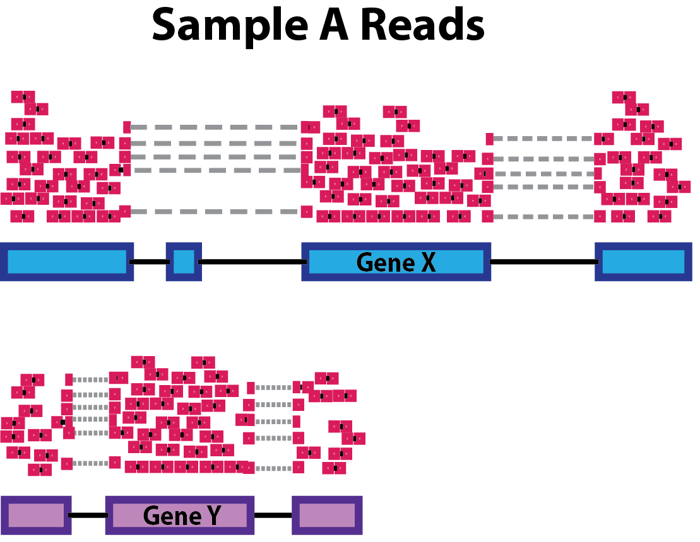

## Goals: DESeq2 workflow
- repeat: generating DESeq-object (data, metadata, design)
- filtering: samples and genes
- transformations: normalization and sizefactors
- modeling: variance + dispersion
- statistical tests
- extracting results

## Preparation (Repeat)

### Load Libraries
``` {r load_libraries}
suppressPackageStartupMessages({
library("tidyverse")
library("DESeq2")
library("pheatmap")
library("ashr")
})
```

### Load data
```{r load_data}
data <- readr::read_tsv("data/myeloma/myeloma_counts.tsv")

data <- data %>% 
  column_to_rownames(var="gene_id") %>%
  mutate(across(where(is.double), as.integer))

data %>% str()
data %>% dim()
data %>% head()
```

### Load Metadata
```{r load_meta_data}

metadata <- readr::read_tsv("data/myeloma/myeloma_meta.tsv")

metadata <- metadata %>% 
  mutate(celltype = factor(celltype)) %>%
  mutate(condition = factor(condition)) %>%
  column_to_rownames("sample")  

metadata %>% str()
metadata %>% dim()
metadata %>% head()

#check if the col and rows are in the same order:
all(rownames(metadata) == colnames(data))

# Convert to factors
metadata$celltype <- metadata$celltype %>% as.factor()
metadata$condition <- metadata$condition %>% as.factor()
```

### Create Design
```{r create_design}
my_design <- ~celltype + condition
```

### Create DESeq Object
```{r create_deseq_object}
dds <- DESeqDataSetFromMatrix(countData=data, colData=metadata, design=my_design)

class(dds)
dim(dds)
```

### First Inspection (PCA)

Previously you noticed that the PCA shows a problem with our data. 

```{r old_PCA, out.width = '80%', fig.align="center"}

# define function (see day 1)
myPlotPCA = function(dds, nt=500) {
  M <- counts(dds)                 # get counts from dds
  Mt <- log2(M + 1)                # a simple (and fast) transformation
  ann <- data.frame(colData(dds))  # get annotations from colData = metadata
  cn_col <- c("#1B9E77", "#D95F02", "#7570B3")   # condition colours
  names(cn_col) <- levels(ann$condition) # name the color vector

  top <- Mt %>% rowVars() %>% order(decreasing=TRUE) %>% head(nt)  # calculate variance for each row and sort
  pca <- Mt[top,] %>% t() %>% prcomp(scale=TRUE)                    # perform PCA

  rld_PCA <- as.data.frame(pca$x[,1:2])                     # only take PC1 and PC2 (column 1 + 2)
  rld_PCA$condition <- ann[rownames(rld_PCA),"condition"]   # add condition label from ann
  rld_PCA$celltype  <- ann[rownames(rld_PCA),"celltype"]    # add celltype label from ann

  ggplot(rld_PCA, aes(PC1, PC2, color=condition, shape=celltype)) +
    geom_point(size=3) +
    scale_colour_manual(values=cn_col)
}


myPlotPCA(dds)
```

> **Poll 2.1:** What should we do next ?


## Filtering


### Filter Samples - 10 min


**Task**: Filter the problematic samples (columns 1 and 7) from dds object and produce a new PCA plot.

Hint: Although the `dds` object is a more complex data class it also has dimensions assigned -- check `dim(dds)` -- and samples can be un/selected like columns in a standard dataframes.


```{r filter_samples, out.width = '80%', fig.align="center"}
dds_clean <- dds[, -c(1,7)] 
myPlotPCA(dds_clean)
```

### Filter Genes - 10 min

- remove genes (rows) that have very low counts 
- arbitrary threshold: < 1, < 10
- benefits:
  - increase robustness of analysis
  - reduces memory size of 'dds' object => increases the speed
  

**Task** Filter out the genes that have a total amount of only zero or 1 counts.

Hint: Have a look at the output of `dds_clean %>% counts %>% rowSums() %>% head()`

```{r filter_genes}
rs = dds_clean %>% counts %>% rowSums()
dds_clean = dds_clean[rs>1,]
```

 
> **Poll 2.2** How many samples and genes are left in the filtered data set?


## Relevel Factors - 10 min

**Remember**: factors are used to represent categorical data ! 

Internally they are stored as integers and per default they are sorted *alphanumerically*. 
It may be more convenient to sort them by some user defined order - this is called relevelling

<center>

{width=60%}

</center>

<br>


> **Task** Reorder the condition with 'DMSO' as baseline - 2 min.

Hint: Use the `relevel` function

This is the order of the factors before and after re-arrangement:
```{r rearrange_factors}
#initial factor arrangement:
dds_clean$condition

dds_clean$condition <- relevel(dds_clean$condition, ref='DMSO')
#dds_clean$condition <- factor(dds_clean$condition, levels = c ('DMSO', 'TG', 'AMIL')) # alternatively

dds_clean$condition
```

**Notice:** Per default DESeq2 will make comparisons with respect to the 1st level,
unless specified more explicitly (contrasts, see tomorrow).
  

## Preparation Summary
We have now covered the most important preparation steps:

- load library and data
- define DESeq data object
  - count data: `counts()` -- not normalized. data frame of integers
  - meta data: `colData()` -- added data on samples. data frame of numerical or categorical variables
  - design: `design()` -- variables to be modeled. formula will be converted to design matrix with dummy variables
- Filtering & Transformation & Relevel

> This is **before** any statistical analysis ! A real-world analysis would likely be iterative


> **Message**: Document your decisions, parameters, workflows and software versions carefully - use notebooks !


## Break - 10 min

***

## The DESeq workflow (60 min)

Everything we did until now was before any statistical analysis. 
Quite some work stil needs to happen. Luckily, our life is made easy (again), as DESeq2 wrap up the rest in one convenient function:

> dds <- DESeq(dds)

```{r run deseq2}
dds_clean <- DESeq(dds_clean)
```


There are several steps to generating differential expression results, and they are wrapped together in the **DESeq()** function. The 3 main steps are of the workflow are:

- Normalization                 - *estimateSizeFactors()*
- estimating dispersions        - *estimateDispersions()*
- general linear model fit for each gene and testing - *nbinomWaldTest()*

### a. Normalization

As mentioned yesterday, raw counts cannot be directly used to compare samples. 
To allow comparison we need to normalize. Note that this is also needed for exploratory analysis and visualisation.

A couple of reasons for normalization include:

***

 *sequencing depth*

{width=50%}

 
***

 *gene length*

{width=35%}

***

*compositional bias*

{width=50%}

***

A number of commonly used normalization techniques:

| method | factors taking into account |
|-------|:-----|
CPM | sequencing depth
RPKM | sequencing depth and gene length
DESeq2 median of ratios | sequencing depth and RNA composition

Workflow for the 'median of ratios':

 * Take geometric mean per gene (of all samples!) -> 'pseudosample'
 * calculate the count / pseudosample ratio
 * 'sizefactor' == median(ratios) 

and many others exist.

Remember that DESeq2 needs **raw counts** as input (upon creating the dds object).


> **Task **: Plot a heatmap of the first 10 rows of your counts (non-normalized), deseq normalized counts and if you are up for some manual labour, sequencing depth normalized counts.

Hint, counts() can return DESeq normalized counts as well with the argument normalized=TRUE!
Hint2: geometric mean of a vector x can be calculated with exp(mean(log(x)))


```{r heatmap_raw}

ann <- data.frame(colData(dds_clean))
ann$seq_depth <- counts(dds_clean) %>% colSums()/1e6    # sequencing depth in millions 

pheatmap(
  counts(dds_clean) %>% head(10),
  main="Raw",
  cluster_cols=FALSE,
  cluster_rows=FALSE,
  annotation=ann
)
```


```{r heatmap deseq_normalized}
pheatmap(
  counts(dds_clean, normalized=TRUE) %>% head(10),
  main="median of ratios",
  cluster_cols=FALSE,
  cluster_rows=FALSE,
  annotation=ann
)
```

```{r heatmap sequencing_depth}
sfs <- (counts(dds_clean) %>% colSums()) / ((counts(dds_clean) %>% colSums()) %>% log() %>% mean() %>% exp())
ann$sfs <- sfs
pheatmap(
  sweep(counts(dds_clean), 2, sfs, FUN = '/') %>% head(10),
  main="sequencing depth",
  cluster_cols=FALSE,
  cluster_rows=FALSE,
  annotation=ann
)
```

```{r seq depth factors vs median of ratios factors}
ggplot(ann) +
  geom_point(aes(x=sfs, sizeFactor)) +
  geom_abline(intercept = 0, slope = 1, color="red") +
  theme_minimal() +
  xlab("Size factor sequencing depth") +
  ylab("Median of ratios sizefactor")
```

### b. Dispersions

Why do we need to model count data ?

```{r plotcounts}
ggplot(data=counts(dds_clean) %>% data.frame()) +
  geom_histogram(
    aes(x=BM_CTRL_2),
    stat='bin', bins=200
  ) +
  theme_minimal()
```

Recall that:

 * Most genes have no counts (0-inflation)
 * very large range of values

Even a non-trained eye can see that this is not normally distributed, so what distribution do we use ?
For count data in general:

 * Binomial distribution: e.g. number of heads upon tossing a coin n times.
 * Poisson distribution: ~= binomial though n = infinite and event is very small (e.g. lottery). Appropriate for data where mean == variance

In RNA-seq data we have a very large number of RNA molecules, finding a particular gene ~= winning the lottery ?

Let's have a look at the mean and variance of our counts within TG treated BM cells (the replicates).

```{r mean vs variance, warning=FALSE, echo=FALSE}
means <- counts(dds_clean) %>% data.frame() %>% select("BM_TG_1", "BM_TG_2", "BM_TG_3") %>% apply(1, mean)
vars <- counts(dds_clean) %>% data.frame() %>% select("BM_TG_1", "BM_TG_2", "BM_TG_3") %>% apply(1, var)
ggplot(data.frame(means,vars)) +
  geom_point(size=0.5, aes(x=means, y=vars)) +
  scale_y_log10(limits=c(1,1e8)) +
  scale_x_log10(limits=c(1,1e8)) +
  geom_abline(intercept = 0, slope = 1, color="red") +
  theme_minimal()
```

> **Poll 2.3 **: what kind of distribution would be the most appropriate for this data ?


A few remarks:

 * Mean != variance
 * higher expressed genes tend to have higher variances
 * the variance in the 'lower expressed regions' is quite scattered

"heteroscedasticity"

If we would have money (and time) for a very large number of replicates, the high expression data points would move closer to the red line -> Poisson.

In practice, we stick to the negative binomial distribution as it's a good approximation for data where mean < variance

Enter: **Dispersion**

#### gene-wise dispersion estimates

Within group variability (e.g. between replicates) is modeled by parameter `α`, which describes variance of counts with: `Var = μ + α*μ²`, where `α` = dispersion, `Var` = variance, and `μ` = mean. 
Accurate estimation of `α` is critical:

 * not a problem for large studies with many replicates
 * but usually we only have 2-3 replicates => estimates of `α` per gene are usually unreliable (genes with similar means usually have different dispersion values).

What do the dispersions represent ?

 * dispersions are inversely related to the mean
 * directly related to the variance

 (Higher for small mean counts, lower for high mean counts)


#### mean-dispersion relationship & shrinking

DESeq2 shares dispersion information across genes to better estimate variation.
The assumption here is that genes with *similar expression values* have *similar dispersion values*.

```{r plot dispersions}
plotDispEsts(dds_clean)
```

what would be 'bad' dispersion ?

```{r baddisp}
metadata_thrash <- metadata 
metadata_thrash$celltype <- sample(metadata$celltype)
metadata_thrash$condition <- sample(metadata$condition)
dds_thrash <- DESeqDataSetFromMatrix(countData=data, colData=metadata_thrash, design=~celltype+condition+celltype:condition)
dds_thrash <- DESeq(dds_thrash)
plotDispEsts(dds_thrash)
```

Signs of a 'good' dispersion plot:

 * data should scatter around the curve
 * dispersion should decrease with increasing mean of counts
 * 'clouds' or 'wonky shapes' often indicate contamination / outliers


### d. fitting model and testing

Finally we get a fit for each gene, and a Wald test can be used to test for significance of coefficients of interest.

Luckily DESeq2 wraps this in a convenient function as well: *results()*.
By default we obtain DE genes for the last coefficient, though you can specify contrasts to get your comparison of interest (see tomorrow).

> **Task** Please run results() on the dds_clean object and have a look at the result.

```{r results_DE}
dds_res <- results(dds_clean)
dds_res
```

- baseMean: mean of normalized counts for all samples
- **log2FoldChange: log2 fold change**
- lfcSE: standard error
- stat: Wald statistic
- pvalue: Wald test p-value
- **padj: BH adjusted p-values**

> **Poll 2.4:** What does a positive log2 foldChange and a significant padj value reflect ?

- how many genes do we get with padj < 0.05?

```{r sig res}
dds_res %>% subset(padj < 0.05) %>% nrow()
```

- get the 20 significantly expressed genes with the highest log2FoldChange.

```{r sort descending}
dds_res %>% 
  data.frame() %>% 
  subset(padj < 0.05) %>% 
  arrange(abs(log2FoldChange), descending=TRUE) %>% head(20)
```


### e. Exporting results and further analyses

{width=80%}


> **Task**: Please export your results table to a csv / tsv file.

hint: write_tsv, write_csv(), write.table(), write_delim() ,...


```{r export results}
write.table(dds_res %>% data.frame, file="DMSO_vs_TG_BMcells.tsv", col.names=T, row.names = T, sep = "\t", quote=F)
```


shiny apps on  MPI-IE website (https://rsconnect.ie-freiburg.mpg.de/shiny/)

{width=80%}

*Genes2Functions*


{width=80%}


{width=80%}


{width=80%} 
