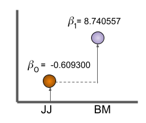
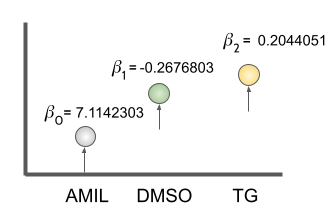
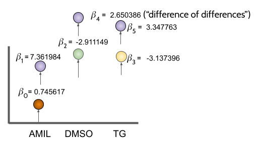

# Goals:
* Different steps of a differential gene expression analysis
  * multi-factor design
  * Normalisation: Estimating size factors (has been explained before)
  * Checking for the dispertion (has been explained before)
  * Building up contrasts
  * Make a results table
  * Summarize and extract a list of significant differentially expressed genes
  * Visualize the results
  * LRT vs. Wald test
  * Biological interpretation

```{r load libraries, message=FALSE, warning=FALSE, paged.print=FALSE}
library("DESeq2")
library("tidyverse")
library("ggrepel")
library("pheatmap")
library("EnsDb.Hsapiens.v75")
library("UpSetR")
library("ashr")
```

```{r read_data, message=FALSE, warning=FALSE}
# Get the data directory
dfile <- "../data/myeloma/myeloma_counts.tsv"
data <- read_tsv(file=dfile)
data <- data %>% column_to_rownames("gene_id") 

# Read samplesheet , detects conditions, generate the formula
mfile <- "../data/myeloma/myeloma_meta.tsv"
metadata <- read_tsv(file=mfile)
metadata <- metadata %>% column_to_rownames("sample") 

metadata$condition <- as.factor(metadata$condition)
metadata$celltype  <- as.factor(metadata$celltype)

metadata

# sanity check
all(rownames(metadata) == colnames(data))
```

# Creating a DDS object. (30 minutes)
## 1. factors and design
A design formula takes all sources of variation to control for (remember day 1).
The first factor is considered as "the factor of interest" to test for during the differential expression testing.

DESeq2 uses the design as a model for each gene, and fits a normalized count based on that. 

## 2. design examples

A single factor with two levels.

|samples |celltype<factor> |
|:-------|:-----|
|sample1 |JJ |
|sample2 |JJ |
|sample3 |BM |
|sample4 |BM |

```{r simplefactordesign}
dds <- DESeqDataSetFromMatrix(countData=data, colData=metadata, design= ~celltype)
dds <- DESeq(dds)
resultsNames(dds)
```

Design:

      ~1+celltype (or ~celltype)
      = beta0 + beta1 * BM

This results in the coefficient for the intercept and coefficient for the effect of “BM” (i.e. differences between BM vs. JJ). 

Each coefficient shows a difference (LFC).

    [1] "Intercept" (beta0)             "celltype_BM_vs_JJ" (beta1)



This can be shown by dummy variables:

|samples | (Intercept) | celltypeBM |
|:-------|:----|:----|
|sample1 |1 | 0 |
|sample2 |1 | 0 |
|sample3 |1 | 1 |
|sample4 |1 | 1 |

Null hypothesis:

    BM vs JJ (AMIL)
    beta1 = 0

***

A single factor with more then two levels.

|samples |condition<factor> |
|:-------|:-----|
|sample1 |AMIL |
|sample2 |AMIL |
|sample3 |DMSO |
|sample4 |DMSO |
|sample5 |TG |
|sample6 |TG |

> **Tasks:** Recreate the dds object, now with a design that incorporates 'condition' (alone!)

> **Poll 3.1** What coefficients do we get when we specify condition alone as a design?

```{r simplefactordesign condition}
dds <- DESeqDataSetFromMatrix(countData=data, colData=metadata, design= ~condition)
dds <- DESeq(dds)
resultsNames(dds)
```

Design:
      ~1+condition
      = beta0 + beta1 * DMSO + beta2 * TG
      beta0 = Intercept
      beta1 = condition_DMSO_vs_AMIL
      beta2 = condition_TG_vs_AMIL



Model matrix:

|samples | (Intercept) | conditionDMSO | condittionTG |
|:-------|:----|:----|:----|
|sample1 |1 | 0 | 0 |
|sample2 |1 | 0 | 0 |
|sample3 |1 | 1 | 0 |
|sample4 |1 | 1 | 0 |
|sample5 |1 | 0 | 1 |
|sample6 |1 | 0 | 1 |

Null hypothesis:

    DMSO vs AMIL
    beta1 = 0

    TG vs AMIL
    beta2 = 0

    DMSO vs TG
    beta1 - beta2 = 0

***

What about celltype and condition?

  * Two factors, with interaction

|samples |celltype<factor> | condition<factor> |
|:-------|:-----|:-----|
|sample1 |JJ |AMIL|
|sample2 |JJ |AMIL|
|sample3 |JJ |DMSO|
|sample4 |JJ |DMSO|
|sample5 |JJ |TG|
|sample6 |JJ |TG|
|sample7 |BM |AMIL|
|sample8 |BM |AMIL|
|sample9 |BM |DMSO|
|sample10 |BM |DMSO|
|sample11 |BM |TG|
|sample12 |BM |TG|

The formula for the model includes all sources of variation in the data. Thus, it should contain the celltype, condition and the difference as the effect of celltype on the condition (celltype:condtion)

Design:

    ~1 + celltype + condition + celltype:condition
    = beta0 + beta1 * BM + beta2 * DMSO + beta3 * TG + beta4 * BM.DMSO + beta4 * BM.TG

      beta0 = Intercept
      beta1 = celltype_BM_vs_JJ
      beta2 = condition_DMSO_vs_AMIL
      beta3 = condition_TG_vs_AMIL
      beta4 = celltypeBM.conditionDMSO
      beta5 = celltypeBM.conditionTG




Null hypothesis:

    BM vs JJ (AMIL)
    beta1 = 0

    BM vs JJ (DMSO)
    beta1 + beta4 = 0

    DMSO vs AMIL (BM):
    beta2 = 0

    TG vs DMSO (BM):
    beta2 + beta3 = 0

    Interaction:
    beta5 = 0
   
**Reminder**: The levels of your factors define which 'baseline' will be used, and thus what coefficients you will have!

* Multi-factor design with increasing complexity are nicely explained in these [slides](https://docs.google.com/presentation/d/1B9zW1_F-kBqQEu4xqxIJrudYP5DecytYMRR6bY4H6aM/edit?usp=sharing)

## 3. Recap

### Build object
```{r build the matrix, message=FALSE, warning=FALSE}
my_design <- as.formula(~celltype + condition + celltype:condition)
# my_design <- ~celltype*condition   # identical alternative

dds <- DESeq2::DESeqDataSetFromMatrix(countData = data, colData = metadata, design = my_design)

# filtering as in day 1 and 2
dds <- dds[, -c(1,7)]                   # sample filtering
dds <- dds[counts(dds) %>% rowSums() > 1, ]  # gene filtering
```

### Size factors
DESeq2 automatically estimates the size factors when performing the differential expression analysis. However, if `estimateSizeFactors()` is called, then DESeq2 will use these values.
To normalize the count data, DESeq2 calculates size factors for each sample using the "median of ratios" method.

```{r estimate size factors, message=FALSE, warning=FALSE}
dds <- estimateSizeFactors(dds)
```

> **Poll 3.2** What is the relation between the size factors and the sequencing depth of a sample?

```{r colsums, message=FALSE, warning=FALSE, eval=FALSE}
seq_depth <- colSums(counts(dds))
plot( sizeFactors(dds),  seq_depth)
```


### Dispersion estimation
DESeq2 uses a measure of variation called dispersion, which accounts for a gene’s variance and mean expression level. Dispersion is calculated by `Var = μ + α*μ^2`, where `α` = dispersion, `Var` = variance, and `μ` = mean
```{r estimate dispersions, message=FALSE, warning=FALSE}
dds <- estimateDispersions(dds)
```

```{r Visualise dispersions, message=FALSE, warning=FALSE}
# Visualise dispersion
plotDispEsts(dds)
```

### Get all the steps for free!
```{r deseq analysis, message=FALSE, warning=FALSE}
dds <- DESeq(dds)
```

# Get some actual results ! (20 min)

## 1. Wald test
By default DESeq2 uses the Wald test to identify genes that are differentially expressed between two groups of samples. This is done through the following steps:
  
  * A regression model fits to each gene (glm.nb),
  * Each gene model coefficient (LFC) is estimated using a maximum likelihood estimation,
  * The shrunken estimate of LFC is divided by its standard error, resulting in a z-statistic,
  * z-statistic is compared to a standard normal distribution to compute the p-values,
  * P values are adjusted for multiple testing using the procedure of Benjamini and Hochberg.

Raw P-value distribution
```{r pvalue, eval=TRUE, message=FALSE, warning=FALSE}
    res.df <- results(dds) %>% data.frame() %>% drop_na
    ggplot(res.df) +
        geom_histogram(aes(res.df$pvalue, fill = "a"), colour = "grey20", alpha = 0.5, stat = "bin") +
        xlab("p-value") +
        # geom_histogram(aes(res.df$padj, fill = "b"), colour = "grey20", alpha = 0.5, stat = "bin") +
        scale_fill_manual(name = "group", values = c("a" = "steelblue"), labels = "p-value") +
        geom_vline(xintercept = 0.05, colour = "red")
```

Adjusted P-value distribution
```{r adjpvalue, eval=TRUE, message=FALSE, warning=FALSE}
    ggplot(res.df) +
        geom_histogram(aes(res.df$padj, fill = "a"), colour = "grey20", alpha = 0.5, stat = "bin") +
        xlab("adj p-value") +
        # geom_histogram(aes(res.df$padj, fill = "b"), colour = "grey20", alpha = 0.5, stat = "bin") +
        scale_fill_manual(name = "group", values = c("a" = "steelblue"), labels = "padj") +
        geom_vline(xintercept = 0.05, colour = "red")
```

A frequently asked question is: 'Why is my padj 'NA' but my p-values are significant ? It's my favorite gene!'

There are three reasons to set p-values to NA (From the [DESeq2 vignette](https://bioconductor.org/packages/release/bioc/vignettes/DESeq2/inst/doc/DESeq2.html#pvaluesNA))
   * within a row, all samples have zero counts
   * a row contains a sample with an extreme count outlier.
   * A row is filtered by automatic filtering

```{r showres}
head(res.df)
```
We have called results here, but what did we actually compare ?

**Reminder**: 

If 'results' is run without specifying 'contrast' or 'name', it will return the comparison of the last level of the last variable in the design formula over the first level of this variable.
For example, for a simple two-group comparison, this would return the log2 fold changes of the second group over the first group (the reference level).

Remember now our coefficients:
```{r showcoeff}
resultsNames(dds)
```

## 2. Contrasts and results

Contrasts are used in our results call to get a specific pairwise comparison.
If there is only two factor levels, There is no need to  specify contrasts, DESeq2 will choose the base factor level based on the alphabetical order of the levels.

Contrasts can be specified in three different ways:

  * a character vector with three elements. c("celltype", "JJ", "BM") (last level == baseline!)
  * A list of 2 character vectors. list(coef1, coef2) (last coef == baseline!)
  * A numerical vector with an element for each coef c(0,0,0,1,0,0)

Let's start with the first option.

```{r contrast, message=FALSE, warning=FALSE}
resultsNames(dds) # to see what names to use
contrast <- c("celltype", "JJ", "BM")
res <- results(dds, contrast = contrast, alpha = 0.05)
class(res)
# What is in the results?
res %>% data.frame() %>% head() %>% drop_na()
```

Columns of results dataframe:

  * baseMean: mean of normalized counts for all samples

  * log2FoldChange: log2 fold change

  * lfcSE: standard error

  * stat: Wald statistic

  * pvalue: Wald test p-value

  * padj: BH adjusted p-values

```{r plot norm_count vs p values}
plot(res$baseMean+1, -log10(res$padj),
     log="x", xlab="mean of normalized counts",
     ylab=expression(-log[10](pvalue)),
     ylim=c(0,30),
     cex=.4, col=rgb(0,0,0,.3))
```

```{r plot l2fc vs p values}
plot(res$log2FoldChange, -log10(res$padj),
     log="x", xlab="mean of normalized counts",
     ylab=expression(-log[10](pvalue)),
     ylim=c(0,30),
     cex=.4, col=rgb(0,0,0,.3))
```


## 3. Shrinking

To generate more accurate log2 foldchange (LFC) estimates, DESeq2 allows for the shrinkage of the LFC estimates toward zero when the information for a gene is low, which could include:

- Low counts
- High dispersion values

LFC shrinkage generates a more accurate estimate.  It looks at the largest fold changes that are not due to low counts and uses these to inform a prior distribution. The genes with little information or high dispersion are then more likely to be assigned to a lower shrunk LFC.

```{r shrink, message=FALSE, warning=FALSE}
# which coef to use?
resultsNames(dds)
res_shrink <- lfcShrink(dds, contrast=contrast, type="ashr")
```

Note that there are three 'built-in' methods for shrinking:
 
 - ashr
 - apeglm -> works *only* with coefficients ! (might have to relevel)
 - normal -> works *only* with design that have no interaction

The specifics about these methods is beyond the scope of this course.

**Recommendation**: ashr works for most (if not all) setups, including contrasts.

```{r MA plot, message=FALSE, warning=FALSE}
# MA plot
plotMA(res, ylim=c(-2,2))
plotMA(res_shrink, ylim=c(-2,2))
```

***
# Break (10 min)
***

# Biological interpretation (60 min)

## 1. Visualisation
  Several ways to visualise the DESeq2 outputs:
  
  * Plot a single gene

    I. Try to plot "ENSG00000164062"
      
```{r visualisation, message=FALSE, warning=FALSE}
# plot a single gene
plotCounts(dds, gene = "ENSG00000164062", intgroup = "celltype")
# To see the data underneath the figure
d <- plotCounts(dds, gene = "ENSG00000164062", intgroup = "celltype", returnData=TRUE)
#d %>% View()
# can be used for ggplot
ggplot(d, aes(x = celltype, y = count, color = celltype)) +
    geom_point(position=position_jitter(w = 0.1,h = 0)) +
    geom_text_repel(aes(label = rownames(d))) +
    theme_bw() +
    ggtitle("ENSG00000164062") +
    theme(plot.title = element_text(hjust = 0.5))
```

  * Make a heatmap of several (or all) significant genes
    
    I. Extract the normalized values of the top 20 significant genes (based on padj) and plot a heatmap of their expression using `pheatmap()`.
      
      (Hint: You can use 'subset' to extract the top genes from the filtered and sorted significant genes which you generated before.)

```{r heatmap, message=FALSE, warning=FALSE}
res_sig <- subset(res_shrink, padj<0.05)
res_sig_sorted = res_sig[order(res_sig$padj), ]
normalized_counts <- counts(dds, normalized=T)
norm_sig <- subset(normalized_counts, row.names(normalized_counts) %in% row.names(res_sig_sorted))
pheatmap(norm_sig[1:20,],
         cluster_rows = T,
         show_rownames = F,
         border_color = NA,
         fontsize = 10,
         scale = "row",
         fontsize_row = 10,
         height = 20)

```
  * Volcano plot

  A commonly used plot to have a global view of the expression is volcano plot; in which the log transformed adjusted p-values plotted on the y-axis and log2 fold change values on the x-axis.
    
  I. Generate a volcano plot of your result and color the siginificant genes differently
    
```{r volcano plot, message=FALSE, warning=FALSE}
volcano_xlim <- max(abs(quantile(na.omit(res_shrink$log2FoldChange),p= c(0.01, 0.99)) ) )
volcano_ylim <- quantile(-log(na.omit(res_shrink$padj) ), p = 0.7)
sig_data <- res_shrink[which(res_shrink$padj < 0.05),]
print(ggplot(res_shrink%>% data.frame(), aes(log2FoldChange, -log(padj))) +
            geom_point(alpha = 0.4, size = 1, colour = "grey50") +
            scale_x_continuous(limits = c(-volcano_xlim, volcano_xlim)) +
            scale_y_continuous(limits = c(0, volcano_ylim) ) +
            geom_vline(xintercept = 0, col = "navy") +
            geom_point(data = sig_data%>% data.frame(), aes(log2FoldChange, -log(padj)), alpha = 0.6, size = 1, colour = "red" ) +
            theme_bw(base_size = 14) +
            labs(x = "log2-fold change",
                 y = "-log (padj)",
                 title = sprintf("Volcano plot"))
    )
```


## 2. Likelihood ratio test

DESeq2 also offers the Likelihood Ratio Test (LRT) as an alternative to Wald test when evaluating expression change across more than two levels. Rather than evaluating whether a gene’s expression is up- or down-regulated in one class compared to another, it identifies genes which are changing in expression in any direction across the different factor levels. Therefore, there is no need for contrasts since we are not making a pair-wise comparison.

The LRT is comparing the 'full' model to the 'reduced' model to identify significant genes. The p-values are determined solely by the difference in deviance between the ‘full’ and the ‘reduced’ model formula (not the log2 fold changes). Essentially the LRT test is testing whether the term(s) removed in the ‘reduced’ model explains a significant amount of variation in the data

```{r lrt, message=FALSE, warning=FALSE}
dds_lrt <- DESeq(dds, test="LRT", reduced = ~celltype + condition)
res_lrt <- results(dds_lrt)
head(res_lrt)
```

Columns relevant to the LRT test:

* baseMean: mean of normalized counts for all samples
* stat: the difference in deviance between the reduced model and the full model
* pvalue: the stat value is compared to a chi-squared distribution to generate a pvalue
* padj: BH adjusted p-values

```{r detect lrt sig genes, message=FALSE, warning=FALSE}
sig_res_lrt <- res_lrt %>%
               data.frame() %>%
               rownames_to_column(var="gene") %>%
               drop_na() %>%
               dplyr::filter(padj < 0.05)
head(sig_res_lrt)
# Get sig gene lists
sig_lrt_genes <- sig_res_lrt %>%
                pull(gene)
length(sig_lrt_genes)
```

```{r heatmap of sig_lrt_genes}
normalized_counts <- counts(dds, normalized=T)
norm_lrt_sig <- subset(normalized_counts, row.names(normalized_counts) %in% sig_lrt_genes)
pheatmap(norm_lrt_sig,
         cluster_rows = T,
         kmeans_k = 3,
         show_rownames = F,
         border_color = NA,
         fontsize = 10,
         scale = "row",
         fontsize_row = 10,
         height = 20)
```

## 3. Back to square one.

We now have an idea on how we can extract pair-wise comparisons from a multi-factor DESeq2 analysis,
and we got a primer on comparisons beyond pair-wise comparisons. What now ?
Let's try to extract something biologically meaningful from the data.

Remember that all the data + metadata + design are available in our DESeq object (dds)

**Reminder**: ```attributes(dds)```

... our factors:

```{r design, message=FALSE, warning=FALSE}
colData(dds)$celltype
colData(dds)$condition
```

... our design
```{r retrieve_design}
design(dds)
```

> **Poll 3.3**: Is there a difference in specifying ~celltype*condition and ~celltype + condition + celltype:condition ?


**Reminder**:
This is in essence a drug repurposing study.

A couple of other relevant notes:

 - BM and JJ are two cell lines generated from multiple myeloma patients.
 - (alternative) splicing is affected in this cancer.
 - TG003 is a drug commonly used in this disease (clk1 kinase inhibitor)
 - Amiloride is an old drug (diuretic) that is hypothesized to be a good candidate for repurposing in multiple myeloma.

## 4. amiloride vs TG

Let's start by assessing the difference between amiloride treated cells and TG treated cells.

Remember our coefficients:
```{r coefficients dds, message=FALSE, warning=FALSE}
resultsNames(dds)
```

Note:
contrasts can be specified in a number of ways.

1. Character vector with three elements: c(factor1, level1, level2) !
2. A list with 2 coefficients
3. A numeric vector with a value for each coefficient

Extract TG vs AMIL:

```{r extract TG vs AMIL, message=FALSE, warning=FALSE}
TGvAMIL <- lfcShrink(dds, contrast = c('condition', 'TG', 'AMIL'), type="ashr")
head( data.frame(TGvAMIL) )


# or

TGvAMIL <- lfcShrink(dds, contrast = c(0,0,0,1,0,0), type="ashr")
head( data.frame(TGvAMIL) )
```

> **Poll 3.4**:
> Given our contrast c('condition', 'TG', 'AMIL'), what would a (significant) positive foldchange correspond to ?

```{r return celltype, message=FALSE, warning=FALSE}
colData(dds)$celltype
```

For celltype JJ, things are a bit more tricky. We cannot use the c(factor1, level1, level2) contrast (since BM is our baseline!), and the coefficient we are interested in is actually not in resultsNames (it's actually a combination of AMIL-TG + the interaction term TG-JJ). We thus have to specify the numerical vector. You can build these manually (which is error prone), but (as always) there is a trick to make our life easier. This is based on the model matrix:

```{r modelMat, message=FALSE, warning=FALSE}
pheatmap(model.matrix(design(dds), colData(dds)),
         cluster_cols = FALSE,
         cluster_rows = FALSE)
```

The workflow is as follows:

1. Get the model matrix.
2. Get the colMeans of a subset of the matrix for each group of interest.
3. Subtract the group vectors from each other.
4. Publish in nature.

The convenient part about this method is that rather than thinking about the coefficients, you think about factor levels.
A more elaborate tutorial can be found [here]( https://github.com/tavareshugo/tutorial_DESeq2_contrasts/blob/main/DESeq2_contrasts.Rmd)

> ! Note that we also could rerun DESeq with the appropriate factor re-leveled.

We'd like to see the difference between condition TG and AMIL in cellType JJ.
(Note that based on our factor levels, this is essentially coefficient TG + interactionJJ:TG)

```{r message=FALSE, warning=FALSE}
mod_mat <- model.matrix(design(dds), colData(dds))

# we'd like to condition TG in cellType JJ
JJ_TG <- colMeans(mod_mat[dds$celltype == 'JJ' & dds$condition == "TG",])
JJ_AMIL <- colMeans(mod_mat[dds$celltype == 'JJ' & dds$condition == "AMIL",])

print(JJ_TG - JJ_AMIL)

TGvAMIL_JJ <- lfcShrink(dds, contrast = JJ_TG - JJ_AMIL, type="ashr")
```

```{r a more complex comparison, message=FALSE, warning=FALSE}

# we'd like to condition TG in cellType JJ
compl1 <- colMeans(mod_mat[dds$celltype == 'BM' & dds$condition == "DMSO",])
compl2 <- colMeans(mod_mat[dds$celltype == 'JJ' & dds$condition == "TG",])

print(compl1 - compl2)

# Something even more obscure:
compl1 <- colMeans(mod_mat[dds$celltype == 'BM' & dds$condition == "DMSO",])
compl2 <- colMeans(mod_mat[dds$condition == "TG",])

print(compl1 - compl2)
```


## 5. Clean & Annotate

One more 'issue' we need to tackle: we only have transcript IDs, not actual gene names. There are a couple of packages that take care of the conversion, and one of the most used is [biomaRt](https://bioconductor.org/packages/release/bioc/html/biomaRt.html). For this course we won't rely on it, since it uses an API (and we'll probably get blocked). An alternative is the [org.Hs.eg.db](https://bioconductor.org/packages/release/data/annotation/html/org.Hs.eg.db.html) package, which keeps all needed files locally (note the Hs stands for Homo Sapiens, and thus can only be used for this matter. As you probably guessed, for most model organisms there is a package like this (mm, sp, ...) ). Since the data is processed with GRCh37, we will use the following database: "EnsDb.Hsapiens.v75". How to utilize these libraries differs from library to library, but is usually pretty well documented.

In our case we can use:


> ensembldb::select(EnsDb.Hsapiens.v79, keys= ensemble, keytype = "GENEID", columns = c("SYMBOL","GENEID"))

Cave! Some function between ensembldb (part of EnsDb.Hsapiens.v79) and dplyr overlap. Explicitely state the library when calling them to avoid errors.

Remember. With our contrast juggling we have 2 results objects ('Large DESeqResults').

TGvAMIL (for BM cells).
TGvAMIL_JJ (for JJ cells).


> **Task**: Treat both result objects as such that we have we get (1) a dataframe that (2) has genes with baseMean 0 removed and, (3) rows with 'NA' filtered out and (4) sorted (ascending) by adjusted p-value. If you are feeling brave, make sure this dataframe has an additional column ("gene_symbol") that contains the gene name. A true R-superhero will wrap these operations in a single function.


```{r parseResults, message=FALSE, warning=FALSE}
cleanDF <- function(RESobj){
  RESdf <- data.frame(RESobj) %>%
    dplyr::filter(baseMean > 0) %>%
    drop_na() %>%
    arrange(padj)
  RESdf$gene_symbol <- ensembldb::select(EnsDb.Hsapiens.v75, keys = rownames(RESdf),
                                         keytype = "GENEID", columns = c("SYMBOL", "GENEID"))$SYMBOL
  return(RESdf)
}

TGvAMIL_JJ_cleaned <- cleanDF(TGvAMIL_JJ)
TGvAMIL_BM_cleaned <- cleanDF(TGvAMIL)

# Plot Zscores for top20 hits.
pheatmap(
  counts(dds, normalized=TRUE)[head( rownames(TGvAMIL_JJ_cleaned) , n=20), c("JJ_AMIL_1",
                                                                             "JJ_AMIL_2",
                                                                             "JJ_AMIL_3",
                                                                             "JJ_TG_1",
                                                                             "JJ_TG_2",
                                                                             "JJ_TG_3")],
  scale = 'row',
  main='TG v AMIL - JJ',
  labels_row = paste0(head(TGvAMIL_JJ_cleaned$gene_symbol, n=20), ' ', head(rownames(TGvAMIL_JJ_cleaned), n=20 ))
)

pheatmap(
  counts(dds, normalized=TRUE)[head( rownames(TGvAMIL_BM_cleaned) , n=20), c("BM_AMIL_1",
                                                                             "BM_AMIL_2",
                                                                             "BM_AMIL_3",
                                                                             "BM_TG_1",
                                                                             "BM_TG_2",
                                                                             "BM_TG_3")],
  scale = 'row',
  main='TG v AMIL - BM',
  labels_row = paste0(head(TGvAMIL_BM_cleaned$gene_symbol, n=20), ' ', head(rownames(TGvAMIL_BM_cleaned), n=20 ))
  )
```

To look at the overlaps:

```{r UpsetPlot, message = FALSE, warning = FALSE}
upsetList <- list(
  "BM - Up" = rownames( TGvAMIL_BM_cleaned[ (TGvAMIL_BM_cleaned$log2FoldChange > 2) & (TGvAMIL_BM_cleaned$padj < 0.05),] ),
  "BM - Down" = rownames( TGvAMIL_BM_cleaned[ (TGvAMIL_BM_cleaned$log2FoldChange < -2) & (TGvAMIL_BM_cleaned$padj < 0.05),] ),
  "JJ - Up" = rownames( TGvAMIL_JJ_cleaned[ (TGvAMIL_JJ_cleaned$log2FoldChange > 2) & (TGvAMIL_JJ_cleaned$padj < 0.05),] ),
  "JJ - Down" = rownames( TGvAMIL_JJ_cleaned[ (TGvAMIL_JJ_cleaned$log2FoldChange < -2) & (TGvAMIL_JJ_cleaned$padj < 0.05),] )
  )

upset(fromList(upsetList), order.by = "freq")
```

## 6. Apoptosis & Spliceosome

Finally, look at two specific geneSets.
 - genes involved in splicing
 - genes involved in apoptosis

```{r Pathways, message = FALSE, warning = FALSE}
data_dir <- "../data/genesets/"
kegg_apoptosis <-  read.table(paste0(data_dir, "KEGG_apoptosis.txt", sep=''),
                          header=FALSE, stringsAsFactor = F)
kegg_apoptosis <- kegg_apoptosis$V1

kegg_spliceosome <-  read.table(paste0(data_dir, "KEGG_spliceosome.txt", sep=''),
                          header=FALSE, stringsAsFactor = F)
kegg_spliceosome <- kegg_spliceosome$V1

retIDsfromSymbolList <- function(df, symbols){
  return(rownames(df[(df$gene_symbol %in% symbols) & (df$padj < 0.05),]) )
}

# spliceosome

pheatmap(
  counts(dds, normalized=TRUE)[retIDsfromSymbolList(TGvAMIL_BM_cleaned,
                                                    kegg_spliceosome), c("BM_CTRL_2",
                                                                         "BM_CTRL_3",
                                                                         "BM_AMIL_1",
                                                                         "BM_AMIL_2",
                                                                         "BM_AMIL_3",
                                                                         "BM_TG_1",
                                                                         "BM_TG_2",
                                                                         "BM_TG_3")],
  scale = 'row',
  main='TG v AMIL - BM : spliceosome',
  fontsize=5,
  labels_row = TGvAMIL_BM_cleaned[(TGvAMIL_BM_cleaned$gene_symbol %in% kegg_spliceosome) & (TGvAMIL_BM_cleaned$padj < 0.05),]$gene_symbol
)

# Apoptosis

pheatmap(
  counts(dds, normalized=TRUE)[retIDsfromSymbolList(TGvAMIL_BM_cleaned,
                                                    kegg_apoptosis), c("BM_CTRL_2",
                                                                         "BM_CTRL_3",
                                                                         "BM_AMIL_1",
                                                                         "BM_AMIL_2",
                                                                         "BM_AMIL_3",
                                                                         "BM_TG_1",
                                                                         "BM_TG_2",
                                                                         "BM_TG_3")],
  scale = 'row',
  main='TG v AMIL - BM : apoptosis',
  fontsize=5,
  labels_row = TGvAMIL_BM_cleaned[(TGvAMIL_BM_cleaned$gene_symbol %in% kegg_apoptosis) & (TGvAMIL_BM_cleaned$padj < 0.05),]$gene_symbol
)
```


## 7. LRT

Finally, let's look at the treatment factor using LRT. For this we'll use ~celltype as the reduced model.

```{r lrt-condition, message=FALSE, warning=FALSE}
# which model are we interested in as reduced?
dds_lrt <- DESeq(dds, test="LRT", reduced = ~celltype)
res_lrt <- results(dds_lrt)
```

Now let's clean the dataframe, write out the results in a tsv file, and redo our heatmap exercise for the
pathways.

```{r parse lrt, message=FALSE, warning=FALSE}
res_lrt_clean <- cleanDF(res_lrt)
res_lrt_clean
# Write out results in a tsv file.

write.table(res_lrt_clean, file="lrtResults.tsv", quote = FALSE, sep = "\t")

# spliceosome
pheatmap(
  counts(dds, normalized=TRUE)[retIDsfromSymbolList(res_lrt_clean,
                                                    kegg_spliceosome), c("BM_CTRL_2",
                                                                         "BM_CTRL_3",
                                                                         "BM_AMIL_1",
                                                                         "BM_AMIL_2",
                                                                         "BM_AMIL_3",
                                                                         "BM_TG_1",
                                                                         "BM_TG_2",
                                                                         "BM_TG_3"
                                                                         )],
  scale = 'row',
  main='LRT : spliceosome',
  fontsize=5,
  labels_row = res_lrt_clean[(res_lrt_clean$gene_symbol %in% kegg_spliceosome) & (res_lrt_clean$padj < 0.05),]$gene_symbol
)

# Apoptosis
pheatmap(
  counts(dds, normalized=TRUE)[retIDsfromSymbolList(res_lrt_clean,
                                                    kegg_apoptosis), c("BM_CTRL_2",
                                                                         "BM_CTRL_3",
                                                                         "BM_AMIL_1",
                                                                         "BM_AMIL_2",
                                                                         "BM_AMIL_3",
                                                                         "BM_TG_1",
                                                                         "BM_TG_2",
                                                                         "BM_TG_3")],
  scale = 'row',
  main='LRT : apoptosis',
  fontsize=5,
  labels_row = TGvAMIL_BM_cleaned[(res_lrt_clean$gene_symbol %in% kegg_apoptosis) & (res_lrt_clean$padj < 0.05),]$gene_symbol
)

```