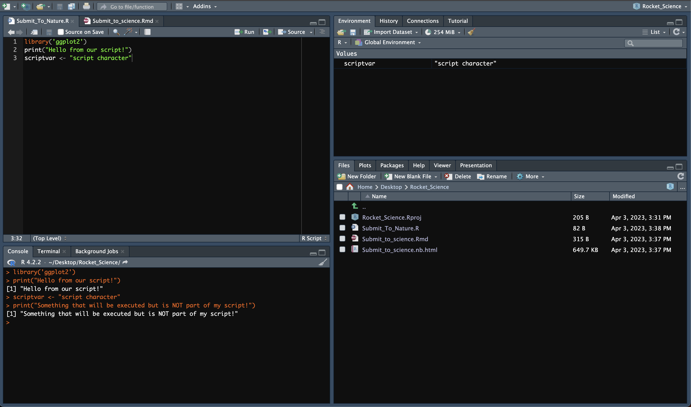
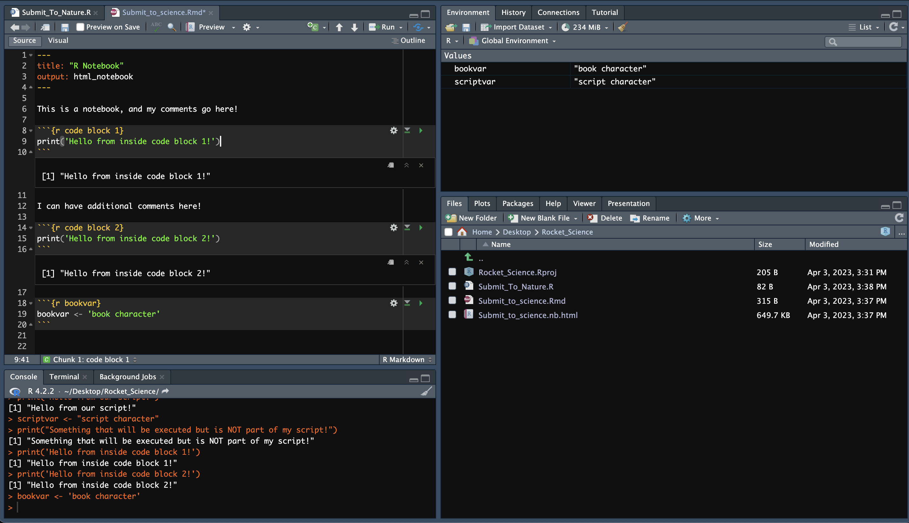

***

# Libraries

We will use a couple of libraries in this course. We have to make sure these are installed. 
These installations can take a while. So it's best to tackle this first.

You can check which packages need to be installed:

```{r load, message=FALSE}
library("DESeq2")
library("tidyverse")
library("pheatmap")
library("ggrepel")
library("EnsDb.Hsapiens.v75")
library("UpSetR")
library("ashr")
```

In case you need to still need these libaries, this code chunk below can be used as an example.

```{r install, message=FALSE}
# Bioconductor
if (!require("BiocManager", quietly = TRUE))
    install.packages("BiocManager")
if (!require("DESeq2", quietly = TRUE))
    BiocManager::install("DESeq2")
if (!require("EnsDb.Hsapiens.v75", quietly = TRUE))
    BiocManager::install("EnsDb.Hsapiens.v75")

# CRAN
if (!require("tidyverse", quietly = TRUE))
    install.packages("tidyverse")
if (!require("pheatmap", quietly = TRUE))
    install.packages("pheatmap")
if (!require("ggrepel", quietly = TRUE))
    install.packages("ggrepel")
if (!require("UpSetR", quietly = TRUE))
    install.packages("UpSetR")
if (!require("ashr", quietly = TRUE))
    install.packages("ashr")
```

***

# What you will (hopefully) learn

After the course you will be able to

* Perform a full bioinformatics workflow (DESeq2): data input $\to$ output  
* Understand the theory behind RNA-seq data generation and analysis
* Perform exploratory analysis: quality controls, filters  
* Visualize data and results with modern tools  
* Apply complex (multifactorial) experimental designs  
* Obtain and visualise differential genes from simple or complex comparison setups  
* Share workflows with your colleagues.

***

# Credits

There is lots of useful material out there. This course is heavily influenced by those tutorials:

 * [Harvard Chan bioinformatics core's DGE workshop using Salmon counts](https://hbctraining.github.io/DGE_workshop_salmon_online/) 
 * [DESeq2 vignette](http://bioconductor.org/packages/release/bioc/vignettes/DESeq2/inst/doc/DESeq2.html)
 * [Hugo Tavares' contrast tutorial](https://github.com/tavareshugo/tutorial_DESeq2_contrasts)

We will also be using publicly available data, which has been altered for educational purposes (and should thus be treated as such).

***

# Overview

## 1. Day I: Getting and understanding the data

* Warmup & R-epetition
* Data, Metadata & Design
* Data Exploration
* Quality Control


## 2. Day II: Data Transformations and Model

* Quality Controls & Filtering
* Data Transformations and Normalization
* Size Factors
* Modeling Count Data: NB and Over-dispersion
* Running DESeq2

## 3. Day III: Differentially Expressed Genes

* Multifactorial Designs & Complex Contrasts
* Hypothesis tests: Wald test & LRT
* Inspection & Visualization
* Gene Annotations
* Exporting results

## 4. Day IV: On your own 

* Run a multifactorial DESeq2 Analysis. We'll be around to help.

***

# Recap

The Rstudio GUI.






> **Poll 0.1**: 
> How will you keep track of the code, course material and notes during this course ?

***