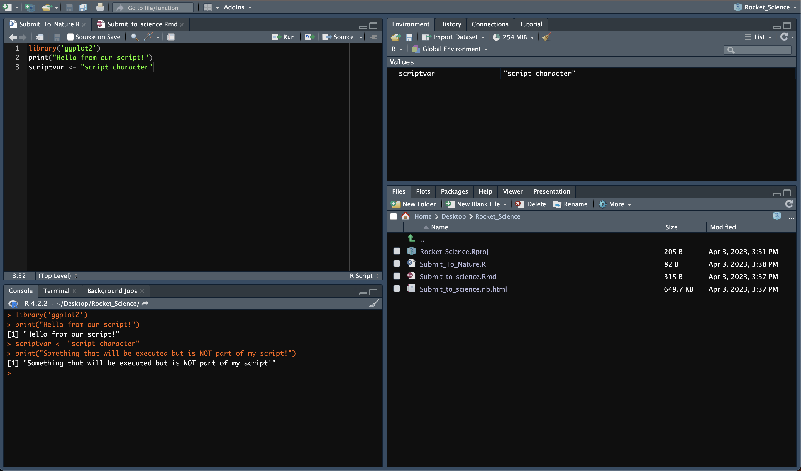
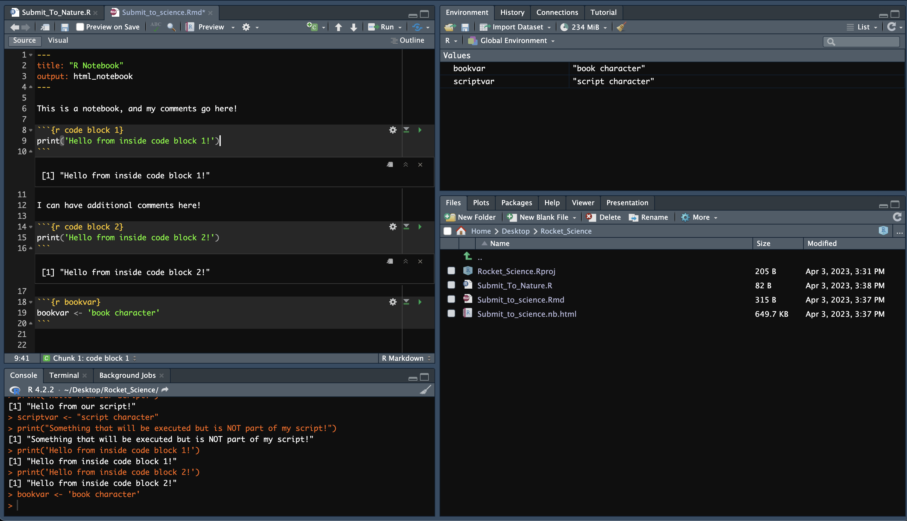
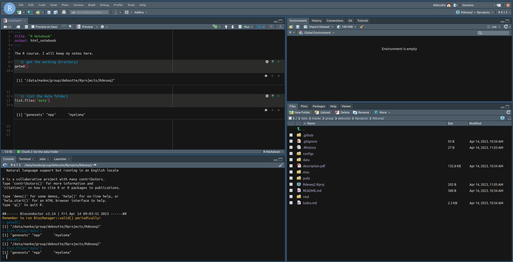

```{r include=FALSE}
knitr::knit_child("parameters.Rmd")
```

***

# Libraries

> **Poll 0.1**: 
> What is the first element in your .libPaths() ?


We will use a couple of libraries in this course. We have to make sure these are installed - in a suitable location defined by .libPaths().

These installations can take a while. So it's best to tackle this first.
The following code chunk will checks if a required library is available and will attempt to install it if this is not the case.

```{r install, message=FALSE}
# Bioconductor
if (!require("BiocManager", quietly = TRUE))
    install.packages("BiocManager")
if (!require("DESeq2", quietly = TRUE))
    BiocManager::install("DESeq2")
if (!require("EnsDb.Hsapiens.v75", quietly = TRUE))
    BiocManager::install("EnsDb.Hsapiens.v75")

# CRAN
if (!require("tidyverse", quietly = TRUE))
    install.packages("tidyverse")
if (!require("pheatmap", quietly = TRUE))
    install.packages("pheatmap")
if (!require("ggrepel", quietly = TRUE))
    install.packages("ggrepel")
if (!require("UpSetR", quietly = TRUE))
    install.packages("UpSetR")
if (!require("ashr", quietly = TRUE))
    install.packages("ashr")
```

After running the above chunk, make sure the libraries can be loaded:

```{r load, message=FALSE}
library("DESeq2")
library("tidyverse")
library("pheatmap")
library("ggrepel")
library("EnsDb.Hsapiens.v75")
library("UpSetR")
library("ashr")
```

# Recap

The Rstudio GUI.






> **Poll 0.2**: 
> How will you keep track of the code, course material and notes during this course ?

***

# Set up our project

## Workbench users

> **Task**: Create a new project and clone the datafiles we will be using from github.

If you are working in workbench, start a new session.

In your session (local or workbench):

* file -> new project -> 'Version Control' -> git

> Repository URL: https://github.com/maxplanck-ie/Rdeseq2  
> Project directory name: chose a folder name  

* create the project as a subdirectory under your group volume (e.g. /data/PI/group/MYFOLDER), or a processing volume (/data/processing/MYFOLDER), or the scratch space (/scratch/local/MYFOLDER)
* Remember to choose version `r RVERS`

## Local users

Go to https://github.com/maxplanck-ie/Rdeseq2 , click on the green '< > Code' dropdown button and select 'Download ZIP'.
Save the file to an appropriate location and extract its content.

Now open your Rstudio instances, and set the working directory to the folder you have just extracted.

## Verification

If it worked, you should have a new session, and in your console you will retrieve your project directory:

 > getwd()

and you should be able to see the data folder:

 > list.files('data')

which should contain these folders:

 * genesets
 * mpp
 * myeloma

How it should look like:

