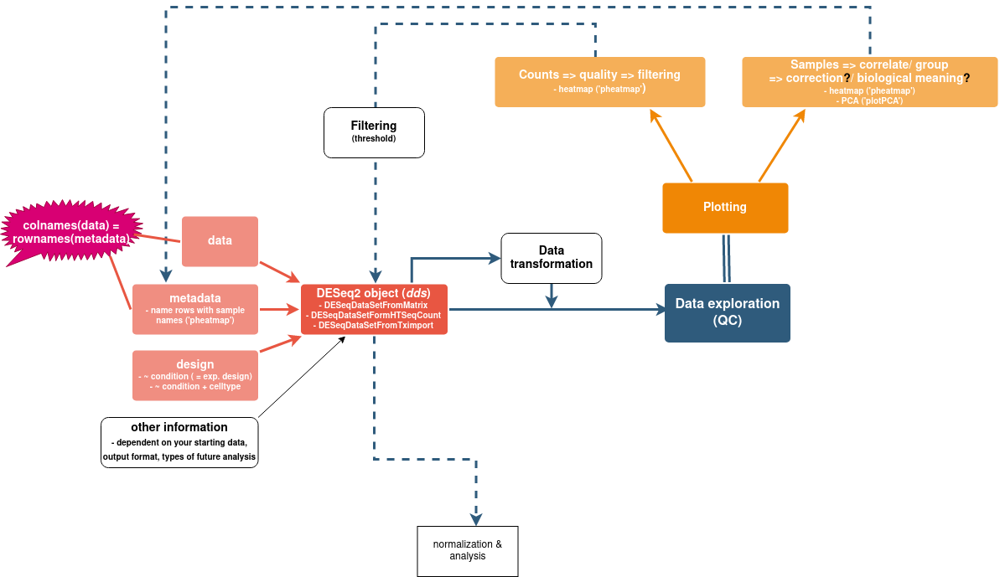

```{r setup, include=FALSE}
knitr::opts_chunk$set(echo = TRUE)
.libPaths("/data/manke/processing/RdeseqEnv/R-4.0.3_Rcourse/lib64/R/library")
```

### 1. Load libraries
```{r paths_libraries, echo=FALSE}
library(tidyverse)
library(DESeq2)
library(apeglm)
library(dplyr)
library(ggplot2)
library(pheatmap)
```

<center>
{width=110%}
</center>


### 2. Load data, metadata, plot (fix data) 
You have learned more about loading and fixing data, exploring it and creating a DESeq2 object in the previous day. Here they are summarized and used to load the data for today's lesson.
```{r load_fix_data_metadata}
#Loading data and metadata (sample sheet)
counts <- read.table("../data/qc/counts_qc.tsv", header=TRUE, check.names = TRUE)
metadata <- read.table("../data/qc/counts_qc_meta.tsv", header=TRUE, check.names = TRUE, stringsAsFactor = F)
metadata$cellType <- as.factor(metadata$cellType)  # observe the in place change from 'character' to 'factor'
metadata$txType <- as.factor(metadata$txType)


#Fix data: 
#switch rows 1 and 7 in metadata
metadata <- metadata[c(7, 2:6, 1, 8:nrow(metadata)),]
rownames(metadata) <- metadata$sample    # needed for plotting with pheatmap
#metadata$sample <- NULL    #if you want to remove the 'sample' column

#switch column names in counts:
colnames(counts)[c(2,8)] <- c("BM_CTRL_1", "JJ_CTRL_1")

#check if the col and rows are in the same order:
all(rownames(metadata) == colnames(counts[2:ncol(counts)]))


# rearrange factors
metadata$txType <- factor(metadata$txType, levels = c("DMSO", "AMIL", "TG"))


# make DESeq2 object 
my_design <- ~cellType+txType             #!!! names must be the same as the columns in the metadata file!!!
dds <- DESeqDataSetFromMatrix(countData=counts[2:ncol(counts)], colData=metadata, design=my_design)  # you need a matrix, not a df!!
```

After creating the DESeq2 object, you need to check if the data is correct and find out more about it. The downstream analyses rely on a couple of assumptions and we need to see to what degree our data match those assumptions, and to correct it if possible.

```{r plot_data}
pheatmap(counts(dds) %>% head(50)) # plot the first 50 genes
```

**Q1**: notice the legend of the map, and look at the heatmap - what does it tell you? Can you think of another way to confirm what you are suspecting?

```{r answerQ1}
summary(counts)[,1:3]  #shows the summary for the 'geneID' column and only for the first 2 samples - for brevity
```
 
As you can see from the summary, there are a lot of zero counts, the **median** of the column is zero (median = the middle value when a dataset/ list is ordered from least to greatest). So we will introduce a **filtering step**. 

## 3. Data filtering
This step is necessary for several reasons. By removing rows with very few reads, you reduce the size of your DESeq2 object, thus reducing the time and computer memory needed to run downstream analyses. You can also improve the outcome of the statistical tests (because you will have fewer tests to compare). From a biological point of view, this approach can be justified by the fact that almost always there is a residual transcription of the genes. So zero means that either the method is not sensitive enough to pick it up, or that there was a processing error. Either way, zero counts can't be interpreted biologically (**need reference!**).

```{r DESeq2_filtering}
#decide on the threshold you want to use  (= the minimum number of counts you want to keep)
keep <- rowSums(counts(dds)) > 1
cat('genes before filter: ', nrow(dds), '\n')    # prints the number of rows you have before the filtering

# keep the desired rows
fdds <- dds[keep, ]
cat('genes before filter: ', nrow(fdds), '\n')    # prints the number of rows you have after the filtering
```

Notice how many rows you have dropped. In this case you are left only with **`r round(nrow(fdds) * 100 / nrow(dds), digits=2)` %** of the initial number of rows! 

NOTE: the threshold depends on the dataset, your goals and the R package you use. With DESeq2 it is recommended to only do a minimal filtering to remove the zero counts. This is because the later analysis will apply their own automatic filtering, such as when using the 'results' function from DESeq2.

There are other types of filtering that you will encounter further down the analysis pipeline. For example, when you have finished extracting the DE genes and you want to only retain those genes that are below a certain adjusted p-value threshold. 

**Q2**: what is the difference between p-value and adjusted p-value? (INSERT EXPLANATION HERE)

**(THOMAS): SHOULD I DISCUSS THIS FILTERING AS WELL? **


## 4. Quality control

<!-- ```{r dispersion} -->
<!-- sD <- colSums(counts(dds))  # sequence depth -->
<!-- sF <- sizeFactors(dds)      # sizeFactors -->
<!-- colData(dds)  # sizeFactors have been added to metadata -->
<!-- pheatmap(counts(dds, normalized=FALSE) %>% head(15), cluster_rows=FALSE, main="Raw Counts") -->
<!-- pheatmap(counts(dds, normalized=TRUE) %>% head(15), cluster_rows=FALSE, main="After Norm") -->
<!-- boxplot(log(counts(dds, normalized=FALSE)), las=2, cex.axis=0.75) -->
<!-- boxplot(log(counts(dds, normalized=TRUE)),  las=2, cex.axis=0.75) -->
<!-- boxplot(log(assay(dds)),  las=2, cex.axis=0.75) -->
<!-- boxplot(assay(vst(dds)),  las=2, cex.axis=0.75) -->
<!-- barplot(sF, las=2, cex.names=0.75) -->
<!-- plot(sD, sF) -->
<!-- plotDispEsts(dds, main="Dispersion plot") -->
<!-- ``` -->


## 5. Data transformation and normalization

## 6. Size factors

## 7. Modelling count data
The tests are performed on normalized data and the model that is used by the DESeq2 package assumes that our data follows a negative binomial distribution.
### Types of distributions
#### Normal Distribution

#### Poisson Distribution


#### Binomial negative distribution


## 8. Over-dispersion


<!-- # Visualization -->
<!-- ```{r visualization} -->
<!-- plotMA(res, ylim=c(-3,3)) -->
<!-- sg <- which.min(res$padj) # select gene -->
<!-- plotCounts(dds, gene=sg, intgroup="condition", col = sampleTable$condition) -->
<!-- # Volcano: more customization with EnhancedVolcano() -->
<!-- sorted_res %>% mutate(significant=padj<padj.cutoff) %>% mutate(rank=row_number()) %>% add_rownames("gene_name") %>%  -->
<!--   ggplot(aes(x=log2FoldChange, y=-log10(padj), color=significant)) +  -->
<!--   geom_point() +  -->
<!--   geom_text(aes(label=ifelse(rank<5,gene_name,'')), size = 3, hjust=0,vjust=-0.15) -->
<!-- #  geom_vline(xintercept=0) + -->
<!-- #  geom_vline(xintercept=log2(1),  linetype="dashed", color = "black") +  -->
<!-- #  geom_vline(xintercept=-log2(1), linetype="dashed", color = "black") -->

<!-- # heatmap -->
<!-- # gene list -->
<!-- ``` -->
<!-- # Output -->
<!-- ```{r} -->
<!-- fn <- paste( c(contrast, "results.csv"), collapse='_') # generate meaningful filename -->
<!-- write.csv(sorted_res,  file=fn, quote=FALSE) -->
<!-- ``` -->